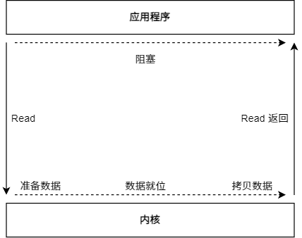
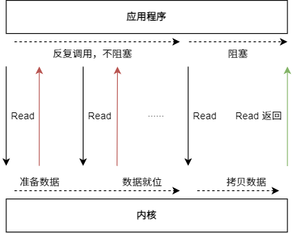
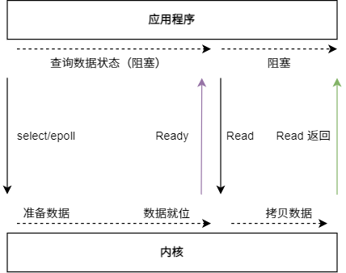
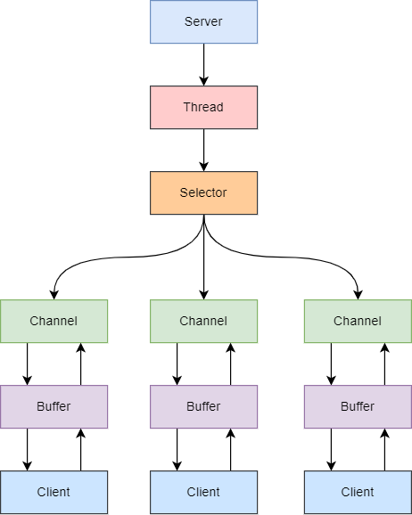
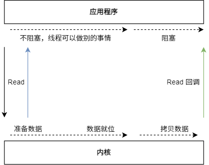

是这样的我，今晚上不知道为什么，突然对 Netty 这个东西激起了非常大的好奇心，于是开始了递归式学习......

## 传统的 HTTP 服务器原理

1. 创建一个 ServerSocket，监听一个端口（Listen）
2. 等待许多客户端请求这个端口（Client Dial）
3. 服务器使用 Accept，获得一个来自客户端的 Socket 连接对象（Conn）
4. 启动一个新线程处理连接（大致步骤如下）

* 读 Socket 得字节流  
* 解码协议，得到请求对象 
* 处理请求得到结果 
* 编码协议，结果序列化成字节流 
* 写 Socket，将字节流发送给客户端

5. 继续循环步骤 3

这是一个传统的多线程服务器，在高并发环境下，线程数量可能会创建非常多，导致操作系统的任务调度压力非常大。

于是 NIO 就诞生了，它代表的另外一个词汇叫 IO 多路复用。它是由操作系统提供的系统调用，早期这个操作系统调用的名字是 select，但是性能低下，后来渐渐演化成了 Linux 下的 epoll 和 Mac 里的 kqueue。

Netty 就是基于 Java NIO 技术封装的一套框架，提供了一个**基于操作**的使用模式和接口。

:::tip 有关于阻塞的意思
* Accept 是阻塞的，只有新连接进来了，它才会返回。
* Read 是阻塞的，只有请求消息来了，它才会返回。
* Write 是阻塞的，只有 Client 把消息接收了，Write 才返回。
:::

所以传统的多线程服务器是 BIO 模式的，有些情况下它们就等着（阻塞）。

> 反正这些都是废话，先来点真实的。

## IO

递归式学习第一步，什么是 IO？

**从计算机的结构视角来看，IO描述了计算机系统与外部设备事件通信的过程。**

再从应用程序的角度来看，为了保证操作系统的稳定性和安全性，一个进程的地址空间划分为**用户空间**和**内核空间**。

平常运行的应用程序都是运行在用户空间，只有内核空间才能进行系统态级别的资源有关操作，比如文件管理、进程通信、内存管理等。原就是说，想要进行 IO 操作，一定要依赖内核空间的能力。（并且，用户空间的程序不能直接访问内核空间）

当想要执行 IO 操作时，由于没有执行这些操作的权限，只能发起**系统调用**请求操作系统帮忙完成。平时开发过程中，接触最多的就是磁盘 IO （读写文件） 和网络 IO（网络请求和响应）。**从应用程序的视角来看，实际上只是发起了 IO 操作的调用而已，具体 IO 的执行是由操作系统的内核来完成的。**

当应用程序发起 IO 调用后，会经历两个步骤：
1. 内核等待 IO 设备准备好数据。
2. 内核将数据从内核空间拷贝到用户空间。

## BIO

BIO 的全程是 Blocking IO，意思是阻塞的 IO。

在 BIO 模型中，应用程序发起 Read 调用后，会一直阻塞，直到内核包数据拷贝到用户空间。

在 Client 连接数量不高的情况下，是没问题的。但是，当面对十万甚至百万级连接的时候，传统的 BIO 模型是无能为力的。因此，需要一种更高效的 IO 处理模型来应对更高的并发量。

## NIO

NIO 的全称是 NoneBlocking IO，意思是不阻塞的 IO。

在这个同步 NIO 模型中，应用程序会一直发起 Read 调用，反复调用的过程不阻塞，但等待数据从内核空间拷贝到用户空间的这段时间里，线程依然是阻塞的。

相比于 BIO 模型，同步 NIO 模型通过轮询操作，避免了一直阻塞。但**是应用程序不断进行 IO 系统调用轮询数据是否准备好的过程是十分消耗 CPU 资源的。**

此时，**IO 多路复用模型**就诞生了。

## IO 多路复用模型

IO 多路复用模型，线程首先发起 select/epoll 调用，询问内核数据是否准备就绪，等内核把数据准备好了，用户线程再发起 Read 调用，Read 调用的过程（数据从内核空间到用户空间）还是阻塞的。

:::tip 有关的系统调用
* **select 调用**：内核提供的系统调用，它支持一次查询多个系统调用的可用状态。几乎所有的操作系统都支持。
* **epoll 调用** ：linux 2.6 内核，属于 select 调用的增强版本，优化了 IO 的执行效率。
:::

可以看看这篇博客：[IO多路复用的三种机制Select，Poll，Epoll](https://www.jianshu.com/p/397449cadc9a)

虽然调用 select/epoll 查询数据状态，发起调用的用户线程依然会阻塞，但是比 Read 系统调用来说开销更小。

单个线程不断的轮询 select/epoll 系统调用所负责的成百上千的 socket 连接，当某个或者某些 socket 网络连接有数据到达了，就返回这些可以读写的连接。因此，好处也就显而易见了：通过一次 select/epoll 系统调用，就查询到到可以读写的一个甚至是成百上千的网络连接。

通过 IO 多路复用模型，减少了无效的系统调用，减少了对 CPU 资源的消耗。

-----

Java 于 1.4 应用 NIO，对应 java.nio 包。它支持面向缓冲的，基于通道 IO 操作方法，对于高负载、高并发的（网络应用），应使用 NIO。但 Java NIO 使用起来没有那么方便，而且还有许多 Bug。

Java 中的 NIO 可以看作是 IO 多路复用模型，但也有许多人认为它属于**同步 NIO 模型**。

Java 中的 NIO，有一个非常重要的**选择器（Selector）**的概念。通过它，只需要一个线程便可以管理多个客户端连接，当客户端数据到了之后，才会为其服务。

:::tip 换句话说
对于服务器，只会有一个进行 select/epoll 系统调用的线程被阻塞。

例如，在经典的 HTTP 服务器中，某个时刻，许多连接被创建了，如果是 BIO，就会有多个线程阻塞在 Read 系统调用中。而在 IO 复用模型，只会有一个线程阻塞在 select 调用中，当其中某个 Conn 的数据到达后，select 才会创建新的线程进行 Read 调用，处理数据。
:::

## AIO

AIO 也就是 NIO 2。Java 7 中引入了 NIO 的改进版 NIO 2,它是异步 IO 模型。

它的缺点就是需要完成事件的注册与传递，里边需要底层操作系统提供大量的支持。

目前来说， Windows 系统下通过 IOCP 实现了真正的异步 I/O。但是，就目前的业界形式来说，Windows 系统，很少作为百万级以上或者说高并发应用的服务器操作系统来使用。

而在 Linux 系统下，异步IO模型在2.6版本才引入，目前并不完善。所以，这也是在 Linux 下，实现高并发网络编程时都是以 IO 复用模型模式为主。

## Netty 的介绍

Netty 是由 JBOSS 提供的一个 Java 开源框架，现为 Github 上的开源项目。它是一个**异步的**、**基于事件驱动**的网络应用框架，用以快速开发高性能、高可靠性的 IO 程序。

> 所以我看了一晚上的 IO 模型？？？ Netty 到底是什么？

## 参考

* [10分钟看懂， Java NIO 底层原理](https://www.cnblogs.com/crazymakercircle/p/10225159.html)
* [JavaGuide-IO](https://snailclimb.gitee.io/javaguide/#/docs/java/basis/io模型详解)