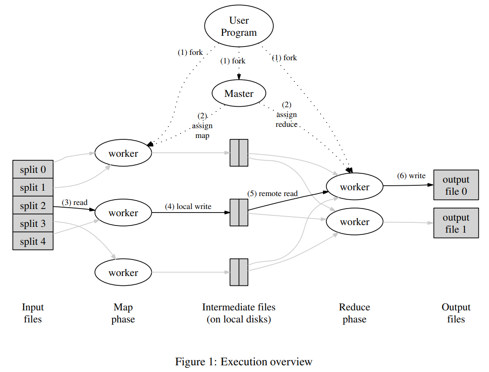

## 2 编程模型

计算读取一组 key/value 键值对，然后输出一组 key/value 键值对。MapReduce 库的用户将计算表示为两个函数：Map 和 Reduce。

Map，由用户编写，获取一个输入的键值对然后输出一组中间的 key/value 键值对。MapReduce 库将所有相同与中间 key I 相关联的 value 分组，并并传递它们给 Reduce 函数。

Reduce 函数也由用户编写，它接受一个中间键 I 和它的一组 value。它将这些 value 合并在一起，形成一个更小的 value 的集合。一般来说，每次调用 Reduce 都只会产生 0 或 一个输出值。通过迭代器，中间 value 会提供给用户的 reduce 函数。这样能让我们去处理太大导致无法放进内存的 value 列表。

### 2.1 样例

假设现在需要从大量文档中计算每一个字母出现次数的问题。用户将编写类似下面的伪代码。

```cpp
map(String key, String value):
    // key: document name
    // value: document contents
    for each word w in value:
        EmitIntermediate(w, "1");

reduce(String key, Iterator values):
    // key: a word
    // values: a list of counts
    int result = 0;
    for each v in values:
        result += ParseInt(v);
    Emit(AsString(result));
```

Map 函数返回每个单词加上它出现的次数（在这个简单的例子中只是1）。Reduce 函数将一个特定的单词的所有数相加起来。

此外，用户编写代码来实现一个符合 MapReduce 规范的对象，它好书输入输出文件的名称和可选的调优参数。然后用户调用 MapReduce 函数，传递该对象给它。用户的代码就和 MapReduce 的库（C++实现）连接在了一起。附录 A 包含了这个例子的完整代码。

### 2.2 类型

尽管前面的伪代码是以字符串输入输出来写的，概念上来说，用户提供的 map 和 reduce 函数是关联类型的。

```cpp
map     (k1, v1)        -->  list(k2, v2)
reduce  (k2, list(v2))  -->  list(v2)
```

也就是说，输入键和输出键均来自不同的域。此外，中间的键值来自同一个域。

我们C++的实现将字符串传递给用户定义的函数，并让用户代码在字符串和适当类型之间进行转换。

### 2.3 更多的实例

这里有几个有趣程序作为简单的例子，可以很容易地表示 MapReduce 计算。

**Distributed Grep**: map 函数如果匹配了所提供的模式，就会返回一行。reduce 函数是一个认证函数，它只是将提供的中间数据复制到输出端。

**Count of URL Access Frequency**: map 函数处理网页请求的日志，并输出 <URL，1\>。reduce 函数将同一 URL 的所有值相加，并输出一个 <URL, total count\>对。

**Reverse Web-Link Graph**: map 函数为每一个页面 source 的标签中的 target URL 输出 <target,source\>对。reduce 函数将所有与给定 target URL 相关联的源 URL 的列表串联起来，然后输出对：<target, list(source)\>

**Term-Vector per Host**: 术语向量将一个文件或一组文件中出现的最重要的词总结为一个<word，frequency\> 对的列表。然后 map 函数为每个输入的文档返回一个<hostname, term vector\>对（其中hostname是从文档的URL中提取的）。reduce函数接受一个给定的主机的每一个文档术语向量。它把这些术语向量加在一起，剔除不常用的术语，然后返回一个最终的 <hostname, term vector\>对。

**Inverted Index**: map 函数解析每个文档，并返还一系列的 <word, document ID\>对。reduce 函数接受给定 word 的所有词对，并将对相应的文档 ID 进行排序，并返回一个<word,list(document ID)\>对。这些 word 对的倒置对形成一个简单的反向索引。很容易对这种计算进行增强，以保持对单词位置的跟踪。

**Distributed Sort**: map 函数从每条记录中提取关键字，并返还一个 <key，record\>对。而 reduce 函数不对这些键值对改变直接返回。这种计算依赖于第4.1节中描述的分区设施和第4.2节中描述的排序属性。



## 3 实现

MapReduce 接口的有许多不同的实现方式。正确的选择依赖于不同的环境。比如，一种实现可能适用于小型共享内存机器，另一种实现适用于大型 NUMA 多处理器的机器，而另一种则适用于更大的网络集群。

本节描述了一种在 Google 中广泛使用且针对计算环境的实现：用交换式以太网连接在一起的大型商业计算机集群。在我们的环境中：
1. 机器通常是运行在 Linux 上的双核 x86 处理器，每一台机器的内存是 2-4GB。
2. 使用的是商用网络硬件——一般是100兆比特/秒或1千兆比特/秒，但平均而言，整体分节带宽要小得多。
3. 一个集群由成千上百台机器组成，因此机器故障是很常见的。
4. 存储功能由直接连接到各个独立的机器上的廉价的IDE磁盘提供。一个内部开发的分布式文件系统$^{[8]}$被用来管理储存在这些磁盘上的数据。该文件系统使用冗余机制，在不可靠的硬件之上去提供可用性和可靠性。
5. 用户提交作业到调度系统中。每一个作业由一系列任务组成，由调度器映射到集群内一组可用的机器上。

### 3.1 运行概述

通过将输入的数据自动分隔成每组 M 个的分片，Map 调用就被分布在多台机器上。这个输入分割可以被多台机器并行地处理。Reduce 的调用是通过使用分区函数（例如，hash(key) mod R）将中间的 key 空间分割成 R 片来分配的。这里分区 R 的数量和分区函数都是用户指定的。（图1中的数字标签对应下面列表的数字）

图1展示了我们实现的 MapReduce 的整体流程。当用户程序调用 MapReduce 函数时，会按顺序发生以下列出的操作。
1. 用户程序中的 MapReduce 库首先将输入文件分成 M 个片段，每一个片段通常是 16MB ~ 64MB（用户可以通过一个可选的参数去控制）。然后，它在集群上启动许多相同的程序。
2. 这些程序中，有一个特殊的程序——master。其余都是 worker，由 master 给它们分配任务。有 M 个 map 任务和 R 个 reduce 任务需要去分配。master 会选择空闲的 worker，然后给它分配一个 map 任务或 reduce 任务。
3. 一个被分配了 map 任务的 worker，会从相应的输入分片中读取内容。它解析输入数据中的 key/value 键值对，然后将这些 key/value 键值对传递给用户定义的 map 函数。Map 函数产生的临时 key/value 键值对会暂储在内存中。
4. 这些被缓存的键值对，会被定期地写入本地磁盘上，分区函数会将其划分成 R 个区域。这些缓存键值对在本地磁盘的位置会被传回 master，master 负责将这些位置传给 reduce 任务。
5. 当 reduce worker 接收到 master 的位置后，它会 PRC 从 map worker 的本地磁盘上读取缓存的数据。当 reduce 读取完所有的中间数据后，会根据 key 进行排序，以便将出现相同的 key 的数据归并到一起。这个排序是必要的，因为通常情况下，许多不同的 key 会被映射到相同的 reduce 任务上。如果中间产生的输出量过大无法缓存在内存中，就需要使用外部排序。
6. reduce worker 会迭代所有的中间数据，对于遇到的每一个唯一中间件，它会传递 key 和它对应的中间 value 集合传递给的 reduce 函数。Reduce 函数的输出会被追加到这个 reduce 分区最终的输出文件中。
7. 当所有的 map 任务和 reduce 任务完成后，master 会唤醒用户程序。此时 MapReduce 调用结束。

成功完成后，MapReduce 执行的输出可以在 R 个输出文件中得到。（每一个 reduce 任务一个，文件名由用户指定）通常情况下，用户不需要将这 R 个输出文件合并成一个文件——他们会将这些文件文件作为另一个 MapReduce 调用的输入，或者用另外一个能处理这些被分割成多个文件作为输入的分布式应用中使用。

### 3.2 Master 数据结构

master 储存了几种数据结构。对于每个 map 任务和 reduce 任务，master 储存着它们的状态（空闲、正在运行中、完成），和 worker 机器唯一的标识（非空闲状态才有）。

master 是一个通道，它将中间文件的区域位置从 map 任务传递到 reduce 任务。因为，对于每一个完成的 map 任务，master 储存了由 map 任务产生的 R 个中间文件区域的位置和大小。随着 map 任务完成，master 会接收到这些位置和大小的更新通知。这些信息会逐渐地推送给正在进行 reduce 任务的 worker。

### 3.3 容错

因为 MapReduce 库是为辅助成千上百的机器处理大量数据而设计的，所以该库必须能够优雅地处理机器故障。

#### worker 故障

master 会定期地 ping 一下每一个 worker。如果在一段时间内没有收到 worker 的响应，master 会将该 worker 标记成 failed。任何由该 worker 完成的 map 任务都会被重置回初始空闲状态，因此它们可以在其他 worker 上进行调度。同样，任何在该 worker 上正在执行的 map 和 reduce 任务也会被重置回初始空闲状态，且也能够被重新调度。

在故障 worker 上已完成的 map 任务被重新执行，是因为它们的执行结构被储存在了故障的机器上而无法访问。但是那些已完成的 reduce 任务不需要去重新执行。因为它们的输出储存在全局文件系统中（GFS、Hadoop）。

当一个 map 任务先由 worker A 执行，然后再由 worker B 执行（因为 A 故障了），所有执行 reduce 任务的 worker 都会被通知重新执行。任何还没有从 worker A 读取数据的 reduce 任务将从 worker B 中读取数据。

MapReduce 能够应对大规模的 worker 故障。例如，在一次 MapReduce 操作过程中，正在运行集群网络的一次维护将会导致80台机器在几分钟内没有响应。MapReduce master 简单执行了无法联系的机器上的任务，然后继续向前推进操作进度，最终完成 MapReduce 操作。

#### master 故障

让 master 定期地写入上述所说的 master 数据结构状态是非常简单的。如果 master 故障，可以从最新的一个检查点中拷贝数据，开启一个新的 master。然而，考虑到只有一个 master，它故障的可能性并不大；因此，我们现在实现的 MapReduce 会在 master 故障时停止 MapReduce 的计算。客户端可以检查这个状态，如果他们愿意，可以重启 MapReduce 的计算。

#### 故障情况下的语义

当用户提供的 map 和 reduce 是它们输入值的确定性函数时，我们的分布式实现得到的输出与整个程序不故障的顺序执行得到的输入是一致的。

我们依靠 map 和 reduce 任务输出的原子性提交来实现这个属性。每一个正在运行的任务都会将它的输出写入到一个私有临时文件。每一个 reduce 任务都会产生这样一个文件，而每一个 map 任务会产生 R 个这样的文件。（每个 reduce 一个文件）当 map 任务完成后，worker 会发送一个信息给 master，消息中包含 R 个临时文件的名称。如果 master 收到一个过去已经完成了 map 任务的消息，它将忽略该消息。否则，它会在将 R 个文件的名称记录在 master 数据结构中。

当一个 reduce 任务完成，该 reduce 的 worker 会将它的临时文件原子化地重命名成最终输出文件。如果同一个 reduce 任务在多台机器上执行，那么同一个最终输出文件将会被多次执行重命名。我们依赖底层文件系统提供的原子性操作来保证最终文件系统里只包含一个 reduce 任务执行产生的数据。

我们绝大多数的 map 和 reduce 操作都是确定性的。在这种情况下，我们的语义相当于顺序执行，这能让程序员非常简单的去理解程序的行为。当 map 和/或 reduce 操作都是不确定性时，我们提供的语义更弱，但仍然合理。在存在不确定性的操作情况下，一个特定的 reduce 任务 $R_1$ 的输出与非确定性程序顺序执行的输出是一致的。然而，不同的 reduce 任务 $R_2$ 的输出可能与另外一个不同的顺序执行的非确定性程序的输出有联系。

假设有 map 任务 $M$ 和 reduce 任务 $R_1$ 和 $R_2$。令 $e(R_i)$ 是 $R_i$ 已经提交的执行（正好有一个这样的执行）。较弱的语义产生了，因为 $e(R_1)$ 可能从一个执行的 M 中读取了 map 的输出，然后 $e(R_2)$ 可能会从另一个不同执行的 M 中读取了 map 的输出。

### 3.4 定位

在我们的计算环境中，带宽是一个相对稀缺的环境。事实上，我们通过将这些输入数据（由 GFS$^{[8]}$ 管理）储存在这些机器的本地磁盘上，从而节省网络带宽。GFS 将每个文件分成了 64MB 大小的块，并且将这些块的副本（通常是 3 副本）储存在不同的机器上。MapReduce master 会考虑这些输入文件的位置信息，并尝试在包含相关输入数据副本的机器上分配 map 任务。如果失败，它会尝试在该任务的输入数据副本附近的机器上分配 map 任务（例如，在与该数据副本储存的机器处于同一交换机的 worker 机器上）。当集群中相当大一部分 worker 执行大型 MapReduce 操作时，大多数输入的数据从本地读取，不消耗网络带宽。

### 3.5 任务颗粒度

如上所述，我们将 map 阶段细分成 M 片，将 reduce 阶段细分成 R 片。理想情况下，M 和 R 的数量应该比 worker 机器的数量要大得多。让每个 worker 执行不同的任务可以改善动态负载平衡，也可以在一个 woker 故障时加速恢复速度：它完成的许多 map 任务可以分散到其他的 worker 机器上。

在我们的实现中，M 和 R 的数量可以有明确的限制，因为 master 必须调度 O(M + R) 次，并在内存中储存 O(M \* R) 个状态，就像上面说的一样。（然而，内存使用的常数因数一般很少：状态的 O(M \* R) 个部分，每个 map task/reduce task 对只占大约1字节数据）

此外，R 的数量通常由用户限制，因为每个 reduce 任务的最终输出都会在一个单独的输出文件上。在实践中，我们倾向于选择合适 M，使每一个独立的任务的输入数据大致在 16MB 到 64MB（这样上面描述定位优化是最有效的），然后让 R 的数量是我们预期使用 worker 数量的一个比较小的倍数。我们通常在 2000 个 worker 机器上执行 M = 200,200 且 R = 5,000 的 MapReduce 计算。

### 3.6 备份任务

加长 MapReduce 的总操作时间的常见原因之一是“滞留者”：在计算即将完成的最后几个 map 或 reduce 任务，机器需要花费较长的时间在上面。“滞留者”的出现有许多原因。例如，一个磁盘不好的机器可能会经常出现可纠正型错误，使其读取性能从 30MB/s 减少到 1MB/s。集群调度系统可能在该机器上调度了其他的任务，机器由于 CPU、内存、本地磁盘和网络带宽的竞争而导致 MapRedcue 代码执行更慢。我们最近遇到的一个 bug 发生在机器初始化代码时，它导致处理器缓存失效：受影响的机器计算速度降低了100倍以上。

我们有一个通用的机制来减缓滞留问题。当一个 MapReduce 操作快要完成时，master 会对剩余的正在进行中的任务进行备份执行。当最初的任务或备份的任务完成时，该任务就被标记完成。我们对这种机制进行了调整，使该操作通常增加消耗的计算资源不超过百分之一。我们发现，这样使大型 MapReduce 任务消耗的时间大大减少了。作为一个例子，在5.3节描述的排序程序中，当备份任务机制被禁用时，完成该程序需要多花费44%。