# 杂题记录

## [1838. 最高频元素的频数](https://leetcode-cn.com/problems/frequency-of-the-most-frequent-element/)

题目的要求是，在给定的元素内，使数组齐平。例如下图是一个 [1，2，4] 的数组，当 k = 5时补齐的状态。所以答案为 3 。


所以可以使用一个滑动窗口，在这个滑动范围之内，都会尝试去用 `k` 将数组补齐。要使用滑动窗口，必须先让它排个序！此时已经是 (`nlogn`)了。

由于排序数组了，每次枚举在区间内最大的数，会尝试用 `k` 去补齐。在滑动循环内只能由两种情况：（假设滑动区间为 `left ~ right`）

1. 尝试将区间的数向 `nums[right]` 补齐，使用的次数 `sum` **小于等于** `k`。

直接更新当前答案。

```js
// 此刻之前的元素已经与 nums[right - 1] 补齐
// 所以现在只需要把之间的差补齐
nums += (nums[right] - nums[right - 1]) * (right - left);
res = Math.max(res, right - left + 1);
```

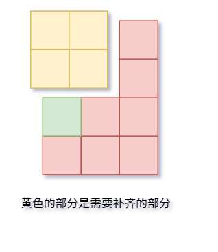

2. 尝试将区间的数向 `nums[right]` 补齐，使用的次数 `sum` **大于** `k`。

这种情况不符合题目题意，需要收缩窗口。

第一步：将 `left` 向 `nums[right]` 补齐时所占的次数返回，即 `sum - <所占部分>`。第二步：将 `left` + 1。

```js
sum -= nums[right] - nums[left];
```

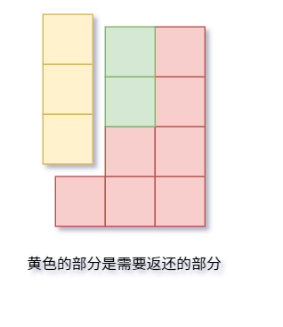

完整JavaScript代码：

```js
/**
 * @param {number[]} nums
 * @param {number} k
 * @return {number}
 */
var maxFrequency = function(nums, k) {
    nums.sort((a, b) => a - b);
    let res = 1;
    let [left, right, sum] = [0, 1, 0];
    for (; right < nums.length; ++ right) {
        sum += (nums[right] - nums[right-1]) * (right - left);
        while (sum > k) {
            sum -= nums[right] - nums[left];
            left++;
        }
        res = Math.max(res, right - left + 1);
    }
    return res;
};
```

## [剑指 Offer 52. 两个链表的第一个公共节点](https://leetcode-cn.com/problems/liang-ge-lian-biao-de-di-yi-ge-gong-gong-jie-dian-lcof/)

输入两个链表，找出它们的第一个公共节点。

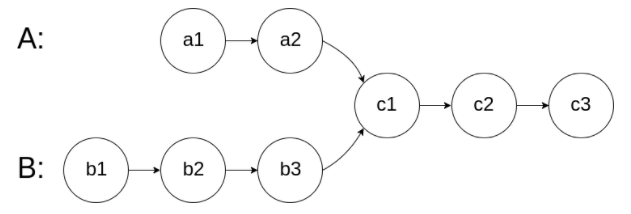

解题思路和动图均来自：[leetcode-腐烂的橘子](https://leetcode-cn.com/u/z1m/)

我们使用两个指针 `node1`，`node2` 分别指向两个链表 `headA`，`headB` 的头结点，然后同时分别逐结点遍历。

当 `node1` 到达链表 `headA` 的末尾时，重新定位到链表 `headB` 的头结点；

当 `node2` 到达链表 `headB` 的末尾时，重新定位到链表 `headA` 的头结点；

这样，当它们相遇时，所指向的结点就是第一个公共结点。

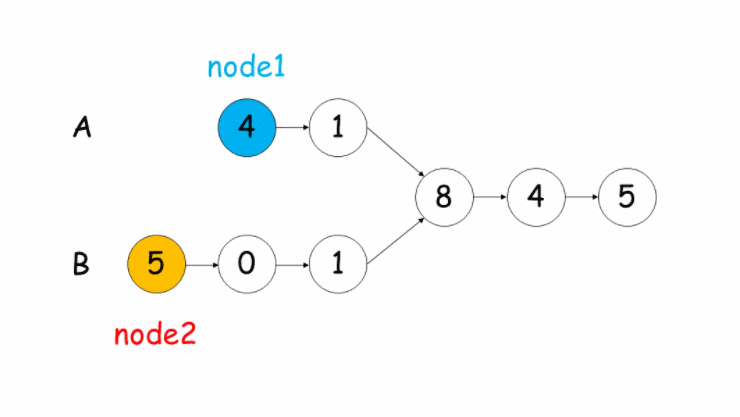

```js
/**
 * Definition for singly-linked list.
 * function ListNode(val) {
 *     this.val = val;
 *     this.next = null;
 * }
 */

/**
 * @param  {ListNode} headA
 * @param  {ListNode} headB
 * @return {ListNode}
 */
var getIntersectionNode = function(headA, headB) {
    if (headA == null || headB == null) {
        return null;
    }
    
    let [p1, p2] = [headA, headB];
    while (p1 !== p2) {
        p1 = p1 === null ? headB : p1.next;
        p2 = p2 === null ? headA : p2.next;
    }
    return p1;
};
```

## [138. 复制带随机指针的链表](https://leetcode-cn.com/problems/copy-list-with-random-pointer/)

思路：

1. 先在原链表上进行复制（蓝色是旧的，黄色是新的）

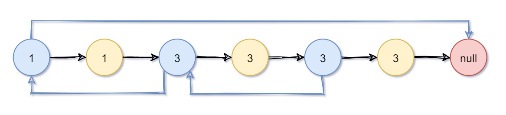

2. 我们先让random指向原链表中的。

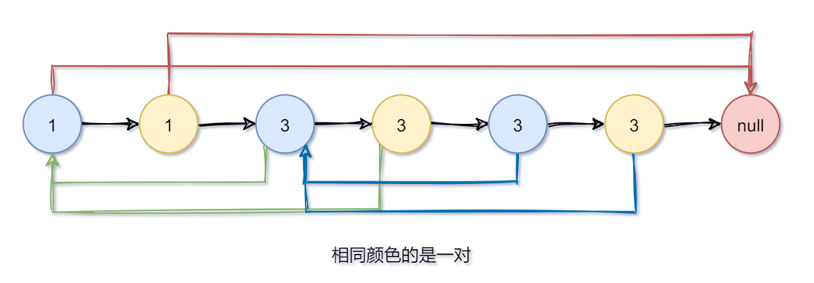

3. 统一让新节点的random指向原链表中的下一个节点，就是random的新节点了。

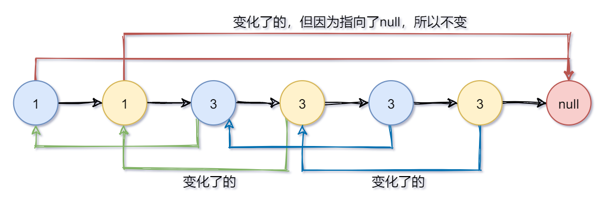

4. 最后再进行分裂

比如 `node.next = node.next.next` ，就是直接越过一个节点（越过新节点直接指向旧节点）。

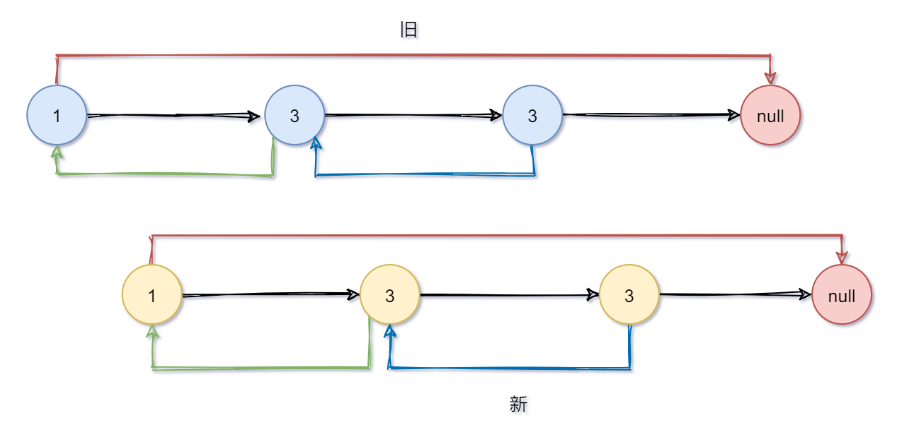

```js
/**
 * // Definition for a Node.
 * function Node(val, next, random) {
 *    this.val = val;
 *    this.next = next;
 *    this.random = random;
 * };
 */

/**
 * @param {Node} head
 * @return {Node}
 */
var copyRandomList = function(head) {
    if (head === null) return null;
    // 复制一份
    for (let node = head; node; node = node.next.next) {
        const newNode = new Node(node.val, null, node.random);
        newNode.next = node.next;
        node.next = newNode;
    }
    
    // 复制random链表
    for (let node = head; node; node = node.next.next) {
        const newNode = node.next;
        newNode.random = newNode.random ? newNode.random.next : null;
    }
    
    // 分裂
    // 还原原来的链表、将新链表分离出去
    const res = head.next;
    for (let node = head; node; node = node.next) {
        const newNode = node.next;
        node.next = node.next ? node.next.next : null;
        newNode.next = newNode.next ? newNode.next.next : null;
    }
    return res;
};
```

## [1893. 检查是否区域内所有整数都被覆盖](https://leetcode-cn.com/problems/check-if-all-the-integers-in-a-range-are-covered/)

再回忆一下差分。

1. 差分求前缀和 -> 得到原数组
2. 在一段区间内的数组元素都加上一个数 `c` -> `diff[left] += c; diff[right+1] -= c`

这道题的 `ranges` 每个元素给的都是一个区间的 `left` 和 `right`，接着把 `1` 当成上面式子的 `c`，这样就能把 `left` 到 `right`之间的数出现次数 `+1`了。

下图的 `ranges` 数组已经给出，`diff` 是差分数组，`prefix` 是前缀和数组，它也代表每个元素出现的次数。

`index` 标红的数字即为满足条件的下标。

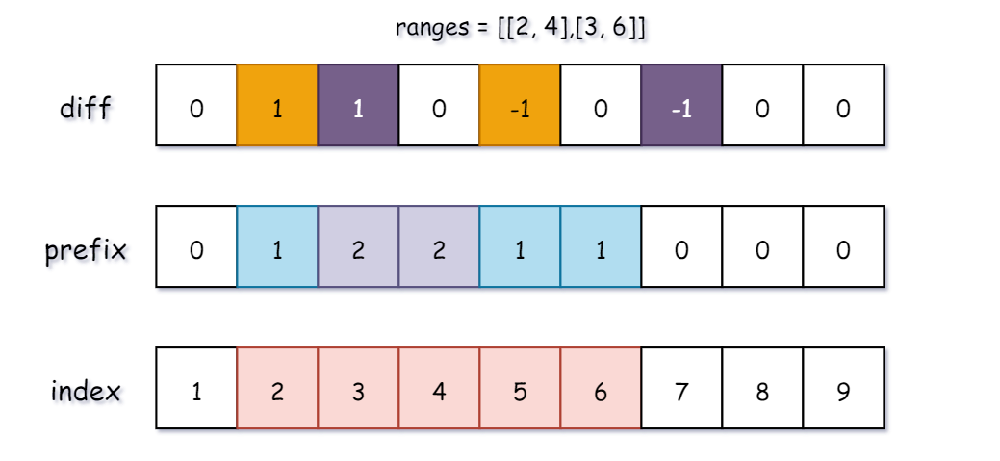

所以思路就是先构造差分数组，通过差分数组去构造前缀和数组，求出每个数组出现的频率。

最后再从 `left` 遍历到 `right`，如果都满足就返回 `true` 就可以了。

```js
/**
 * @param {number[][]} ranges
 * @param {number} left
 * @param {number} right
 * @return {boolean}
 */
var isCovered = function(ranges, left, right) {
    const diff = createZeroArray(60);
    // 构造差分数组
    ranges.forEach(x => {
        diff[x[0]] = diff[x[0]] + 1;
        diff[x[1] + 1] = diff[x[1] + 1] - 1;
    });
    
    // 差分数组求前缀和就是每个数字出现的次数
    const prefix = createZeroArray(60);
    for (let i = 1; i <= 51; ++ i) {
        prefix[i] = diff[i] + prefix[i-1];
    }
    
    for (let i = left; i <= right; ++ i) {
        if (prefix[i] === 0) return false;
    }
    return true;
};

function createZeroArray(size){
    const res = [];
    res.length = size;
    res.fill(0, 0, size);
    return res;
}
```

## [剑指 Offer 07. 重建二叉树](https://leetcode-cn.com/problems/zhong-jian-er-cha-shu-lcof/)

输入某二叉树的前序遍历和中序遍历的结果，请构建该二叉树并返回其根节点。

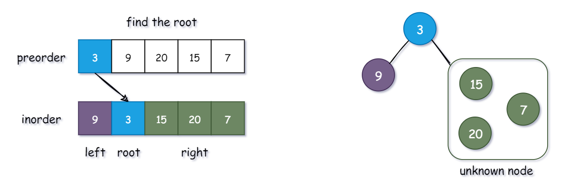

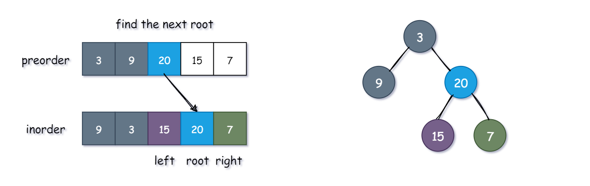

**知识点：**

1. 前序遍历列表：第一个元素永远是 【根节点 (root)】
2. 中序遍历列表：根节点 (root)【左边】的所有元素都在根节点的【左分支】，【右边】的所有元素都在根节点的【右分支】

**算法思路：**

1. 通过【preorder】确定【根节点 (root)】
2. 将【inorder】的节点分割成【left】和【right】
3. 递归寻找【left】中的【根节点 (left root)】和 【right】中的【根节点 (right root)】

```js
/**
 * Definition for a binary tree node.
 * function TreeNode(val) {
 *     this.val = val;
 *     this.left = this.right = null;
 * }
 */
/**
 * @param {number[]} preorder
 * @param {number[]} inorder
 * @return {TreeNode}
 */
var buildTree = function (preorder, inorder) {
    if (preorder == 0) return null;
    
    const tree = new TreeNode(preorder[0]);
    
    const divideIdx = inorder.indexOf(tree.val);
    
    const leftPre = preorder.slice(1, divideIdx + 1);
    const leftIn = inorder.slice(0, divideIdx);
    const left = buildTree(leftPre, leftIn);
    
    const rightPre = preorder.slice(divideIdx + 1);
    const rightIn = inorder.slice(divideIdx + 1);
    const right = buildTree(rightPre, rightIn);
    
    tree.left = left, tree.right = right;
    return tree;
};
```

## [剑指 Offer 04. 二维数组中的查找](https://leetcode-cn.com/problems/er-wei-shu-zu-zhong-de-cha-zhao-lcof/)

题解来自：[leetcode-Krahets](https://leetcode-cn.com/problems/er-wei-shu-zu-zhong-de-cha-zhao-lcof/solution/mian-shi-ti-04-er-wei-shu-zu-zhong-de-cha-zhao-zuo/)

我们将矩阵逆时针旋转 45° ，并将其转化为图形式，发现其类似于**二叉搜索树** ，即对于每个元素，其左分支元素更小、右分支元素更大。因此，通过从 “根节点” 开始搜索，遇到比 `target` 大的元素就向左，反之向右，即可找到目标值 `target` 。

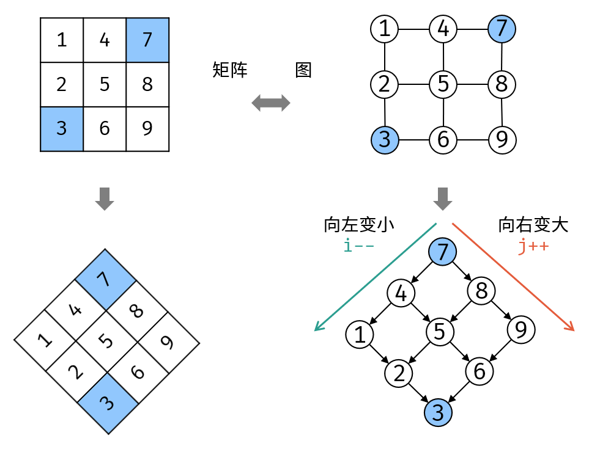

**算法流程：**

从矩阵 `matrix` 左下角元素（索引设为 `(i, j)` ）开始遍历，并与目标值对比：

1. 当 `matrix[i][j] > target` 时，执行 `i--` ，即消去第 `i` 行元素；
2. 当 `matrix[i][j] < target` 时，执行 `j++` ，即消去第 `j` 列元素；
3. 当 `matrix[i][j] = target` 时，返回 `true` ，代表找到目标值。

若行索引或列索引越界，则代表矩阵中无目标值，返回 `false` 。


```js
/**
 * @param {number[][]} matrix
 * @param {number} target
 * @return {boolean}
 */
var findNumberIn2DArray = function(matrix, target) {
    let [x, y] = [matrix.length - 1, 0];
    while (x >= 0 && y < matrix[0].length) {
        const now = matrix[x][y];
        if (now > target) x--; 
        else if (now < target) y++;
        else return true;
    }
    return false;
};
```

## [L1-050 倒数第N个字符串 (15 分)](https://pintia.cn/problem-sets/994805046380707840/problems/994805080346181632)

十进制与二十六进制相互转换

## [L1-6 福到了 (15 分)](https://pintia.cn/problem-sets/994805046380707840/problems/994805076512587776)

```cpp
getchar(); // 读取上一行换行符
getline(cin, str); // 读取一行到 string str 中
```

## [L2-3 名人堂与代金券 (25 分)](https://pintia.cn/problem-sets/994805046380707840/problems/994805055176163328)

结构体数组排序

```cpp
struct student {
    string email;
    int score;
    bool operator< (const student &S) const {
        if (score != S.score) return score > S.score; // 成绩降序
        else return email < S.email; // 邮箱升序
    }
}stu[N];

// ......

sort(stu, stu + n);
```

## [L2-028 秀恩爱分得快 (25 分)](https://pintia.cn/problem-sets/994805046380707840/problems/994805054698012672)

```cpp
bool exitsA = find(pic[i].begin(), pic[i].end(), aId) != pic[i].end();
```

## [L1-042 日期格式化 (5 分)](https://pintia.cn/problem-sets/994805046380707840/problems/994805088529268736)

整数前补 0

```cpp
printf("%d-%02d-%02d", y, m, d);
```

## [L1-3 阅览室 (20 分)](https://pintia.cn/problem-sets/994805046380707840/problems/994805087447138304)

`unordered_map` 判断存在和删除

```cpp
m.count(id); // exist
m.erase(id); // delete
```

## [L1-048 矩阵A乘以B (15 分)](https://pintia.cn/problem-sets/994805046380707840/problems/994805082313310208)

```txt
1 2 3
4 5 6
```

```txt
7 8 9 0
1 2 3 4
5 6 7 8
```

res

```txt
1 * 7 + 2 * 1 + 3 * 5 | 1 * 8 + 2 * 2 + 3 * 6 | 1 * 9 + 2 * 3 + 3 * 7 | 1 * 0 + 2 * 4 + 3 * 8
4 * 7 + 5 * 1 + 6 * 5 | 4 * 8 + 5 * 2 + 6 * 6 | 4 * 9 + 5 * 3 + 6 * 7 | 4 * 0 + 5 * 4 + 6 * 8
```

## [L2-024 部落 (25 分)](https://pintia.cn/problem-sets/994805046380707840/problems/994805056736444416)

并查集树的数目可以用 unordered_map 的 size 来表示

## [L3-029 还原文件 (30 分)](https://pintia.cn/problem-sets/994805046380707840/problems/1386335159927652365)

字符串哈希 + 深搜拼接