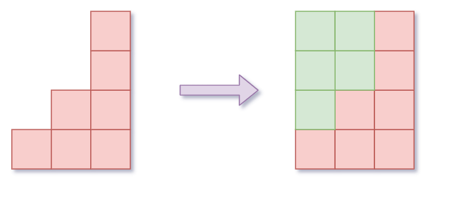
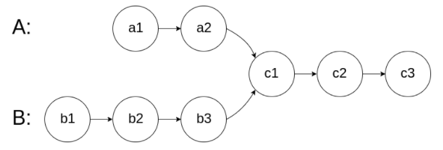
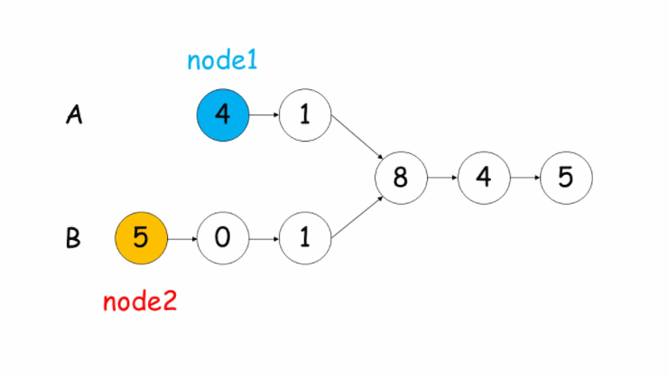
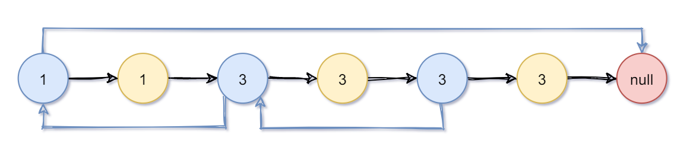
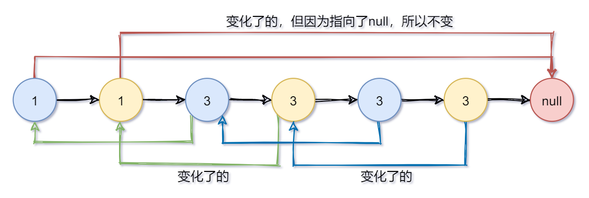
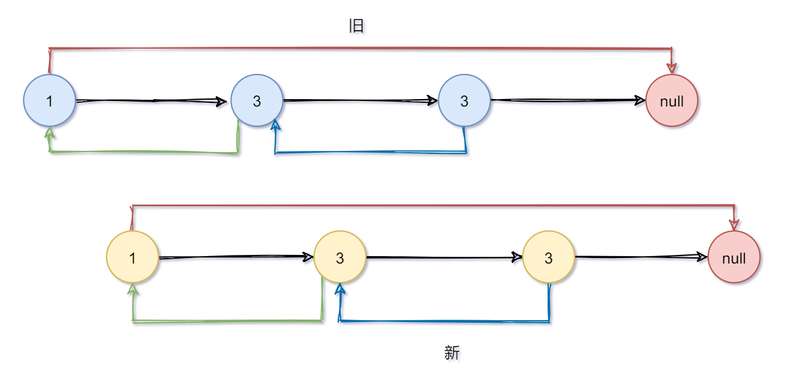
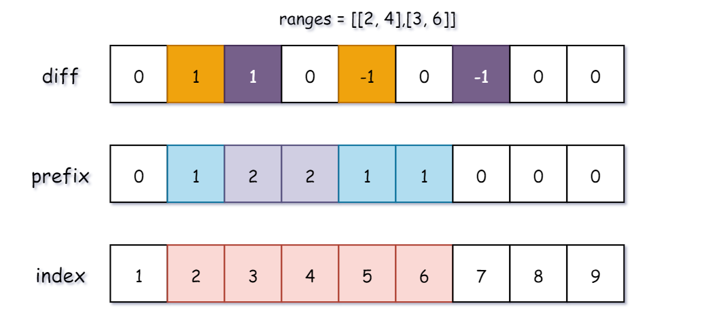

# 每日一题

## [1838. 最高频元素的频数](https://leetcode-cn.com/problems/frequency-of-the-most-frequent-element/)

题目的要求是，在给定的元素内，使数组齐平。例如下图是一个 [1，2，4] 的数组，当 k = 5时补齐的状态。所以答案为 3 。



所以可以使用一个滑动窗口，在这个滑动范围之内，都会尝试去用 `k` 将数组补齐。要使用滑动窗口，必须先让它排个序！此时已经是 (`nlogn`)了。

由于排序数组了，每次枚举在区间内最大的数，会尝试用 `k` 去补齐。在滑动循环内只能由两种情况：（假设滑动区间为 `left ~ right`）

1. 尝试将区间的数向 `nums[right]` 补齐，使用的次数 `sum` **小于等于** `k`。

直接更新当前答案。

```js
// 此刻之前的元素已经与 nums[right - 1] 补齐
// 所以现在只需要把之间的差补齐
nums += (nums[right] - nums[right - 1]) * (right - left);
res = Math.max(res, right - left + 1);
```


2. 尝试将区间的数向 `nums[right]` 补齐，使用的次数 `sum` **大于** `k`。

这种情况不符合题目题意，需要收缩窗口。

第一步：将 `left` 向 `nums[right]` 补齐时所占的次数返回，即 `sum - <所占部分>`。第二步：将 `left` + 1。

```js
sum -= nums[right] - nums[left];
```


完整JavaScript代码：

```js
/**
 * @param {number[]} nums
 * @param {number} k
 * @return {number}
 */
var maxFrequency = function(nums, k) {
    nums.sort((a, b) => a - b);
    let res = 1;
    let [left, right, sum] = [0, 1, 0];
    for (; right < nums.length; ++ right) {
        sum += (nums[right] - nums[right-1]) * (right - left);
        while (sum > k) {
            sum -= nums[right] - nums[left];
            left++;
        }
        res = Math.max(res, right - left + 1);
    }
    return res;
};
```

## [剑指 Offer 52. 两个链表的第一个公共节点](https://leetcode-cn.com/problems/liang-ge-lian-biao-de-di-yi-ge-gong-gong-jie-dian-lcof/)

输入两个链表，找出它们的第一个公共节点。



解题思路和动图均来自：[leetcode-腐烂的橘子](https://leetcode-cn.com/u/z1m/)

我们使用两个指针 `node1`，`node2` 分别指向两个链表 `headA`，`headB` 的头结点，然后同时分别逐结点遍历。

当 `node1` 到达链表 `headA` 的末尾时，重新定位到链表 `headB` 的头结点；

当 `node2` 到达链表 `headB` 的末尾时，重新定位到链表 `headA` 的头结点；

这样，当它们相遇时，所指向的结点就是第一个公共结点。



```js
/**
 * Definition for singly-linked list.
 * function ListNode(val) {
 *     this.val = val;
 *     this.next = null;
 * }
 */

/**
 * @param  {ListNode} headA
 * @param  {ListNode} headB
 * @return {ListNode}
 */
var getIntersectionNode = function(headA, headB) {
    if (headA == null || headB == null) {
        return null;
    }
    
    let [p1, p2] = [headA, headB];
    while (p1 !== p2) {
        p1 = p1 === null ? headB : p1.next;
        p2 = p2 === null ? headA : p2.next;
    }
    return p1;
};
```

## [138. 复制带随机指针的链表](https://leetcode-cn.com/problems/copy-list-with-random-pointer/)

思路：

1. 先在原链表上进行复制（蓝色是旧的，黄色是新的）



2. 我们先让random指向原链表中的。


3. 统一让新节点的random指向原链表中的下一个节点，就是random的新节点了。



4. 最后再进行分裂

比如 `node.next = node.next.next` ，就是直接越过一个节点（越过新节点直接指向旧节点）。



```js
/**
 * // Definition for a Node.
 * function Node(val, next, random) {
 *    this.val = val;
 *    this.next = next;
 *    this.random = random;
 * };
 */

/**
 * @param {Node} head
 * @return {Node}
 */
var copyRandomList = function(head) {
    if (head === null) return null;
    // 复制一份
    for (let node = head; node; node = node.next.next) {
        const newNode = new Node(node.val, null, node.random);
        newNode.next = node.next;
        node.next = newNode;
    }
    
    // 复制random链表
    for (let node = head; node; node = node.next.next) {
        const newNode = node.next;
        newNode.random = newNode.random ? newNode.random.next : null;
    }
    
    // 分裂
    // 还原原来的链表、将新链表分离出去
    const res = head.next;
    for (let node = head; node; node = node.next) {
        const newNode = node.next;
        node.next = node.next ? node.next.next : null;
        newNode.next = newNode.next ? newNode.next.next : null;
    }
    return res;
};
```

## [1893. 检查是否区域内所有整数都被覆盖](https://leetcode-cn.com/problems/check-if-all-the-integers-in-a-range-are-covered/)

再回忆一下差分。

1. 差分求前缀和 -> 得到原数组
2. 在一段区间内的数组元素都加上一个数 `c` -> `diff[left] += c; diff[right+1] -= c`

这道题的 `ranges` 每个元素给的都是一个区间的 `left` 和 `right`，接着把 `1` 当成上面式子的 `c`，这样就能把 `left` 到 `right`之间的数出现次数 `+1`了。

下图的 `ranges` 数组已经给出，`diff` 是差分数组，`prefix` 是前缀和数组，它也代表每个元素出现的次数。

`index` 标红的数字即为满足条件的下标。



所以思路就是先构造差分数组，通过差分数组去构造前缀和数组，求出每个数组出现的频率。

最后再从 `left` 遍历到 `right`，如果都满足就返回 `true` 就可以了。

```js
/**
 * @param {number[][]} ranges
 * @param {number} left
 * @param {number} right
 * @return {boolean}
 */
var isCovered = function(ranges, left, right) {
    const diff = createZeroArray(60);
    // 构造差分数组
    ranges.forEach(x => {
        diff[x[0]] = diff[x[0]] + 1;
        diff[x[1] + 1] = diff[x[1] + 1] - 1;
    });
    
    // 差分数组求前缀和就是每个数字出现的次数
    const prefix = createZeroArray(60);
    for (let i = 1; i <= 51; ++ i) {
        prefix[i] = diff[i] + prefix[i-1];
    }
    
    for (let i = left; i <= right; ++ i) {
        if (prefix[i] === 0) return false;
    }
    return true;
};

function createZeroArray(size){
    const res = [];
    res.length = size;
    res.fill(0, 0, size);
    return res;
}
```