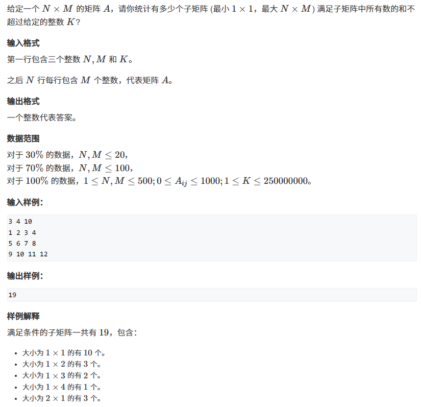
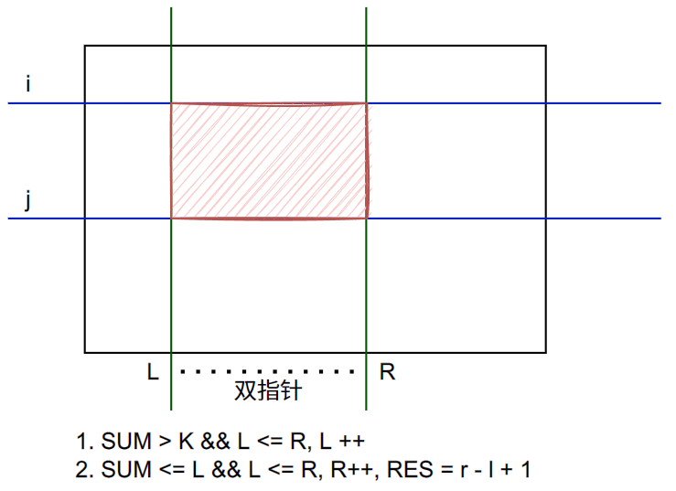
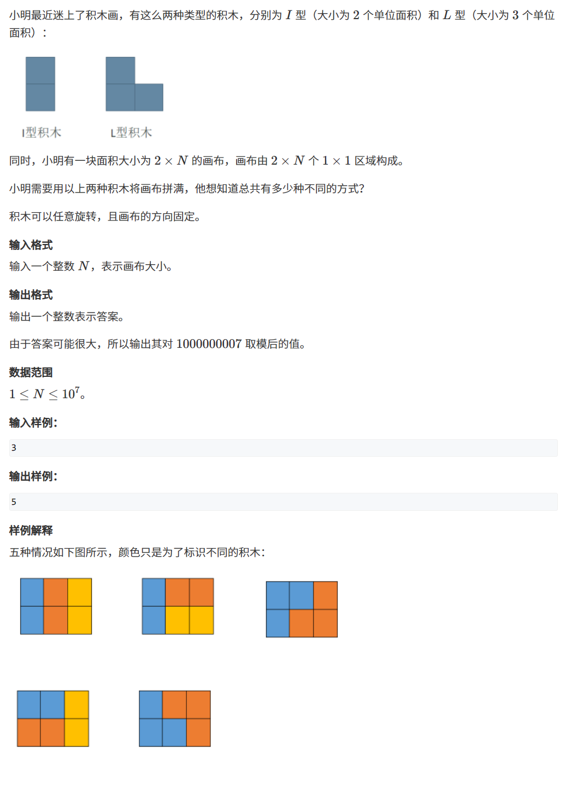
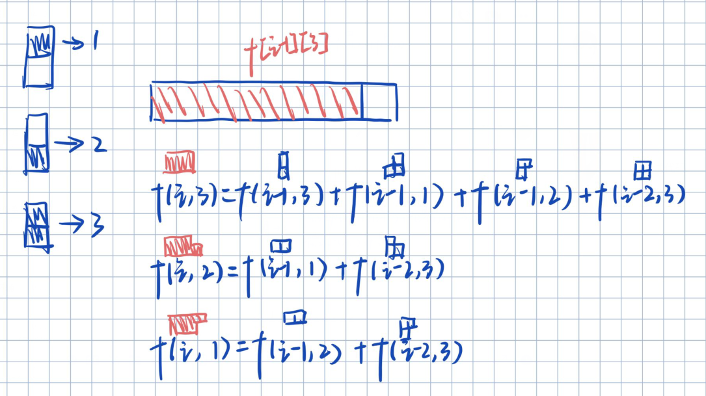

# 2022XX杯省赛

## [Acwing.4405.统计子矩阵](https://www.acwing.com/problem/content/4408/)



### 当时的想法

利用前缀和，然后四个`for`循环枚举四个点，如果满足条件则`res+1`。

### 利用双指针算法($n^3$)

用两个变量枚举上边界和下边界，然后用双指针枚举两个端点`L`和`R`。如果个时刻，`L`到`R`之间的矩阵满足$sum < k$ 的条件，则在该区间内一定有$r - l + 1$个子矩阵满足条件。




```cpp
#include <bits/stdc++.h>

using namespace std;
typedef long long LL;
const int N = 510;
int a[N][N], b[N][N];
int n, m, k;
LL res = 0;

int main() {
    cin >> n >> m >> k;
    for (int i = 1; i <= n; i ++) {
        for (int j = 1; j <= m; j ++) {
            cin >> a[i][j];
            b[i][j] = b[i-1][j] + b[i][j-1] - b[i-1][j-1] + a[i][j];
        }
    }
    for (int i = 1; i <= n; i ++)  {
        for (int j = i; j <= n; j ++) {
            for (int l = 1, r = 1; l <= m && r <= m; r ++) {
                while (l <= r && b[j][r] - b[i-1][r] - b[j][l-1] + b[i-1][l-1] > k) {
                    l ++;
                }
                if (l <= r) res += r - l + 1;
            }
        }
    }
    cout << res;
    
    return 0;
}
```

## [Acwing.4406.积木画](https://www.acwing.com/problem/content/4409/)



反正考蓝桥杯的时候各种蠢，赛后看了一眼题解自己就是活神仙。



```cpp
#include <bits/stdc++.h>

using namespace std;
typedef long long LL;
const int N = 10000010, MOD = 1000000007;

unsigned int f[N][4];

int main() {
    int n; cin >> n;
    f[1][3] = 1;
    f[2][1] = 1;
    f[2][2] = 1;
    f[2][3] = 2;
    for (int i = 3; i <= n; i ++) {
        f[i][3] = f[i-1][3] % MOD + f[i-1][1] % MOD + f[i-1][2] % MOD + f[i-2][3] % MOD;
        f[i][2] = f[i-1][1] % MOD + f[i-2][3] % MOD;
        f[i][1] = f[i-1][2] % MOD + f[i-2][3] % MOD;
    }
    cout << f[n][3] % MOD;
	
	return 0;
}
```