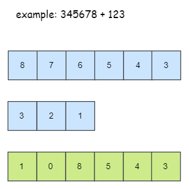

# 一些乱七八糟的东西

## 文件重定向输入到 stdin

```cpp
freopen("input.txt", "r", stdin);
cin >> // ......
```

## 普普通通的高精度

### 高精度加法（A + B）



```cpp
vector<int> add(vector<int> &A, vector<int> &B) {
    vector<int> C;
    int t = 0;
    for (int i = 0; i < A.size() || i < B.size(); ++ i) {
        if (i < A.size()) t += A[i];
        if (i < B.size()) t += B[i];
        C.push_back(t % 10);
        t = t / 10;
        
    }
    if (t) C.push_back(1);
    return C;
}
```

### 高精度减法（A - B）

```cpp
// A >= B = true
bool than(vector<int> &A, vector<int> &B) {
    if (A.size() != B.size()) {
        return A.size() > B.size();
    } else {
        for (int i = A.size() - 1; i >= 0; -- i) {
            if (A[i] != B[i]) {
                return A[i] > B[i];
            }
        }
        return true;
    }
}

vector<int> sub(vector<int> &A, vector<int> &B) {
    vector<int> C;
    int t = 0;
    
    for (int i = 0; i < A.size(); ++ i) {
        // 上一位的借位
        t = A[i] - t;
        if (i < B.size()) t = t - B[i];
        C.push_back((t + 10) % 10);
        // 告诉下一位，这一位是否有借位
        if (t < 0) t = 1;
        else t = 0;
    }
    
    // 去除前导0
    while (C.size() > 1 && C.back() == 0) {
        C.pop_back();
    }
    
    return C;
}
```

### 高精度乘法（A * b）

```cpp
vector<int> mul(vector<int> &A, int &b) {
    vector<int> C;
    int t = 0;
    for (int i = 0; i < A.size() || t; ++ i) {
        if (i < A.size()) t = t + A[i] * b;
        C.push_back(t % 10);
        t = t / 10;
    }
    while (C.size() > 1 && C.back() == 0) {
        C.pop_back();
    }
    return C;
}
```

### 高精度除法（A / b）

```cpp
// A / b = C ..... r
vector<int> div(vector<int> &A, int &b, int &r) {
    vector<int> C;
    r = 0;
    for (int i = A.size() - 1; i >= 0; -- i) {
        r = r * 10 + A[i];
        C.push_back(r / b);
        r = r % b;
    }
    reverse(C.begin(), C.end());
    while (C.size() > 1 && C.back() == 0) C.pop_back();
    return C;
}
```

## 利用结构体重载运算符和sort排序

[团体程序设计天梯赛-练习集-L2-027 名人堂与代金券 (25 分)](https://pintia.cn/problem-sets/994805046380707840/problems/994805055176163328)

“按总评成绩非升序输出进入名人堂的学生的名次、账号和成绩。需要注意的是：成绩相同的学生享有并列的排名，排名并列时，按账号的字母序升序输出。”

字符串大赛遇到这种问题，非常的简单。

```cpp
struct student {
    string email;
    int score;
    bool operator< (const student &S) const {
        if (score != S.score) return score > S.score;
        else return email < S.email; // string 可以比较
    }
}stu[N];

// ......

int main() {
    // ......
    sort(stu, stu + n); // 将结构体数组排序
    // ......
}
```

## 当需要读入一行字符串，但字符串中有空格时

```cpp
cin >> c >> n;
getchar(); // 消除上一行的换行符

string line;
for (int i = 0; i < n; ++ i) {
    getline(cin, line);
}
```

## 当需要输入一串下标从 1 开始的字符串

但是这样就不能使用上面那个 getline 的函数了

```cpp
char str[256];
cin >> str + 1;
```

## X 进制转换

* 二十六进制转换为十进制过程。

以 GWW 为例，则为 $G(6) \times 26^2 + W(22) \times 26^1 + W(22) \times 26^0 = 4650$

* 十进制转换为二十六进制过程

以 4650 为例，

$4650 / (26^2) = 6 ...... 594$

$594 / (26^1) = 22 ...... 22$

$22 / (26^0) = 0 ...... 22$

则结果为：（6 22 22）-> (GWW)

[团体程序设计天梯赛-练习集-L1-050 倒数第N个字符串 (15 分)](https://pintia.cn/problem-sets/994805046380707840/problems/994805080346181632)