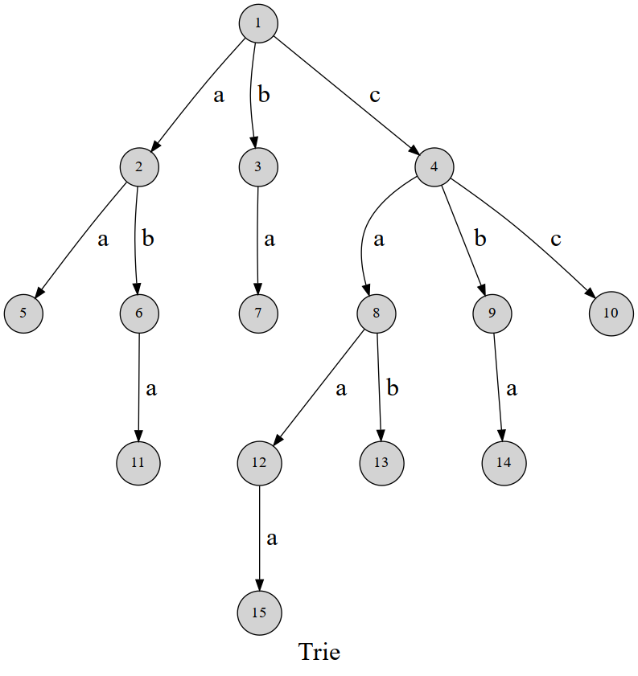

# 字典树（Trie）

大概是长这样的一颗树。

使用场景，当然这道题用 map 也可以：

(Trie字符串统计)[https://www.acwing.com/problem/content/description/837/]

这道题是把数字处理成了 31 深度的 trie 树。

(最大异或对)[https://www.acwing.com/problem/content/145/]