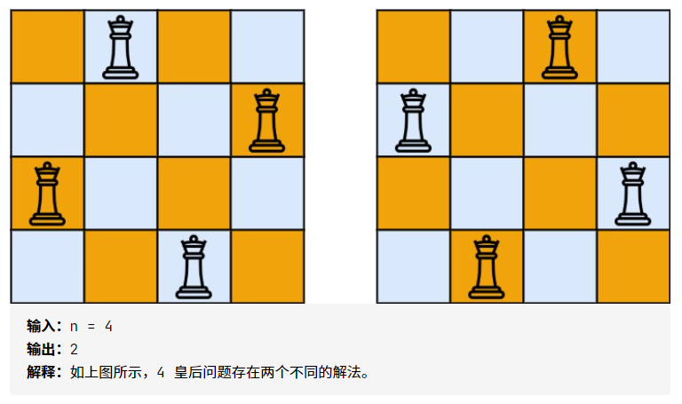

# 搜索与图论

## N皇后问题

:::tip 关于它
递归 + 回溯法
:::
[来源：力扣（LeetCode）](https://leetcode-cn.com/problems/n-queens-ii/)

n 皇后问题 研究的是如何将 `n` 个皇后放置在 `n×n` 的棋盘上，并且使皇后彼此之间不能相互攻击。

给你一个整数 `n` ，返回 `n` 皇后问题 不同的解决方案的数量。



### 思路

开三个数组代表列、对角线、斜对角线上是否能放置皇后。

```cpp
int col[N], xe[N], rxe[N];

// 
```

如果（2, 3）上放置了一个皇后，会导致

1. 这一列无法放置皇后 `col[2] = 1`（行也无法放置，搜索的过程中，若行放置了，这一行就不在考虑了，所以行不用记录）
2. 列与行的和为`2 + 3 = 5`的格子上无法放置皇后`xe[2 + 3] = 1`
3. 列与行的差为`2 + 3 = -1`的格子上无法放置皇后`rxe[2 - 3] = 1` （数组不能为负数，后面会处理）

```cpp
// now是正在搜索第几个皇后
void search(int now) {
    if (now == t + 1) {
        // 记录答案
        res ++; return;
    }
    for (int i = 1; i <= t; ++ i) {
        if (!col[i] && !xe[i + now] && !rxe[i - now + t]) {
            // 将对应的位置标记不可放置
            col[i] = xe[i + now] = rxe[i - now + t] = 1;
            search(now + 1);
            // 恢复状态
            col[i] = xe[i + now] = rxe[i - now + t] = 0;
        }
    }
}
```


## Floyd

:::tip 关于它
它用于求任意两点间的最短路，时间复杂度$O^3$
:::

###  问题

给定一个 $n$ 个点 $m$ 条边的有向图，图中可能存在重边和自环，边权可能为负数。

再给定 $k$ 个询问，每个询问包含两个整数 $x$ 和 $y$，表示查询从点 $x$ 到点 $y$ 的最短距离，如果路径不存在，则输出 impossible。

数据保证图中不存在负权回路。

### 思路

1. 算法主体

* 对于任意的两个点 $a$ 和 $b$，选择一个中间点 $c$
* 如果 $a$ 直接走到 $b$ 的距离，大于 $a$ 先到 $c$ 再到 $b$ 的距离，那么更新对应的邻接矩阵

2. 存储方式

图中有重边和自环，所以它是一个稠密图。稠密图推荐使用邻接矩阵来存储。

此时，这个稠密图中存着两顶点间的路径长，如果两顶点不存在边，那么将其设为无穷大。Floyb算法将会不断的更新这个邻接矩阵。

```cpp
int g[a][b] = c; // 记录着顶点a到顶点b的最短路径长c
```

### 代码 

ACWING OJ: [Floyd求最短路](https://www.acwing.com/problem/content/856/)


```cpp {10-20}
#include <iostream>

using namespace std;

const int N = 210, INF = 1e9;

int n, m, k;
int g[N][N];

void floyb() {
    // t是中间点，必须保证它在最外层循环
    for (int t = 1; t <= n; ++ t) {
        // 选择两个任意顶点，开始更新
        for (int i = 1; i <=n; ++ i) {
            for (int j = 1; j <= n; ++ j) {
                g[i][j] = min(g[i][j], g[i][t] + g[t][j]);
            }
        }
    }
}

int main (){
    cin >> n >> m >> k;
    for (int i = 1; i <= n; ++ i) {
        for (int j = 1; j <= n; ++ j) {
            // 初始化邻接矩阵
            if (i == j) g[i][j] = 0;
            else g[i][j] = INF;
        }
    }
    
    while (m --) {
        int a, b, w;
        cin >> a >> b >> w;
        // 如果存在重边，那么选择较短的那条
        g[a][b] = min(g[a][b], w);
    }
    
    floyb();
    
    while (k --) {
        int x, y;
        cin >> x >> y;
        // 注意！数据中有负权边，会导致最短路的值不一定是INF
        // 这里瞎处理一下
        if (g[x][y] > INF / 2) cout << "impossible" << endl;
        else cout << g[x][y] << endl;
    }
    
    return 0;
}
```

## Kruskal

:::tip 关于它
它用于求最小生成树的权值，时间复杂度$mlogm$
:::

###  问题

给定一个 $n$ 个点 $m$ 条边的无向图，图中可能存在重边和自环，边权可能为负数。

求最小生成树的树边权重之和，如果最小生成树不存在则输出 impossible。

给定一张边带权的无向图 $G=(V,E)$，其中 $V$ 表示图中点的集合，$E$ 表示图中边的集合，$n=|V|$，$m=|E|$。

由 $V$ 中的全部 $n$ 个顶点和 $E$ 中 $n−1$ 条边构成的无向连通子图被称为 $G$ 的一棵生成树，其中边的权值之和最小的生成树被称为无向图 $G$ 的最小生成树。求该最小生成树。

### 思路

1. 算法主体

* 将所有边从小到大排序
* 选取一条不在生成树中的最小边，如果加入到生成树导致生成树产生回路，则跳过。无回路产生则是生成树的一部分

2. 存储方式

首先因为需要将所有边的权值从小到大排序，那么需要设计一能排序的邻接表来存储。操作符`<`的重载将会在调用`sort`函数时体现。

```cpp
struct Edge {
    int a, b, w;
    bool operator< (const Edge &E) const{
        return w < E.w;
    }
}edges[N];
```

检查添加某条边后是否产生回路，需要使用并查集的方法。

```cpp
int father[s] = f; // 代表s点的父亲是f
int cnt; // 选取了多少条边加入到生成树中
int res; // 生成树边的权值之和
```

### 代码 

ACWING OJ: [Kruskal算法求最小生成树](https://www.acwing.com/problem/content/861/)

```cpp {15-17,35-45}
#include <iostream>
#include <cstring>
#include <algorithm>

using namespace std;

const int N = 200010;

int n, m;
int cnt, res;
int father[N];

struct Edge{
    int a, b, w;
    bool operator< (const Edge &E) const {
        return w < E.w;
    }
}edges[N];

/* 
    并查集模板
*/
int find(int x) {
    if (father[x] != x) father[x] = find(father[x]);
    return father[x];
}

int kruskal() {
    // 将邻接表从小到大排序
    sort(edges, edges + m);
    
    // 初始化并查集
    for (int i = 1; i <= n; ++ i) father[i] = i;
    
    //kruskal
    for (int i = 0; i < m; ++ i) {
        int a = edges[i].a, b = edges[i].b;
        a = find(a), b = find(b);
        // 如果他俩不在一个集合内
        if (a != b) {
            res += edges[i].w;
            cnt ++;
            father[a] = b;
        }
    }
    
    return res;
}

int main () {
    cin >> n >> m;
    for (int i = 0; i < m; ++ i) {
        int a, b, w;
        cin >> a >> b >> w;
        edges[i] = {a, b, w};
    }
    
    res = kruskal();
    // 如果选取的边少于n-1,那么这个图不连通
    if (cnt < n - 1) cout << "impossible" << endl;
    else cout << res << endl;
    
    return 0;
}
```


## Dijkstra 

:::tip 关于它
它用于求一个顶点到其余顶点的最短路径长，时间复杂度$O^2$
:::

### 问题

给定一个 $n$ 个点 $m$ 条边的有向图，图中可能存在重边和自环，所有边权均为正值。

请你求出 $1$ 号点到 $n$ 号点的最短距离，如果无法从 $1$ 号点走到 $n$ 号点，则输出 $-1$。

**输入格式**

第一行包含整数 $n$ 和 $m$。

接下来 $m$ 行每行包含三个整数 $x$,$y$,$z$，表示存在一条从点 $x$ 到点 $y$ 的有向边，边长为 $z$。

### 思路

1. 算法主体

* 每一次循环选择一个已经确定最短路的顶点作为更新点
* 从该顶点出发，更新它能走到的顶点的最短路径
* 该顶点更新结束后，选择在结束更新的顶点中选择最短的那个点作为下一个更新点，重复第二个步骤，直到所有顶点的最短路确定。

2. 存储方式

图中有重边和自环，所以它是一个稠密图。稠密图推荐使用邻接矩阵来存储。

为了存储顶点 $1$ 到其余顶点的最短路径长，可以一数组记录其到达某个顶点的最短路径长。

如果一个顶点确定了最短路，那么就不再考虑，设一标记数组，标记该顶点是否已经确定了最短路。

```cpp
int g[a][b] = c; // 记录着顶点a到顶点b的最短路径长c
int dist[x] = l; // 记录着顶点0到x的最短路径长l
int st[x] = 0 or 1; //记录这顶点x，是否已经确认了0到x的最短路
```

### 代码 

ACWING OJ: [Dijkstra求最短路 I](https://www.acwing.com/problem/content/description/851/)

```cpp {17-30}
#include <iostream>
#include <cstring>

using namespace std;

const int N = 510;
int g[N][N];
int dist[N];
int st[N];
int n, m;

void dijkstra() {
    memset(dist, 0x3f, sizeof dist); // 将最短路数组初始化为无穷大
    int now = 1; // 第一个顶点是1
    dist[now] = 0; // 它到自身的距离是0
    st[now] = 1; // 顶点1已经找到了最短路
    for (int i = 1; i <= n - 1; ++ i) { // n个点，只需要遍历n-1次
        // next是顶点now想要走去的点
        for (int next = 1; next <= n; ++ next) {
            dist[next] = min(dist[next], dist[now] + g[now][next]);
        }
        // 现在开始选取下一个更新点now
        now = -1;
        for (int j = 1; j <= n; ++ j) {
            if (st[j] == 0 && (now == -1 || dist[j] < dist[now])) {
                now = j;
            }
        }
        // 选中了更新点，那么这个点就确认了最短路
        st[now] = 1;
    }
}

int main (){
    cin >> n >> m;
    memset(g,0x3f,sizeof g); // 将临界矩阵初始化为无穷大
    for (int i = 1; i <=m; ++ i) {
        int a, b, l;
        cin >> a >> b >> l;
        // 如果出现重边，选择两条边最小的一个即可
        // 如果出现自环，可不做处理
        g[a][b] = min(g[a][b], l); 
    }
    dijkstra();
    // 如果顶点1到顶点n的距离是无穷大
    if (dist[n] == 0x3f3f3f3f) cout << "-1";
    else cout << dist[n];
    
    return 0;
}
```


## 待定