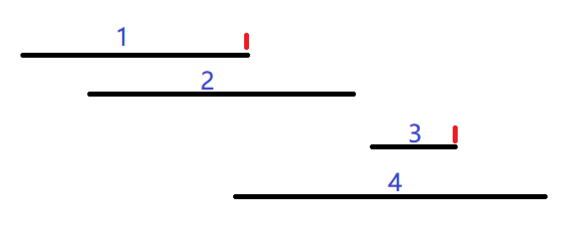

# 贪心

## 区间选点 

给定 $N$ 个闭区间 $[a_i,b_i]$，请你在数轴上选择尽量少的点，使得每个区间内至少包含一个选出的点。

输出选择的点的最小数量。

:::tip 提示
将区间右端点从小到大排序，选择的点必是某区间的右端点。

按排序好的顺序依次遍历每个区间，如果当前区间上没有选点，则将该区间的右端点作为一个点。
:::



-----

ACWING-OJ：[区间选点](https://www.acwing.com/problem/content/907/)

```cpp
#include <bits/stdc++.h>

using namespace std;

const int N = 1e5 + 10;

struct Range{
    int l, r;
    bool operator< (const Range &R) const {
        return r < R.r;
    } 
}R[N];

int main(){
    int n;
    cin >> n;
    for (int i = 0; i < n; ++ i) {
        int l, r;
        cin >> l >> r;
        R[i] = {l, r};
    }
    sort(R, R + n);
    
    int point = -1e9-10, res = 0;
    for (int i = 0; i < n; ++ i) {
        if (R[i].l > point) {
            point = R[i].r;
            res ++;
        }
    }
    cout << res << endl;
    
    return 0;
}
```

## 最大不相交区间数量

给定 $N$ 个闭区间 $[a_i,b_i]$，请你在数轴上选择若干区间，使得选中的区间之间互不相交（包括端点）。

输出可选取区间的最大数量。

:::tip 提示
贪心策略和[区间选点](#区间选点)完全一样，代码也是
:::

-----

ACWING-OJ：[最大不相交区间数量](https://www.acwing.com/problem/content/910/)

## 区间分组

给定 $N$ 个闭区间 $[a_i,b_i]$，请你将这些区间分成若干组，使得每组内部的区间两两之间（包括端点）没有交集，并使得组数尽可能小。

输出最小组数。

:::tip 提示
按区间左端点升序进行排序，初始化一个小根堆。

依次遍历每个区间，如果堆大小为0（没有选点），或堆顶元素（已经选择的区间最小的右端点）大于当前区间左端点（已经选择的区间不能与当前区间相容），那么将当前区间的右端点加入堆中（创建新的组）。

若不满足上述条件，证明其可相容，弹出堆顶元素将当前区间的右端点加入堆中（接上旧组）
:::

-----

ACWING-OJ：[区间分组](https://www.acwing.com/problem/content/908/)

```cpp
#include <bits/stdc++.h>

using namespace std;

const int N = 1e5+10;

struct Range{
    int l, r;
    bool operator< (const Range &R) const {
        return l < R.l;
    }
}R[N];

int n, l, r;

int main(){
    cin >> n;
    for (int i = 0; i < n; ++ i) {
        cin >> l >> r;
        R[i] = {l, r};
    }
    
    sort(R, R + n);
    
    priority_queue<int, vector<int>, greater<int> > heap;
    
    for (int i = 0; i < n; ++ i) {
        if (heap.size() == 0 || heap.top() >= R[i].l) heap.push(R[i].r);
        else {
            heap.pop();
            heap.push(R[i].r);
        }
    }
    
    cout << heap.size();
    
    
    return 0;
}
```