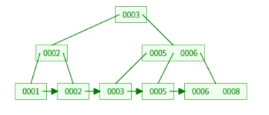
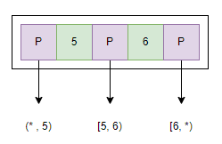

# B+树

## 大概是什么

B+树它包含根节点（root），内部节点（internal node）和叶子节点（leave node）。其中，根节点（root）只可能是叶子节点（leave node）或拥有多个子节点的内部节点（internal node）。

B+树的主要价值在于，面向块的存储中能进行高效的索引，特别是在文件系统中。不像二叉搜索树每个节点只有两个指针指向子节点，B+树每个节点都有很多指向子节点的指针，通常约为 100 甚至更多，这减少了在树中找到一个元素所需的 I/O 操作次数。（B+树中一般一个节点对应一个磁盘块）

B+树的 internal node 只存有某 key 指向相关子节点的指针，不存储 key 对应的 value 信息。如果一个节点为对应一个盘块，这些 internal node 就能存储足够多的指针，大大减少访问 internal node 的次数，使索引时减少 I/O 操作次数。（比B树好的地方）

## 要求

这里采取维基百科上所定义B+树

* root 的 key 最少可以只有一个。
* m 阶 B+树表示 internal node 最多有 m 个子树， 即 internal node 最多有 m-1 个 key。
* internal node 中的 key 都从递增排序，对于其中的每一个 key，左子树中所有 key 都小于它，右子树中所有 key 都大于它。
* 每个 leave node 都存有相邻 leave node 的指针，leave node 本身存储的记录也递增排序。

## 特性

* 所有 key 都存储在 leave node 中，leave node 按照 key 的递增序列，有序地连接在一起
* internal node 不存储记录，只用作索引，不可能在 非 leave node 命中
* internal node 相当于 leave node 的索引，leave node 相当于是存储 key 相关数据的数据层
* 更适合文件索引系统

## B+树的查找

在查询时，B+树会自顶向下逐层寻找，最终找到匹配的 leave node。

每一次通过 internal node 进行索引。如图，以第二层右边的节点为例，该 internal node 节点构成为（p 5 p 6 p），p 是指针。

* 如果要找的 key x < 5，则在 5 左边的 p
* 如果要找的 key 5 ≤ x < 6，则在 5 和 6 中间的 p
* 如果要找的 key 6 ≤ x，则在 6 右边的 p

如果进入下一次后还是 internal node，则继续进行刚才的寻址方式。直到进入 leave node。

进入 leave node 后，从 leave node 起始遍历到末尾，找得到对应 key 则匹配，反之匹配失败。

## B+树的插入

[https://www.youtube.com/watch?v=h6Mw7_S4ai0](https://www.youtube.com/watch?v=h6Mw7_S4ai0)

## B+树的删除

[https://www.youtube.com/watch?v=QrbaQDSuxIM](https://www.youtube.com/watch?v=QrbaQDSuxIM)