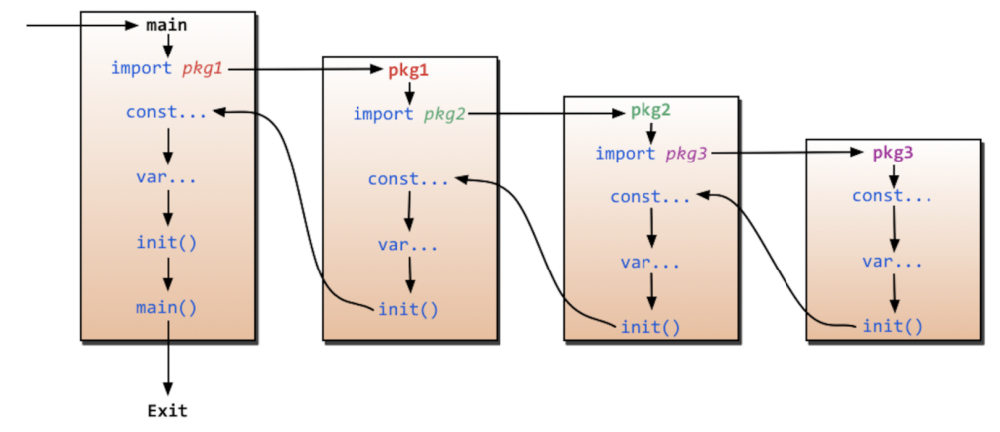
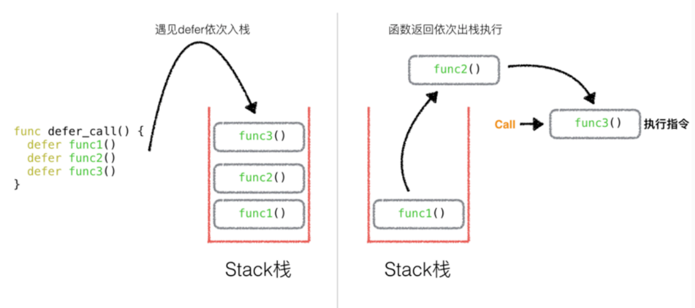

# 基础部分

## 变量的声明方式

```go
// 默认声明一个变量 默认值是0
var a int
// 声明并赋值
var a int = 100
// 让它自动推断
var a = 100
// 让人自动推断（注意，这种方式不支持声明全局变量）
a := 100
```

## 多行变量的声明

```go
var name, age = "Therainisme", 19

var (
    name = "Therainisme"
    age = 19
)
```

## 常量

```go
const a int = 10
const (
    a = 10
    b = 20
)
```

## iota

与`const`来表示枚举，可在`const()`内添加一个关键字，每行的`iota`都会累加`1`。第一行的默认值是`0`

```go
const (
    A = 10 * iota  // 0 
    B              // 10
    C              // 20
)
```

## 函数的多返回值

```go
// 多返回值，匿名的
func test(a int, b int) (int, int) {
    return 100, 200
}

// 多返回值，有名字的
func test(a int, b int) (x int, y int) {
    // 此时x与y的作用域在该函数内
    x = 100
    y = 200
    return
}
```

## init函数

如果使用`import`导包，就会经过如下流程




## import导包

```go
// 给fmt包起⼀个别名，匿名，⽆法使⽤当前包的⽅法，但是会执⾏当前的包内部的init()⽅法
import _ "fmt" 
// 给fmt包起⼀个别名，a
// 可以a.Println()来直接调⽤。
import a "fmt"  
// 将当前fmt包中的全部⽅法，导⼊到当前本包的作⽤中，
// fmt包中的全部的⽅法可以直接使⽤API来调⽤，不需要fmt.API来调⽤
import . “fmt”
```

## 指针

和C/C++是一样的

## defer

`defer`是在函数将要被销毁时调用，所以是先返回返回值，再执行`defer`语句



## 数组

长度不可变

```go
var array [4]int; 
array2 := [5]int{1, 2, 3, 4}

func getArray(a [4]int) {
    // 此时的a是值拷贝
}
```

## slice（可变数组）

```go
var array []int = make([]int, 3)
```

## 实现面向对象

### 继承

```go {13-19}
package main

import "fmt"

type Father struct {
	Name string
}
// 这里带*意味着传递过来的就是一个指针了
func (that *Father) Run() {
	fmt.Printf("Father <%s> running....\n", that.Name)
}

type Son struct {
	Father
}

func (that *Son) Run() {
	fmt.Printf("Son <%s> running....\n", that.Name)
}

func main() {
	var father Father = Father{"FFF"}
	var son Son
	son.Name = "SSS"
	father.Run()
	son.Run()
}

```

### 多态

```go
// 本质是一个指针
type Person interface {
	Run()
}

// 多态
var person Person = &father
person.Run()
person = &son
person.Run()
```

## 通⽤万能类型 & 类型推断

像Java的Object一样

`int`、`string`、`float32`、`float64`、`struct` .... 都实现了`interface{}`


```go
value, ok := arg(string)
if !ok {
    fmt.Println("it is not string type")
} else {
    // 是
}
```