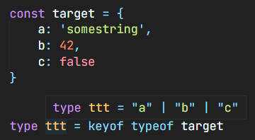

# 黑魔法心路历程

## Object.keys() 与 Object.values()

`Object.keys()`可以将对象的key值转化成数组取出，同理`Object.values()`是取值

```ts
const target = {
  a: 'somestring',
  b: 42,
  c: false
}

Object.keys(target)
// output: Array ["a", "b", "c"]
```

## typeof xxx

获取一个对象的类型，可以通过此种方式访问原型对象上的属性和方法（类方法）

```ts
typeof 123456 // -> number

class Hero {
    static namee = "AAA"
}

function getHeroClass() : typeof Hero {
    return Hero
}

getHeroClass().namee // -> "AAA"
```

它也可以和`keyof`用作类型体操



## Object.fromEntries

可以将一个二维数组转化成对象

```ts
const entries = new Map([
  ['foo', 'bar'],
  ['baz', 42]
]);

Object.fromEntries(entries); // -> Object { foo: "bar", baz: 42 }
```

## Record<K, T>

它可以用来声明一个对象，该对象的`Key`是`K`中的，`Values`是`T`中的。注意这里的`Keys`和`Values`是类型

```ts
type Keys = 'a' | 'b';
type Values = 'foo' | 'bar';

const obj: Record<Keys, Values> = {
    a: 'foo',
    b: 'bar',
}
```

## Parameters

获取泛型`T`的参数类型，例如下面的防抖`debounce`和节流`throttle`。

```ts
export function debounce<T extends (...args: any[]) => void>(func: T, dalay: number) {
    let timer: any = null
    return (...args: Parameters<T>): void => {
        if (!!timer) clearTimeout(timer)
        timer = setTimeout(() => {
            func(...args)
        }, dalay)
    }
}

export function throttle<T extends (...arg: any[]) => void>(func: T, interval: number) {
    let _args: any = null;
    let _timer: any = null;
    return (...args: Parameters<T>) => {
        _args = args;
        if (!_timer) {
            _timer = setTimeout(() => {
                func(..._args);
                _timer = null;
            }, interval);
        }
    }
}
```