# HTMLCSS

## 文字和图片在同一行对齐

```ts
<h1 className={css.h1}>
    
    {content}
</h1>
```

给图片加上 `vertical-align: middle;`



## 获取滚动条的位置

```ts
const scroll = window.pageYOffset || document.documentElement.scrollTop || document.body.scrollTop || 0
```

`window.pageYOffset`：设置或返回当前页面相对于窗口显示区左上角的 Y 位置

`window.pageXOffset`：设置或返回当前页面相对于窗口显示区左上角的 Y 位置

这些属性都是只读的。

-----

`documentElement` 对应的是html标签，而 `body` 对应的是 `body` 标签。

`document.documentElement.scrollTop`：获取的是页面滚动条的位置

`document.body.scrollTop`：在标准w3c下，它始终为0，需要用上面的这个去替代它