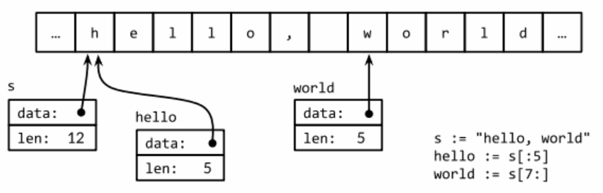
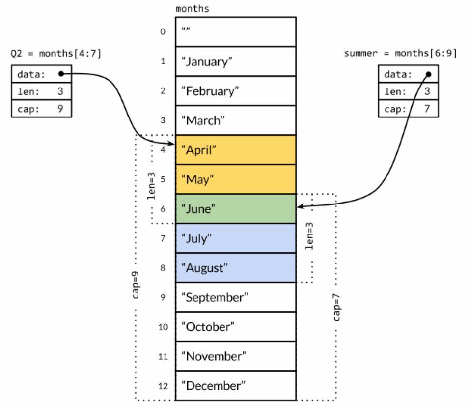

# 其他

### 变量

`struct{}` 和 `[]int` 类型的大小是 0，他们有可能有相同的地址

对于在**包一级声明的变量**来说，他们的声明周期和整个程序的运行周期是一致的。**局部变量**的声明周期是动态的，每次从创建一个新变量的声明语句开始，直到该变量不再被引用为止。然后局部变量的存储空间才可能被回收。函数的参数和返回值都是局部变量，它们在函数每次被调用的时候创建。

### GC

Go 语言的自动垃圾收集器基本实现思路：从每个包级的变量和每个当前运行函数的每一个局部变量开始，通过指针或引用的访问路径遍历，是否可以找到该变量。如果不存在这样的访问路径，说明变量不可达，代表它的存在不会影响程序后续的计算结果。编译器会自动选择在栈上还是在堆上分配局部变量的储存空间，而且不由 `var` 或 `new` 声明变量的方式决定。

虽然 Go 的垃圾回收机制不会回收不被使用的内存，但是这不包括操作系统层面的资源，比如打开文件、网络连接，因此必须显示的释放这些资源。

### 元组赋值

```go
a, b = b, a
```

在赋值之前，赋值语句右边的所有表达式将会先进行求值，然后再统一更新左边对应变量的值。

### 包的初始化

包的初始化首先是解决包级变量的依赖顺序，然后按照包级变量声明出现的顺序一次初始化

```go
var a = b + c // a 第三个初始化, 为 3
var b = f()   // b 第二个初始化, 为 2, 通过调用 f (依赖c)
var c = 1     // c 第一个初始化, 为 1

func f() int { return c + 1 }
```

如果包中含有多个.go源文件，它们将**按照发给编译器的顺序**进行初始化。Go语言的构建工具首先**会将.go文件根据文件名排序**然后**依次调用编译器编译**。

某些表格数据初始化并不是一个简单的赋值过程，在这种情况下，可以使用 init 初始化函数简化初始化工作，每个文件都可以包含多个 init 初始化函数。

```go
func init() { /* ... */}
func init() { /* ... */}
func init() { /* ... */}
```

每个包在解决依赖的前提下，以导入声明的顺序初始化，**每个包只会被初始化一次**。如果一个 b 包导入了 a，那么在 b 包初始化的时候可以认为 a 包必然已经初始化过了。初始化工作是自下而上进行的，main 包最后才被初始化。以这种方式，可以确保 main 函数执行之前，所有依赖的包都已经完成初始化的工作了。  

### 作用域

当编译器遇到一个名字引用时，它会对其定义进行查找，查找过程从最内层的词法域向全局的作用域进行。
* 如果查找失败，则报告“未声明的名字”这样的错误。
* 如果该名字在内部和外部的块分别声明过，则内部的块声明首先被找到。（在这种情况下，内部的声明屏蔽了外部的声明，让外部的声明无法被访问）

### 运算

在 Go 语言中，% 取模的运算符的符号**和被取模数的符号总是一致**的，因此 -5%3 和 -5%-3 结果都是 -2。

除法运算符 / 的结果依赖于操作数是否全为整数。5.0/4.0 的结果是 1.25，但是 5/4 的结果是 1。

运算的结果，如果需要更多 bit 位才能正确表示的话，就说明计算结果是移除了。超出的高位的bit位部分将被丢弃。如果原始的数值是有符号类型，而且最左边的bit位是1的话，那么最终结果可能是负的。

```go
var u uint8 = 255
println(u, u+1, u*u) // 255 0 1

var i int8 = 127
println(i, i+1, i*i) // 127 -128 1
```

### string

两个字符串 A 和 B 使用 + 号进行拼接，会返回一个新字符串 C。如果连接涉及的数据量很大，代价高昂。

:::tip
这里应该补充系统性的性能测评
:::

因为字符串是不可修改的，因此尝试修改字符串内部数据的操作也是被禁止的。

```go
s[0] = 'L' // compile error: cannot assign to s[0]
```

不变性意味着，如果两个字符串共享相同的底层数据的话也是安全的，这使得复制任何长度的字符串代价是低廉的。同样，一个字符串 `s` 和对应的子字符串切片 `s[7:]` 的操作可以安全地共享相同的内存，因此字符串切片的代价也是低廉的。在这两种情况下都没有必要分配新的内存。



一个字符串是包含只读字节的数据，一旦创建，是不可变的。相比之下，一个 []byte 的元素可以自由地修改，一般可以将 string 转成 []byte。

一个 `[]byte(s)` 转换是分配一个新的字节数组用于保存字符串数据的拷贝，然后引用这个底层的字节数组。

### 常量

常量表达式的值在编译期计算，而不是在运行期。常量的值不可修改，这样可以防止在运行期被恶意的修改。

所有常量的运算都可以在编译期完成，这样可以减少运行时的工作，也方便编译器优化。当操作数是常量时，一些运行时的错误也可以在编译时被发现，例如整数除零、字符串索引越界、任何导致无效浮点数的操作等。

许多常量没有一个明确的基础类型，编译器为这些没有明确基础类型的数组常量提供比基础类型更高精度的算数运算。例如。

```go
println(YiB/ZiB) // 1024
```

`YiB/ZiB` 的值已经超出任何Go语言中整数类型能表达的范围，但是它们依然是合法的常量。这个表达式在编译期计算出来的，并且结果常量是 1024。

### 数组

如果一个数组的元素类型是可比较的，那么数组类型也是可以相互比较的。

通过 `==` 运算符，只有当两个数组的所有元素都是相等的时候数组才是相等的。

```go
a := [2]int{1, 2}
b := [...]int{1, 2}
c := [2]int{1, 3}
fmt.Println(a == b, a == c, b == c) // "true false false"
d := [3]int{1, 2}
fmt.Println(a == d) // compile error: cannot compare [2]int == [3]int
```

当调用一个函数的时候，函数的每个调用参数将会被赋值给函数内部的参数变量，所以函数参数变量接收的是一个复制的副本，并不是原始调用的变量。

因为函数传递机制导致传递大的数组类型将是低效的，并且对数组参数的任何修改都是发生在复制的数组上。

```go
a := [...]int{1, 2, 3}
b := a // 此时修改 a 中的元素影响不到 b
```

### Slice

slice 是一个轻量级的数据结构，提供了访问数组子序列（或者全部）元素的功能，而且 slice 的底层确实引用一个数组对象。

slice 由三个部分组成，指针，长度和容量。
* 指针：指向第一个 slice 元素对应的底层数组元素的地址。（slice 的第一个元素并不一定就是数组的第一个元素）
* 长度：对应 slice 中元素的数目（长度不能超过容量）
* 容量：一般是从 slice 开始的位置到底层数组的结尾位置。

多个 slice 之间可以共享底层的数据，并且引用的数组部分区间可能重叠。



因为 slice 值包含指向第一个 slice 元素的指针，因此向函数传递 slice 将允许在函数内部修改底层数组的元素。换句话说，复制一个 slice 只是对底层的数组创建了一个新的 slice 别名。

和数组不同的是，slice 之间不能比较，因此我们**不能使用** `==` 操作符来判断两个 slice 是否含有全部相等元素。标准库提供了 `bytes.Equal` 函数来判断两个 `[]byte` 是否相等，而其他类型的 slice 只能字节展开比对每个元素了。

一个零值的 slice 等于 nil，一个 nil 值的 slice 并没有底层数组。一个 nil 值的 slice 长度和容量都是 0，但是也有非 nil 值的 slice 的长度和容量也是 0。

```go
var s []int    // len(s) == 0, s == nil
s = nil        // len(s) == 0, s == nil
s = []int(nil) // len(s) == 0, s == nil

s = []int{}    // len(s) == 0, s != nil
```

#### 和函数传参的一些坑

传参的时候传入的是指针的复制。

```go
func main() {
	var list []string = []string{"Happy"}
	test(list)
	println(list[0])
}

func test(funcList []string) {
	funcList[0] = "New Year"
}
```

但是这样不能在 `test` 函数中调用 `append` 函数向该 `slice` 追加元素。

```go
func main() {
	var list []string = []string{"Happy"}
	test(list)
	println(list[0])
}

func test(funcList []string) {
    // 如果这样追加了，在 main 函数中的可能依然是 ["Happy"]
    // 不能保证 append 过后 slice 底层数组与 main 函数中的是否一致
	funcList = append(funcList, "New Year")
}
```

### map

key 可以是任意类型，但其值必须能用 `==` 运算符比较。

如果查找失败将返回 value 类型对应的零值。

map 中的元素并不是一个变量，因此不能对 map 的元素进行取址操作：
```go
_ = &ages["bob"] // compile error: cannot take address of map element
```
禁止对 map 元素取址的原因是 map 可能随着元素数量的增长而重新分配更大的内存空间，从而可能导致之前的地址无效。

map 的迭代顺序并不确定，顺序随机。

map 上的大部分操作，包括查找、删除、len 和 range 循环都可以安全工作在 nil 值的 map 上，它们的行为和一个空的 map 类似。但是向一个 nil 值的 map 存入元素将导致一个 panic 异常。所以向 map 存数据前必须先创建 map。

如果元素类型是一个数字，你可能需要区分一个已经存在的 0，和不存在而返回零值的 0，可以像下面这样测试。
```go
if age, ok := ages["bob"]; !ok { /* ... */ }
```

和 slice 一样，map 之间也不能进行相等比较，唯一的例外是可以和 nil 进行比较。

### 结构体

一个命名为 S 的结构体类型将不能再包含 S 类型的成员，可以包含 `*S` 指针类型的成员。

如果结构体没有任何成员的话就是空结构体，写作 `struct{}`，它的大小为 0，不包含任何信息。有些Go语言程序员用 map 来模拟 set 数据结构时，用它来代替 map 中布尔类型的 value，强调 key 的重要性。

如果要在函数内部修改结构体成员的话，用指针传入是必须的。在Go语言中，所有函数的参数都是值拷贝传入，如果不使用指针，将会拷贝一个完全一样的结构体变量。

如果结构体的全部成员都是可以比较的，那么结构体也是可以比较的。可比较的结构体类型和其他可比较类型一样，可以用于 map 的 key 类型。

### 函数

函数的类型被称为函数的签名。如果两个函数形式参数列表和返回值列表中的变量类型一一对应，那么这两个函数被认为有相同的类型或签名。形参和返回值的变量名不影响函数签名，也不影响它们是否可以以省略参数类型的形式表示。

实参通过值的方式传递，因此函数的形参是实参**值的拷贝**。对形参进行修改不会影响实参。

### 错误处理策略

#### 传播错误

```go
resp, err := http.Get(url)
if err != nil {
    return nil, err
}
```

```go
doc, err := html.Parse(resp.Body)
resp.Body.Close()
if err != nil {
    return nil, fmt.Errorf("parsing %s as HTML: %v", url, err)
}
```

由于错误信息经常是以链式组合在一起的，所以错误信息中应避免大写和换行符。

以os包为例，os包确保文件操作（如os.Open、Read、Write、Close）返回的每个错误的描述不仅仅包含错误的原因（如无权限，文件目录不存在）也包含文件名，**这样调用者在构造新的错误信息时无需再添加这些信息**。

一般而言，被调用函数f(x)会将调用信息和参数信息作为发生错误时的上下文放在错误信息中并返回给调用者，**调用者需要添加一些错误信息中不包含的信息**，比如添加url到html.Parse返回的错误中。

#### 重试尝试失败的操作

如果错误的发生是偶然性的，或由不可预知的问题导致的。**一个明智的选择是重新尝试失败的操作**。在重试时，我们需要限制重试的时间间隔或重试的次数，**防止无限制的重试**。

```go
func WaitForServer(url string) error {
    const timeout = 1 * time.Minute
    deadline := time.Now().Add(timeout)

    for tries := 0; time.Now().Before(deadline); tries ++ {
        _, err := http.Head(url)
        if err == nil {
            return nil // success
        }

        log.Printf("server not responding (%s); retrying...", err)
        time.Sleep(time.Second << uint(tries))
    }

    return fmt.Errorf("server %s failed to respond after %s", url, timeout)
}
```

#### 错误发生导致无法运行

输出错误信息并结束程序。这种策略只应在 main 中执行，对库函数而言，应仅向上传播。

```go
if err := WaitForServer(url); err != nil {
    fmt.Fprintf(os.Stderr, "Site is down: %v\n", err)
    os.Exit(1)

    // or use log.Fatalf
    // log.Fatalf("Site is down: %v\n", err)
}
```

#### 只输出错误信息不中断程序

rt

#### 忽略错误

rt

### 函数

函数类型的零值是 nil，而且函数类型不可比较

#### 回调陷阱

```go
var rmdirs []func()
for _, dir := range tempDirs() {
    os.MkdirAll(dir, 0755)
    rmdirs = append(rmdirs, func() {
        os.RemoveAll(dir) // NOTE: incorrect!
    })
}
```

for 循环语句引入了新的词法块，循环变量 dir 在这个词法块中被声明。在该循环中生成的所有函数值都共享相同的循环变量。函数值中记录的是循环变量的内存地址，而不是循环变量某一时刻的值。后续的迭代会不断更新 dir 的值，当删除操作执行时，for 循环已完成，dir 中存储的值等于最后一次迭代的值。

#### 可变参数

和 JavaScript 稍微有点不同。

```go
func sum(vals ...int) int {
    total := 0
    for _, val := range vals {
        total += val
    }
    return total
}
```

```go
println(sum(1, 2, 3, 4)) // 10

values := []int{1, 2, 3, 4}
println(sum(values...))
```

虽然在 ...int 型参数行为看起来像切片类型，但实际上是不同的类型。

```go
func f(...int) {}
func g([]int) {}

println("%T\n", f) // "func(...int)"
println("%T\n", g) // "func([]int)"
```