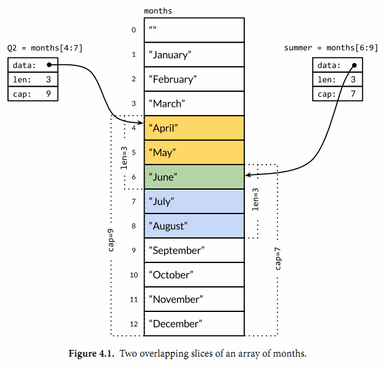

# 关于 slice

### 简单的切片之后的 len 和 cap



len 是能看到的元素，cap 是从能看到元素的第一个起到底层数组的末尾。

```go
func main() {
	months := []string{"", "January", "February", "March", "April", "May", "June",
		"July", "August", "September", "October", "November", "December"}

	Q2 := months[4:7]
	summer := months[6:9]

	fmt.Printf("Months: %v\n", months)
	fmt.Printf("len:%d, cap:%d\n", len(months), cap(months))
	fmt.Printf("-------------\n")

	fmt.Printf("Q2: %v\n", Q2)
	fmt.Printf("len:%d, cap:%d\n", len(Q2), cap(Q2))

	fmt.Printf("-------------\n")

	fmt.Printf("Summer: %v\n", summer)
	fmt.Printf("len:%d, cap:%d\n", len(summer), cap(summer))
}
```

```text
Months: [ January February March April May June July August September October November December]
len:13, cap:13
-------------
Q2: [April May June]
len:3, cap:9
-------------
Summer: [June July August]
len:3, cap:7
```

如果对 Q2 进行 append 操作，则会影响原 slice 的底层数组。

```go
func main() {
	months := []string{"", "January", "February", "March", "April", "May", "June",
		"July", "August", "September", "October", "November", "December"}

	Q2 := months[4:7]
	summer := months[6:9]

	Q2 = append(Q2, "XXXX", "XXXX") // 注意这里对 Q2 进行了修改
	fmt.Printf("Months: %v\n", months)
	fmt.Printf("len:%d, cap:%d\n", len(months), cap(months))
	fmt.Printf("-------------\n")

	fmt.Printf("Q2: %v\n", Q2)
	fmt.Printf("len:%d, cap:%d\n", len(Q2), cap(Q2))

	fmt.Printf("-------------\n")

	fmt.Printf("Summer: %v\n", summer)
	fmt.Printf("len:%d, cap:%d\n", len(summer), cap(summer))
}
```

```text
Months: [ January February March April May June XXXX XXXX September October November December]
len:13, cap:13
-------------
Q2: [April May June XXXX XXXX]
len:5, cap:9
-------------
Summer: [June XXXX XXXX]
len:3, cap:7
```

:::tip res
在 Q2 上进行 append，则只看 Q2。在 Q2 后面增加了两个 XXXX，但是底层数组并没有扩容。

也能很清晰的看到，Months 和 Summer 也受到了影响。
:::

### slice[]之后，对新的 slice 会不会影响旧的 slice

```go
func main() {
	a := []int{1, 2, 3, 4, 5}
	b := a[2:5]

	fmt.Printf("a: %v, cap: %d\n", a, cap(a))
	fmt.Printf("b: %v, cap: %d\n", b, cap(b))

	b = append(b, 6) // // 注意这里对 Q2 进行了 append

	fmt.Printf("after append ..... \n")
	fmt.Printf("a: %v, cap: %d\n", a, cap(a))
	fmt.Printf("b: %v, cap: %d\n", b, cap(b))
}
```

:::tip res
对 b 进行 append 超出了底层数组的上线，append 进行扩容，返回了一个新的底层数组，但是 a 并没有发生变换。
:::

### slice 如果使用过程中需要做频繁的扩容操作，建议变量声明时，指定其容量

避免在扩充过程中频繁的 resize 或 reallocation 操作。