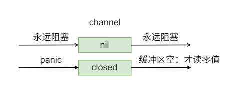

# 关于 channel

### 如果仅仅只是声明一个 channel，能不能直接用呢？

```go
func main() {
	var c chan int

    fmt.Printf("c: %v\n", c) // nil

	var wg sync.WaitGroup

	wg.Add(2)
	go func() {
		c <- 1
		wg.Done()
	}()

	go func() {
		<-c
		wg.Done()
	}()

	wg.Wait()
}
```

:::tip 提示
完全不可用，因为会死锁出现 panic。（对 channel 的操作阻塞了，channel 为 nil）
:::

### 对一个 close 的 channel 进行操作

