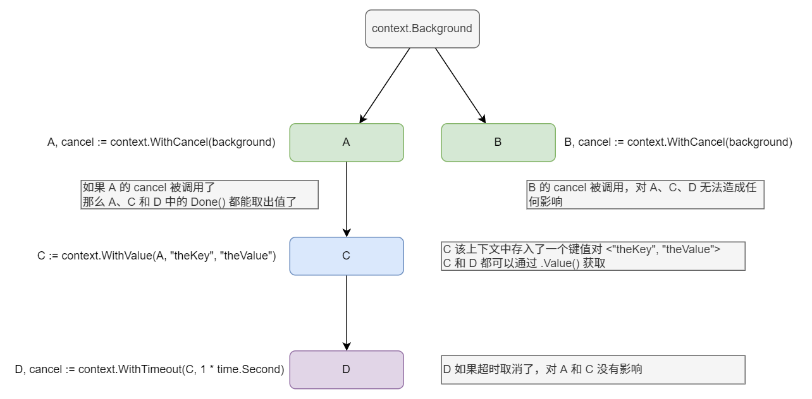

# Context

## Context 存在的意义

使用 `sync.WaitGroup` 和 `channel` 就可以实现 Go 中大部分的并发操作。

如果主协程启动了多个子协程，需要等待所有子协程的运行结束，`WaitGroup` 非常适用于这类场景。

```go
var wg sync.WaitGroup

func runTask(id int) {
	time.Sleep(time.Duration(id))
	fmt.Printf("Task %d Done\n", id)
	wg.Done()
}

func main() {
	for i := 1; i <= 3; i++ {
		wg.Add(1)
		go runTask(i)
	}
	wg.Wait()
	fmt.Printf("All task done")
}
```

还有一种情况，主协程需要主动通知子协程结束。

如下代码中，创建了一个全局无缓冲管道变量。在子协程中用 `for` 和 `select` 监听，如果 `stop` 中能取出值，那么就退出该子协程。

```go {5-7}
var stop chan bool

func runTask(name string) {
	for {
		select {
		case <-stop:
			fmt.Println("stop", name)
			return
		default:
			fmt.Println(name, "running...")
			time.Sleep(1 * time.Second)
		}
	}
}

func main() {
	stop = make(chan bool)

	go runTask("task 1")

	time.Sleep(3 * time.Second)
	stop <- true
	time.Sleep(3 * time.Second)
}
```

一个子协程的代码比较简单易读。如果子协程中又创建了新的协程。就像细胞分裂一样，主协程需要主动的去停止后续创建的子协程，又需要创建许多类似 `stop` 的管道。试想项目负责到一定程度，协程的父子关系链就像一个树一样，这种方法显然会让代码更加复杂。

Context 存在的意义便是解决这类问题
* 通知子协程退出（正常退出、超时退出）
* 向子协程传递简单信息

## context.WithCancel

使用 Context 将刚刚的代码改写，注意代码中强调的部分。

`context.withCancel` 以 `context.Backgroud()` 为父 `Context`，创建了一个能调用 `cancel` 函数的上下文 `ctx`。

如果该 `ctx` 的 `cancel` 函数被调用，那么以该 `ctx` 为父 `Context` 的 `Context` 都将一同收到停止的消息。（即`.Done()` 调用有返回）

如果 `ctx.Done()` 能取出值，说明该 `Context` 的上级已经主动或被动的调用了 `cancel` 函数。

```go {4-6,15,17-19,22}
func runTask(ctx context.Context, name string) {
	for {
		select {
		case <-ctx.Done():
			fmt.Println("stop", name)
			return
		default:
			fmt.Println(name, "running...")
			time.Sleep(1 * time.Second)
		}
	}
}

func main() {
	ctx, cancel := context.WithCancel(context.Background())

	go runTask(ctx, "task 1")
	go runTask(ctx, "task 2")
	go runTask(ctx, "task 3")

	time.Sleep(3 * time.Second)
	cancel()
	time.Sleep(3 * time.Second)
}
```

## context.WithValue

创建一个包裹了值的 `Context`，并且这个 `Value` 在子 `Context` 也能被取出。

包裹过程：

```go
ctx, cancel := context.WithCancel(context.Background())
valueCtx := context.WithValue(ctx, "theKey", "theValue")
```

取值过程：

```go
fmt.Println(valueCtx.Value("theKey"))
```

## context.WithTimeout

创建一个拥有计时器的 `Context`，在 `Context` 创建后设置的时间内没有主动 `cancel`，该 `Context` 在计数器结束后自动 `cancel`。例如下面的例子中设置了 `1s`。

```go
ctx, cancel := context.WithTimeout(context.Background(), 1*time.Second)
```

## context.WithDeadline

创建一个拥有截至时间的 `Context`，类似 `context.WithTimeout`，它也会自动关闭，只不过第二个参数中传入的是截至时间。如果到了截至时间没有 `cancel`，该 `Context` 会自动调用 `cancel`。

```go
ctx, cancel := context.WithDeadline(context.Background(), time.Now().Add(1*time.Second))
```

## 图例



## Context 接口

```go
type Context interface {
	Deadline() (deadline time.Time, ok bool)
	Done() <-chan struct{}
	Err() error
	Value(key interface{}) interface{}
}
```

`Context` 接口包含四个方法：

* `Deadline()` 返回的是当前 `Context` 生命周期的截止时间。
* `Done()` 返回的是一个只读的 `channel`，如果能从这个 `channel` 中读到任何值，则表明 `context` 的 `cancel` 已被调用。
* `Err` 如果 `Done` 返回的 `channel` 没有关闭，将返回 `nil`; 如果 `Done` 返回的 `channel` 已经关闭，将返回非空的值表示任务结束的原因。
* `Value` 返回 `context` 存储的键值对中当前 `key` 对应的值，如果没有对应的 `key`,则返回 `nil`。
