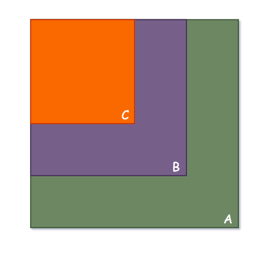
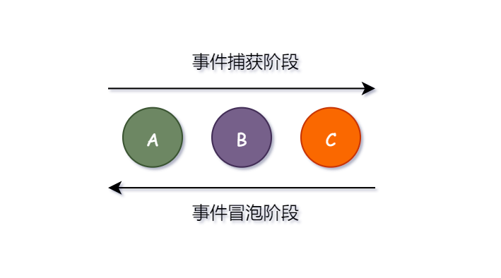

# JavaScript 事件

## 普通事件被覆盖的解决方法

比如说一个按钮，如果需要用 `onclick` 的方式给它添加一个点击事件之后再添加另外一个点击事件，前者会被后者覆盖。

```js
const btn = document.getElementById("btn");

btn.onclick = function() {
    alert("first click");
}
btn.onclick = function() {
    alert("second click"); // 最终点击后只会触发这个
}
```

用 `addEventListener()` 可以给单个按钮添加多个事件。下面那个例子两个匿名回调函数都会触发。

```js
const btn = document.getElementById("btn");

btn.addEventListener("click", function() {
    alert("first click");  // 触发
});
btn.addEventListener("click", function() {
    alert("second click"); // 触发
});
```

## 移除事件的方式

下面的例子分别对应了上述的两种方法。

```js
btn.onclick = null;
```

```js
function handleOnClick() {
    alert("first click");
}

btn.addEventListener("click", handleOnClick);    // 添加
btn.removeEventListener("click", handleOnClick); // 移除
```

## 事件冒泡

事件的触发一般实在冒泡的时候触发。

事件会从子组件冒泡到父组件。如图，当最里边的元素 C 被点击时，事件会从最里边的元素开始向父元素传播。（父元素 `A -> B -> C` 子元素）。如果给它们分别绑定上点击事件的话（点击事件是打印自己的字母），控制台会按顺序打印 `C` `B` `A`。



## 事件捕获

`addEventListener` 的第三个参数，如果为 `true`，上图的打印顺序会颠倒，为 `A` `B` `C`。

```js
btn.addEventListener("click", handleOnClick, true); // 事件会在捕获的时候触发
```



## 阻止事件冒泡

超级简单。

```js
btn.onclick = function(event) {
    event.stopPropapation();
}
```

## 事件委托

例如我现在有一个列表的元素需要有一个点击删除的功能。（点击哪个元素删除哪个元素）

```html
<ul>
    <li>A</li>
    <li>B</li>
    <li>C</li>
</ul>
```

如果用一个循环分别给每个元素添加删除事件的话，会很丑陋。

```js
let ul = document.querySelector("ul");
let li = document.querySelectorAll("li");

for (let i = 0; i < li.length; ++ i) {
    li[i].onclick = function() {
        ul.removeChild(this); // this 是被挂载事件的元素
    }
}
```

如果知道在事件的回调函数中，`this` 是挂载事件的元素，`event.target` 是被点击的元素，就知道怎么用事件委托来做删除了。

```js
let ul = document.querySelector("ul");
ul.onclick = function (event) {
    ul.removeChild(event.target); // event.target 是被点击事件的元素
}
```

把子级的元素委托给父级来处理，这一概念叫事件捕获。