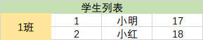

# 表格与表单

没想到我居然连原生的这两个玩意都没写过

## table

```html
<table>
    <!-- 表头部分 -->
    <thead>
        <th>序号</th>
        <th>姓名</th>
        <th>年龄</th>
    </thead>

    <!-- 表体部分 -->
    <tbody>
        <!-- 一行（row） -->
        <tr>
            <td>1</td>
            <td>小明</td>
            <td>17</td>
        </tr>
         <!-- 一行（row） -->
        <tr>
            <td>2</td>
            <td>小红</td>
            <td>18</td>
        </tr>
    </tbody>
</table>
```

如果想合并单元格，列合并或行合并

```html
<table>
    <tr>
        <td colspan="4">学生列表</td>
    </tr>
    <tr>
        <td rowspan="2">一班</td>
        <td>1</td>
        <td>小明</td>
        <td>17</td>
    </tr>
    <tr>
        <td>2</td>
        <td>小红</td>
        <td>18</td>
    </tr>
</table>
```

实现的效果就是那么个样子，“学生列表”占 4 列，“一班”占 2 行。



## form

```html
<form>
    <!-- for + id 可用于点击 label标签后仍是聚焦到 input 框 -->
    <label for="username">用户名</label>
    <input id="username" type="text" placeholder="用户名" />

    <label for="password">密码</label>
    <input id="password" type="password" placeholder="密码" />

    <!-- radio 为单选框，相同 name 的只能选一个 -->
    <label>男</label>
    <input name="sex" type="radio"/>
    <label>女</label>
    <input name="sex" type="radio"/>

    <!-- 下拉选择框 -->
    <select name="" id="">
        <option value="">男</option>
        <option value="">女</option>
    </select>

    <!-- checkbox 为复选框 -->
    <input type="checkbox"/> 
    <input type="checkbox"/> 

    <!-- 点击可以提交表单的按钮 -->
    <input type="submit" value="提交"/>
    <!-- 普通的按钮 -->
    <input type="button" value="按钮"/>
</form>
```