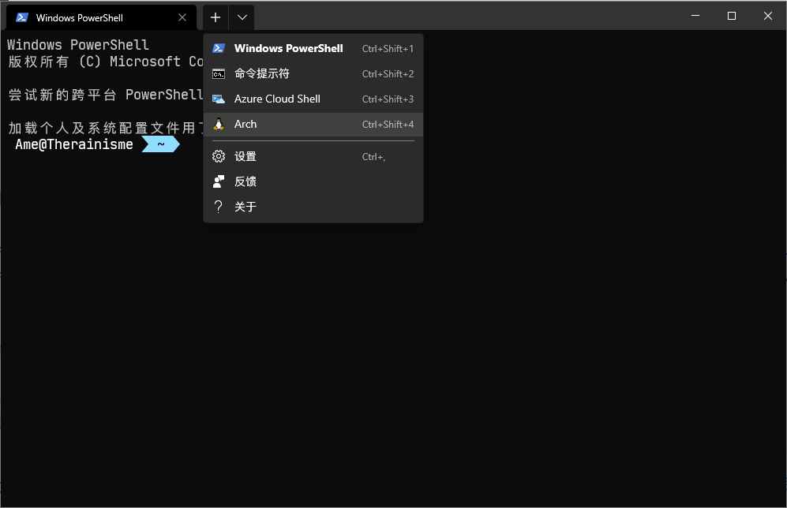

# Arch-WSL2

## 创建环境

### 预先事项

WSL 2 要求系统版本应该在 Windows 10, Version 2004, Build 19041 及以上。

以管理员身份打开 powershell，运行如下命令以启动需要的组件：

```powershell
dism.exe /online /enable-feature /featurename:Microsoft-Windows-Subsystem-Linux /all /norestart
dism.exe /online /enable-feature /featurename:VirtualMachinePlatform /all /norestart
```

然后重启。并且在 此处 下载并安装适用于 x64 计算机的最新 WSL2 Linux 内核更新包。

打开 powershell，运行如下命令以将 wsl 的默认版本设置为 WSL 2：

```powershell
wsl --set-default-version 2
```

### 安装 Windows Terminal

在微软的应用商店安装就行了。

### 安装 Arch WSL

在[yuk7/ArchWSL - releases](https://github.com/yuk7/ArchWSL/releases/tag/21.7.16.0)下载Arch.zip，解压，双击 Arch.exe 进行安装。

如果你解压到哪，那么Arch就会安装到哪。

### 安装完后就可以通过Windows Terminal启动Arch了。



### 换源更新

以下部分都以 root 用户身份运行命令。

```shell
passwd # 设置密码
# 设置软件源
echo 'Server = https://mirrors.neusoft.edu.cn/archlinux/$repo/os/$arch' > /etc/pacman.d/mirrorlist
# 初始化 keyring
pacman-key --init
pacman-key --populate
pacman -Syu # 更新
```

### 启用 multilib 库

Arch Linux 有些软件是 32 位的，我们需要开启 multilib 才可以安装。

`nano /etc/pacman.conf`，取消这几行的注释：

```ini
[multilib]
Include = /etc/pacman.d/mirrorlist
```

并且取消该文件中`#Color`这一行的注释，以启用彩色输出。

### 添加 archlinuxcn 源

Arch Linux 中文社区仓库 是由 Arch Linux 中文社区驱动的非官方用户仓库。包含中文用户常用软件、工具、字体/美化包等。

`nano /etc/pacman.conf`，在文件末尾加上：

```ini
[archlinuxcn]
Server = https://mirrors.aliyun.com/archlinuxcn/$arch
```

然后

```shell
pacman -Syy
pacman -S archlinuxcn-keyring
```

### 创建用户

注：此处的 yourname 是你要创建的用户名

```shell
# 新建用户。-m 为用户创建家目录；-G wheel 将用户添加到 wheel 用户组
useradd -m -G wheel yourname
# 设置密码
passwd yourname
```

将以下两行行首的`#`去掉。

```shell
# %wheel ALL=(ALL) ALL
# %wheel ALL=(ALL) NOPASSWD: ALL
```

在 powershell 中进入到 Arch.exe 所在文件夹，设置 WSL 默认登陆用户和默认的 WSL：

```powershell
.\Arch.exe config --default-user yourname
wsl -s Arch
```

重新打开，就是在 yourname 用户了。

## 开始安装必用软件

### 安装 zsh

给 windows 安装以下字体，并且改变 windows terminal 的字体设置（百度吧，推荐 JetBrians Mono NF相关的）

安装 zsh 并且将其设置为默认 shell

```shell
sudo pacman -S --needed zsh
chsh -s /bin/zsh # 改变当前用户的默认shell
touch ~/.zshrc # 创建zsh默认配置文件
# 在yourname用户创建软链接，让root用户也使用yourname用户的.zshrc
# 我觉得这样比较方便
sudo ln -s ~/.zshrc /root/.zshrc
```

### 使用 proxychains 代理终端程序

可以使用 windows 的 qv2ray 代理软件来代理 wsl 中的程序！先安装 proxychains：

```powershell
sudo pacman -S --needed proxychains-ng
```

首先，`sudo nano /etc/proxychains.conf`，将`proxy_dns`这一行注释。（这样能够让 proxychains 代理 yay）

如果用的是 WSL 2，由于目前 WSL 2 和 windows 的 ip 不同，我们需要先`cp -f /etc/proxychains.conf ~/.proxychains.conf`，然后在`~/.zshrc`中添加以下内容：

```bash
# 获取windows的ip
export WIN_IP=`cat /etc/resolv.conf | grep nameserver | awk '{print $2}'`
# 删除 ~/.proxychains.conf 中 [ProxyList] 所在行到文件末尾的全部内容
sed -i '/\[ProxyList\]/,$d' ~/.proxychains.conf
# 往文件末尾添加socks5设置，这个 7890 是我的 qv②ray 的 socks5 端口号，改成你自己的
echo '[ProxyList]\nsocks5 '${WIN_IP}' 7890' >> ~/.proxychains.conf
# 设置别名；使用 ~/.proxychains.conf 作为proxychains的配置文件；让proxychains quiet（不输出一大串东西）
alias pc='proxychains4 -q -f ~/.proxychains.conf'
# 用来手动开关代理，建议走 http 协议，因为 wget 不支持 socks5
my_proxy=http://${WIN_IP}:7891
alias p-on='export all_proxy='${my_proxy}' http_proxy='${my_proxy}' https_proxy='${my_proxy}''
alias p-off='unset all_proxy http_proxy https_proxy'
```

然后，在yournane用户中：

```shell
sudo ln -s ~/.proxychains.conf /root/.proxychains.conf
source ~/.zshrc
```

接下来的的命令如果想走代理，只需要加上前缀`pc`即可。

### 安装yay

```shell
sudo pacman -S --needed base-devel
```

出现`:: fakeroot is in IgnorePkg/IgnoreGroup. Install anyway? [Y/n]`，选 n，接下来一直回车即可。

```shell
sudo pacman -S --needed yay
# yay 换源
yay --aururl "https://aur.tuna.tsinghua.edu.cn" --save
```

### 安装 antigen

使用 antigen 管理 zsh 的插件：

```shell
sudo pcaman -S antigen
```

往`~/.zshrc`中添加如下内容，以启用历史命令、按键绑定、命令补全、语法高亮、agnoster 主题

```shell
# 初始化 antigen
source /usr/share/zsh/share/antigen.zsh
# Load the oh-my-zsh's library
# oh-my-zsh 会启用历史命令、按键绑定等功能
antigen use oh-my-zsh
# 启用一些 bundle
antigen bundle zsh-users/zsh-syntax-highlighting
antigen bundle zsh-users/zsh-autosuggestions
antigen bundle zsh-users/zsh-completions
# Load the theme
antigen theme agnoster
# Tell antigen that you're done
antigen apply
```

然后`pc zsh`，antigen 就会给你安装插件

::: warning 关于zsh-autosuggestions插件导致粘贴内容很慢的问题
在`.zshrc`文件中配置以下内容:

```shell
# This speeds up pasting w/ autosuggest
# https://github.com/zsh-users/zsh-autosuggestions/issues/238
pasteinit() {
  OLD_SELF_INSERT=${${(s.:.)widgets[self-insert]}[2,3]}
  zle -N self-insert url-quote-magic # I wonder if you'd need `.url-quote-magic`?
}
 
pastefinish() {
  zle -N self-insert $OLD_SELF_INSERT
}
zstyle :bracketed-paste-magic paste-init pasteinit
zstyle :bracketed-paste-magic paste-finish pastefinish
```

:::