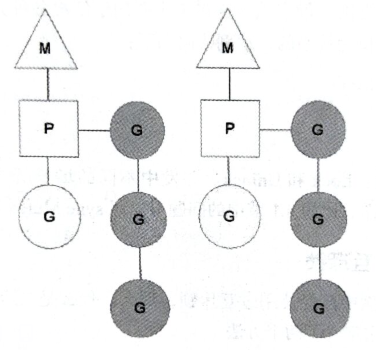

# Go 并发编程

## 数据竞态

数据竞态一般发生在多个 goroutine 并发读写同一个变量时。

```go
func main() {
    fmt.Printf(getNumber())
}

func getNumber() int {
    var i int
    go func() {
        i = 5;
    }()

    return i;
}
```

如果执行上面的代码，打印出来的结果很可能不是 5，而是 0。这取决与执行 return 语句的时候 goroutine 有没有执行完成。

有三种避免数据竞态的方式。

第一种方案是不修改变量。这种解决方案只有极少数场景可行，比如数据库连接。

第二种方案是避免多个 goroutine 读取一个变量。这种方案的思路是只让一个 goroutine 访问需要的变量。比如：

```go
// 用于读写 i 当前的值
var realNum = make(chan int)

// 设置增减额
var delta = mak(chan int) 

func SetNumber(n int) {
    realNum <- n
}

func ChangeByDelta(d int) {
    delta <- d
}

//读取现在的 i 值
func GetNumber() int {
    return <- realNum
}

func monitor() {
    // 局部变量 i 只在一个 goroutine 内
    var i int
    for {
        select {
            // 调用了 SetNumber，则改变 i 的值
            case i = <- realNum:

            // 调用了 ChangeByDelta，则改变 i 的值
            case d := <- delta:
                i += d;

            // 如果没有操作，填充 channel，供给 GetNumber 调用
            case realNum <- i;
        }
    }
}

func init() {
    go monitor();
}
```

:::tip 提示
Go 的多线程模式倡导：不要通过共享内存进行通信，而是要通过通信来共享内存
:::

这样虽然看上去每个变量都只有一个 goroutine，但这个 goroutine 要存在于整个项目的生命周期，这是非常麻烦的。可以将方法进行改变一下，借助 channel 把共享变量的地址从一个方法传递到下一步的方法上，让整个变量编程串行来使用。

```go
type Meat struct {
    status string
}

func cook(balls chan<- *Meat) {
    for {
        ball := new(Meat)
        ball.status = "meat ball"
        balls <- ball
    }
}

func server(service chan<- *Meat, balls <-chan *Meat) {
    for ball := range balls{
        ball.status = "server ball"
        service <- ball
    }
}
```

第三种避免数据竞态的方式是传统的互斥访问方式，也属于共享内存式并发编程。

## 并发原理（MPG）

除 Go 外，大多数主流语言使用的都是内存共享式的并发模式。（通过并发的方式使用相同的内存区域）。

Go 语言也支持内存共享的并发方式，但这不是它倡导的。在 Go 并发编程中，应该优先使用通信顺序进程方式（CSP，Communicating Sequential Process）。它是通过 goroutine 和 channel 实现的。goroutine 可以理解为协程，是 Go 语言中并发编程必须使用的基本单位。goroutine 彼此之间可以通过 channel 进行数据传递。

仅有 goroutine 和 channel 不够灵活。当逻辑比较复杂，仅有他俩代码会非常啰嗦。鉴于此，Go 提供了 select 关键字。select 语句可以高效地等待事件，从几个满足条件的 case 中均匀、随机地算则一个，并在没有满足条件的情况下继续等待

goroutine 的运行机制是基于 M:N 的调度方式。有 M 个 Go 运行时绿色线程映射到 N 个操作系统线程。而 goroutine 运行在绿色线程之上。若 goroutine 数量超过绿色线程数，调度程序会行使调度作用，确保部分 goroutine 阻塞且让之间处于等待状态的程序运行。如此反复、充分利用，这便是 Go 的 MPG 模型。

- M：Machine，一个 M 关联一个内核线程
- P：Processer，用户代码逻辑之上的处理器，是 M 和 G 调度所需要的上下文，P 的数量由 GOMAXPROCS 决定。（通常来说是 CPU 的核心数）
- G：goroutine，运行在运行时绿色线程之上的轻量级线程（协程）



上图展示了两个系统线程（M），每个 M 对应一个内核线程，同时每一个 M 还会连接一个 P 作为上下文，这个 P 是逻辑上的处理器，P 上面可以运行一个或多个 goroutine。P 就是前面说的运行时绿色线程，作为内核线程的 M 是不能直接运行 goroutine 的，必须要先有上下文。

P 的数量由启动时环境变量 GOMAXPROCS 的值决定。通常情况下，此数量在程序运行期间不会改变。比如四核的处理器上就有四个运行时绿色线程运行 Go 代码。

运行的 goroutine 是左侧的 M、P、G。而右侧带底纹的 G 代表在等候状态的 goroutine。处于等待状态的 goroutine 排成了一个队列。

:::tip 为什么一定需要 P 呢，让 goroutine 直接运行在 M 上不可以吗？
如果 goroutine 直接挂载在 M 上，就会严重依赖于 M。一旦某个 M 阻塞，就很可能导致许多 goroutine 阻塞。而如果有了 P 这一层，即便有个 M 阻塞，只要有其他 M 可以运行，那么 P 就可以带着上下文信息便利地在 M 上开始运行。
:::

P 在运行的过程中还起着负载均衡的作用，一旦自己的 goroutine 队列运行完毕，还回去找其他 P 的队列，会从其他队列分一部分过来。

## sync 包

### sync.Mutex 互斥锁

sync.Mutex 锁只能加锁一次，想要再次加锁则要等待开锁以后。

### sync.RWMutex 多读写锁

- 一次只能有一个 goroutine 获取写锁
- 可以有多个 goroutine 同时获取读锁
- 读锁和写锁是互斥的

### sync.Once 

sync.Once 提供了延迟初始化的功能。

```go
type Once struct {
    m Mutex
    done uint32
}

func (o *Once) Do(f func())
```

结构体内的 done 用来记录执行次数，用 m 来保证同时一刻只有一个 goroutine 在执行 Do 方法。在使用该结构体时先定义 Once 型变量，然后通过定义的变量 Do 方法传入函数，以此作为参数。即便是多次调用 `once.Do(f)`，f 也仅仅执行一次。

Once 解决 Mutex 和 RWMutex 不方便解决的问题。如果每次都用 Mutex 去判断变量是否已经初始化，那么会让所有的 goroutine 在这一步都是互斥的，而且永远要进行这个操作。

例如下面这个例子，虽然启动了 10 个 goroutine，但是执行完成会发现 onlyOnce 函数仅打印一次。（就算传入不同的函数，onlyOnce 也仅会执行第一个函数）

```go
func main() {
    var wg sync.WaitGroup
    var once sync.Once
    for i := 0; i < 10; i ++ {
        wg.Add(1)
        go func() {
            defer wg.Done()
            once.Do(onlyOnce)
        }()
    }
    wg.Wait()
}

func onlyOnce() {
    fmt.Println("only once")
}
```

### sync.Cond

Cond 是条件变量，其作用是通过某个条件控制多个 goroutine。如果满足条件 goroutine 可以继续向下执行；如果不满足条件，goroutine 则会进入等待状态。

Cond 内部维护了一个 notifyList，一旦 goroutine 不满足条件，就会进入 notifyList 并进入等待队列。即使后续条件满足，也需要其他的程序通过 `Broadcast()` 或者 `Signal()` 来唤醒 notifyList 内的 goroutine。

```go
type Cond struct {
    noCopy noCopy
    L Locker             // 用来读写 Cond 时加锁
    notify notifyList    // 通知列表
    checker copyChecker
}

func NewCond(l Locker) *Cond
func (c *Cond) Broadcast()
func (c *Cond) Signal()
func (c *Cond) Wait()
```

- Broadcast 方法用户**向所有等待的** goroutine 发送通知——通知条件已经满足
- Signal 方法用于唤醒一个最先挂起的 goroutine
- Wait 让该 goroutine 挂起

:::tip 注意
在进行条件判断时，必须使用互斥锁保证条件判断的安全，这也是 Cond 结构体中有一个 Locker 类型的 L 变量的原因
:::

sync.Cond 食用方式如下：

```go
c.L.Lock()
for !condition {
    c.Wait()
}
... 对于 condition 的条件
c.L.Unlock()
```

这里使用的是 for 循环，而不是 if，不会导致 Cond 一直处于加锁状态。这与 Wait 方法的实现方式有关。

```go
func (c *Cond) Wait() {
    c.checker.check()
    t := runtime_notifyListAdd(&c.notify) // 获取 notifyList
    c.L.Unlock()
    runtime_notifyListWait(&c.notify, t) // 进入等待模式
    c.L.Lock()
}
```

可以看到，Wait 方法内会自动解锁，并且进入等待模式。这时其他 goroutine 可以加锁，然后进行条件判断，如果不满足条件则也会进入等待模式。在进入等待模式后，Wait 方法不会执行最后一行的 `c.L.Lock()`，除非方法外部使用 Broadcast 或者 Signal 方法唤醒所有等待的 goroutine。之后所有的 goroutine 会被唤醒，开始去执行最后一行的加锁动作，加锁以后要重新回到 for 循环去执行条件判断。**如果满足条件就跳过循环继续往下执行，不满足条件又会进入等待状态**。所以此处必须使用 for 循环。

### sync.Pool

Go 支持垃圾自动回收，对于一些暂时用不到但后续后用到的对象，为了提供性能，可以先暂存起来。虽然这样会占用一些内存，但是比起销毁了再新建，要节省运行时间。（典型的以空间换时间）

sync.Pool 是一个对象池，它是并发安全的，大小可伸缩的，仅受限于内存。当需要使用对象时可以从对象池中直接取出使用。

:::tip 注意
存入 sync.Pool 的对象可能会在不通知的情况下被释放，比如一些 socket 长连接就不适合存入 sync.Pool 内。
:::

sync.Pool 的结构体和方法：

```go
type Pool struct {
    noCopy noCopy
    local unsafe.Pointer   // 本地缓冲池指针，每个处理器分配一个
    localSize uintptr      // 数组大小
    
    New func() interface{} // 缓冲池中没有对象时，调用此方法构造一个
}

func (p *Pool) Get() interface{}
func (p *Pool) Put(interface{})
```

Get 和 Put 是 Pool 的两个公共方法，Put 方法是向池中添加对象，Get 方法是从池中获取对象。（Get 方法会把返回的对象从池子里面删除。所以用完了的对象，还是得重新放回池子）如果没有对象则调用 New 方法创建，如果没有设置 New 则返回 nil。

Pool 在运行时会为每个操作 Pool 的 goroutine 所关联的 P 都创建一个本地池。在执行 Get 方法的时候，会先从本地池获取，如果本地池没有则从其他 P 的本地池获取。这种特性让 Pool 的存储压力基于 P 进行了分摊。

下面是一个 sync.Pool 的示例代码：

```go
var byteSlicePool = sync.Pool{
	New: func() interface{} {
		b := make([]byte, 1024)
		return &b
	},
}

func main() {
	t1 := time.Now().Unix()

	// 不使用 Pool
	for i := 0; i < 10000000000; i++ {
		bytes := make([]byte, 1024)
		_ = bytes
	}

	t2 := time.Now().Unix()

	// 使用 Pool
	for i := 0; i < 10000000000; i++ {
		bytes := byteSlicePool.Get().(*[]byte)
		_ = bytes
		byteSlicePool.Put(bytes)
	}

	t3 := time.Now().Unix()
	fmt.Printf("不使用 Pool:%d s\n", t2-t1)
	fmt.Printf("使用 Pool:%d s\n", t3-t2)
}
```

### sync.Map

Go 自带的 map 类型是并发读安全，但并发写不安全的。如果自己实现一个 RWMutex 锁的 map 类型，在大并发的情况下会有性能问题，相当于串行写。

sync.Map 提供的常用五个方法

- Load(key interface{}) (value interface{}, ok bool)：通过参数 key 查询对应的 value，如果不存在则返回 nil，ok 表示是否找到对应的值。
- Store(key, value interface{})：更新或新增，参数是键值对
- LoadOrStore(key, value interface{}) (actual interface{}, loaded bool)：参数是一个键值对，如果 key 对应的 value 找到了直接返回，loaded 为 true，如果没找到则修改，loaded 为 false。
- Delete(key interface{})：通过 key 删除键值对
- Range(f func(key, value interface{}) bool)：遍历 sync.Map 的元素，sync.Map 单独的 Range 方法

### Context

略 [Golang——Context](/docs/golang/Context)