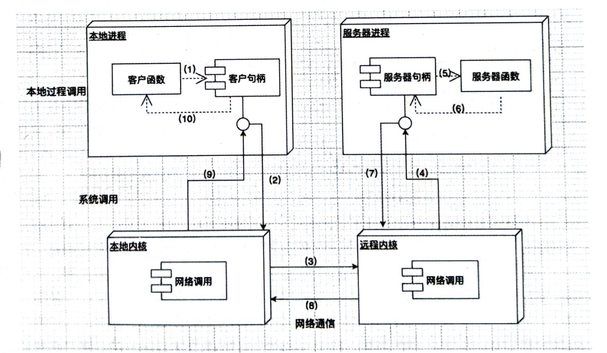
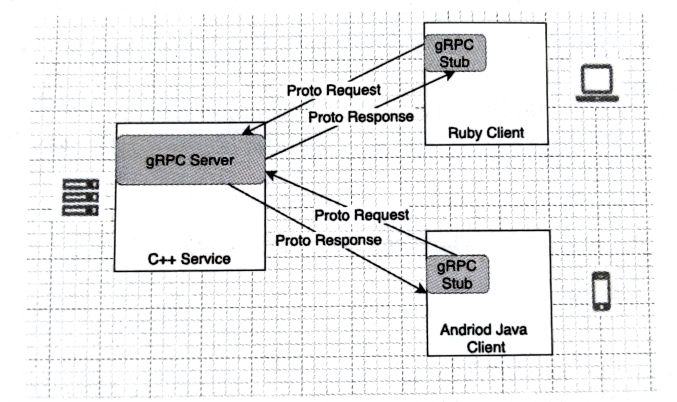
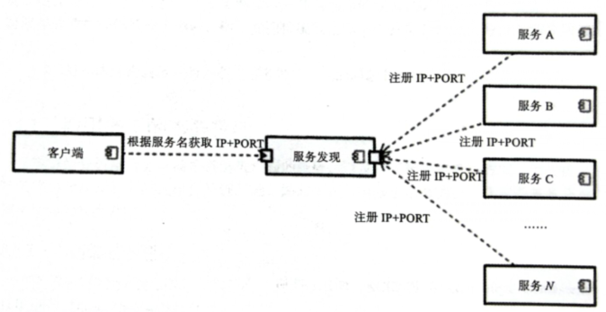

# 2 微服务中的进程间通信

进程间通信（Inter-Process Coummunication，IPC）主要是为了满足跨服务器的调用。

## 2.1 微服务中的进程间通信概述

可以选择基于同步通信的通信机制：HTTP REST。

也可以选择基于异步通信的方式，Go 提供了 net/rpc 包以支持异步。此外在数据的交互上，可以使用基于文本的 JSON 或 XML，也可以选择基于二进制的 gRPC。

## 2.1.1 交互模式

第一个维度是从客户端与服务端的交互方式来划分：
- 一对一：客户端的一个请求对应服务端的一个请求
- 一对多：客户端的一个请求，需要服务端的多个请求

第二个维度是从同步/异步模式的角度来划分：
- 同步模式：发起请求后等待被请求服务的处理结果，直到获取结果后再进行下一步。
- 异步模式：发起请求后不会等待处理结果再进行其他操作，而是直接进行其他操作。
- 并行模式：多数情况下服务都是串行调用的：A 调用服务 1，服务 1 又调用服务 2，形成了 A->1->2的形式。但有时候 A 需要同时调用 1 和 2 得到一个返回，这就是并行。

服务端在收到请求后，经过业务处理、消息编码等操作，最终序列化后的结果一般都是放在中间消息队列中。不管客户端采用何种方式（同步/异步），只要服务端处理完消息没有等待就放入消息队列里，就认为服务端是同步模式。

刚刚说的是进程间的交互模式，不是整个框架的交互模式。不要把框架提供的异步认为是服务的异步，服务是天生同步的。在调用方式上又可以分为：
- 单向通知：请求方向服务方发送请求到服务端，但是不关心返回
- 请求 - 响应：请求方向服务方发起请求，然后请求方的线程一直等待服务方的返回。（这种方式在 Go 语言中比较常见）
- 请求 - 响应- 异步通知：请求发起后，服务端立即响应，但结果是通过异步通知的方式告知请求方的。（比如缴费充值接口）

## 2.1.2 API 定义

如果使用 HTTP1.X 协议，性能就非常容易形成问题。由于 HTTP1.X 使用的是同步阻塞模式，一个访问一个线程。如果内部的进程间通信非常频繁，使用这种方式再性能上不够优秀。

如果一定要使用 Restful API 作为 IPC 选择，应该使用 HTTP2.0，优点如下：
- 支持双向流
- 可实现消息头压缩
- 单 TCP 的多路复用
- 服务端的推送

## 2.2 protobuf 格式

在 Go 语言的微服务世界中，protobuf 使用得更为广泛。

### 2.2.1 protobuf 介绍

它是一种平台无关、语言无关、可拓展序列化结构的数据格式，非常适合作为数据存储和不同语言之间相互通信的数据交换格式。在项目中，工程师只需要编写一个协议格式文件，该 proto 文件将被编译成不同的语言版本假如到各自的工程中去。这样不同的语言就可以解析其他语言通过 protobuf 序列化的数据了。

相比其他数据交互格式，它有如下优点：
- 序列化后体积比 JSON、XML 还小，便于网络传输
- 支持跨平台、跨语言
- 有很好的”向后“兼容性
- 序列化和反序列化速度快，高于JSON的处理速度

### 2.2.2 protobuf 的使用

安装

```shell
go get github.com/golnag/protobuf/proto           # protobuf 文件库
go get github.com/golnag/protobuf/protoc-gen-go   # 插件
```

定义一个拓展名为 .proto 的文件，里面定义交互数据的格式。该文件经过编译以后，会自动生成一个 Go 语言的 .go 文件。

```proto
syntax = "proto3";
package protocol;

enum FOO
{
    X = 0;
}

// message 是固定关键字，UserInfo 是自定义类名
message UserInfo {
    string message = 1;
    int32 length = 2;
}
```

该文件 Go 语言无法直接调用，需要进行编译。在该文件的同路径下，执行：

```shell
protoc --go_out=. *.proto
```

然后就可以看到同路径下生成了一个新的文件 test.pb.go，它可以直接使用 Go 语言调用。

## 2.3 gRPC 包

### 2.3.1 net/rpc 包

远程过程调用协议（Remote Producedure Call Protocol，RPC），是一种协议。通过网络从远程计算机程序上请求服务，而不需要了解底层网络技术的协议。它使用的协议多为网络层协议 TCP，减少了信息的包装，加快了处理速度。RPC 流程图如下。



1. 调用客户端句柄，执行转递参数
2. 调用本地系统内湖发送网络消息
3. 消息传送到远程服务器
4. 服务器句柄获取消息并得到参数
5. 执行远程函数
6. 执行的函数结构将返回服务器举报
7. 服务器句柄返回结果，调用远程系统内核
8. 消息传回本地主机
9. 本地系统内核获取消息并传给客户句柄
10. 客户端接收句柄返回的数据

- client.go

```go
func main() {
	client, err := rpc.Dial("tcp", ":13133")
	if err != nil {
		log.Fatal(err)
	}

	in := bufio.NewReader(os.Stdin)
	for {
		line, _, err := in.ReadLine()
		if err != nil {
			log.Fatal(err)
		}
		var reply bool
		err = client.Call("Listener.GetLine", line, &reply)
		if err != nil {
			log.Fatal(err)
		}
	}
}
```

- server.go

```go
type Listener int

func (l *Listener) GetLine(line []byte, ack *bool) error {
	fmt.Println(string(line))
	return nil
}

func main() {
	addy, err := net.ResolveTCPAddr("tcp", "0.0.0.0:13133")
	if err != nil {
		log.Fatal(err)
	}

	inbound, err := net.ListenTCP("tcp", addy)
	if err != nil {
		log.Fatal(err)
	}

	listener := new(Listener)
	rpc.Register(listener)
	rpc.Accept(inbound)
}
```

### 2.3.2 gRPC

在 gRPC 里，客户端可以像调用本地对象一样直接调用另一台服务器应用的方法。他的基本运行模式是跨平台、跨语言并且效率非常高的 RPC 方式。

定义一个服务，指定其能够被远程调用的方法（包含参数和返回类型）。在服务端实现这个接口，并运行一个 gRPC 服务器来处理客户端调用。

在客户端拥有一个类似服务端的句柄方法。gRPC 客户端和服务端可以在多种环境中运行和交互——从 Google 内部的服务器到用户自己的笔记本，而且可以用 gRPC 支持的任何语言来编写。

gRPC 默认使用 protobuf。下面的例子中，用 proto files 创建 gRPC 服务，用 protobuf 消息类型来定义方法参数和返回类型。



### 2.3.3 Go 使用 gRPC

这里只做简单的介绍。

- 安装

```shell
go get google.golang.org/grpc
```

- hello.proto

```proto
syntax = "proto3";
package protocol;


// path 表示生成的go文件的存放地址，会自动生成目录的。
// name 表示生成的go文件所属的包名
option go_package="./;pt";

service HelloServer {
    // 接口 1
    rpc SayHello(HelloRequest) returns (HelloReplay) {}

    // 接口 2
    rpc GetHelloMsg(HelloRequest) returns (HelloMessage) {}
}

message HelloRequest {
    string name = 1;
}

message HelloReplay {
    string message = 1;
}

message HelloMessage {
    string msg = 1;
}
```

- 编译，得到 hello.pb.go

```shell
protoc --go_out=plugins=grpc:./* .proto
```

- server.go

```go
const (
	post = "127.0.0.1:18887"
)

// 对象要和 proto 内定义的服务一样
type server struct{}

// 实现 RPC SayHello 接口
func (s *server) SayHello(ctx context.Context, in *pt.HelloRequest) (*pt.HelloReplay, error) {
	return &pt.HelloReplay{Message: "Hello " + in.Name}, nil
}

// 实现 RPC GetHelloMsg 接口
func (s *server) GetHelloMsg(ctx context.Context, in *pt.HelloRequest) (*pt.HelloMessage, error) {
	return &pt.HelloMessage{Msg: "this is from server!"}, nil
}

func main() {
	// 监听网络
	in, err := net.Listen("tcp", post)
	if err != nil {
		fmt.Println("网络异常", err)
	}

	// 创建一个 gRPC 句柄
	srv := grpc.NewServer()

	// 将 server 结构体注册到 gRPC 服务中
	pt.RegisterHelloServerServer(srv, &server{})
	// 监听 gRPC 服务
	err = srv.Serve(in)
	if err != nil {
		fmt.Println("网络启动异常", err)
	}
}
```

- client.go

```go
const (
	post = "127.0.0.1:18887"
)

func main() {
	conn, err := grpc.Dial(post, grpc.WithInsecure())
	if err != nil {
		fmt.Println("连接服务器失败", err)
	}
	defer conn.Close()

	// 获得 gRPC 句柄
	c := pt.NewHelloServerClient(conn)

	// 远程调用 SayHello 方法
	r1, err := c.SayHello(context.Background(), &pt.HelloRequest{Name: "Scott"})
	if err != nil {
		fmt.Println("远程调用 SayHello 方法失败", err)
		return
	}
	fmt.Println("HelloServer resp: ", r1.Message)

	// 远程调用 GetHelloMsg 方法
	r2, err := c.GetHelloMsg(context.Background(), &pt.HelloRequest{})
	if err != nil {
		fmt.Println("远程调用 GetHelloMsg 方法失败", err)
		return
	}
	fmt.Println("HelloServer resp: ", r2.Msg)
}
```

### 2.3.4 微服务发现 Consul

实例项目上微服务有多个，而且一般运行在多个不同的服务器或容器上。服务器和容器的 IP 地址往往是动态的。随着代码的升级、集群的重启，IP 地址都会变化。

当一个项目有非常多的服务时，就需要一种自动化的方式帮助发现服务。Go 语言的微服务，实现服务发现最有名的工具是 Consul。它具备以下特性：
- 服务发现：Consul 通过 DNS 或者 HTTP 接口使服务注册和服务发现变得更容易，一些外部服务（例如 Sass 提供的）也可以注册
- 健康检测：使 Consul 可以快速地预警集群中的失败操作并与服务发现集成，防止服务转发到发生故障的服务上面
- 键/值存储：用来存储动态配置的系统，提供简单的 HTTP 接口，可以在任何地方操作
- 多数据中心：无须复杂的配置即可支持任意数量的区域

有了服务发现模块，微服务的调用变得更加简单。

从 A 到 N 的服务都注册在服务发现模块内，在 Consul 内就是以 K-V 形式存储的，K 一般是服务的名字，V 就是 IP 地址和 Port。这样一方面方便了服务的查找，另一方面 Consul 还可以起到健康检查的作用，避免客户端调用阻塞。



:::tip 注意
在服务发现模块内，容错处理是非常重要的设计策略。
:::

