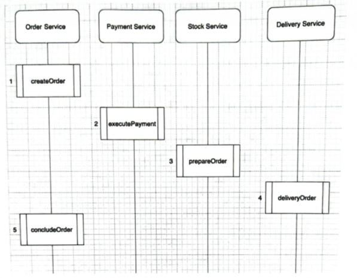
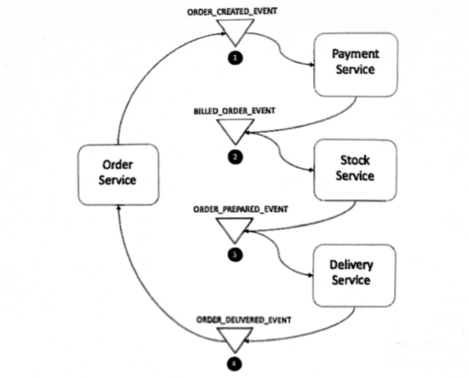
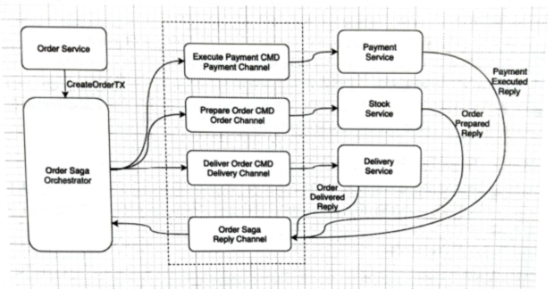

# 3 微服务中的分布式事务管理

每个服务都应该拥有自己的独立数据库，并且数据库彼此之间不能相互操作，要影响非本服务数据库的数据就必须通过其他服务。所以不能像传统数据库一样直接在一个事务内对多个数据进行操作。

## 3.1 微服务下的事务管理

### 3.1.1 面临的难题

传统数据库有四个原则：

- Atomicity：原子性表面数据库修改必须遵守“全部或全无”规则，每个事务都被称为“原子的”。如果事务的一部分失败，则整个事务都会失败。
- Consistency：一致性规定仅将有效数据写入数据库。如果由于某种原因执行的事务违反了数据库的一致性规则，将回滚整个事务，并将数据库恢复到与那些规则一致的状态。如果事务成功执行，它将使数据库从规则一致的一种状态转移到也与规则一致的另一种状态。
- Isolation：隔离要求同时发生的多个事务不影响彼此的执行。隔离属性不确保哪个事务先执行，只是确保事物之间不会相互干扰。
- Durability：持久性确保了提交给数据库的任何事物都不会消失。可通过使用数据库备份和事务日志来确保持久性，即使后来发生任何软件或硬件的故障，这些日志也有助于恢复已提交的事务。

不过非常遗憾，这些特征都只有在一个数据库内并且允许跨表操作时才可以满足。

对于微服务开发，强烈建议开发人员用单一存储库原则（SRP），意味着每个微服务都要维护自己的数据库，并且任何服务都不应该直接访问其他服务的数据库。没有直接简单的方法来跨多个数据库维护 ACID 原则。

### 3.1.2 SRP 的折衷

折衷方案一般是把所有微服务要用到的表放在一个数据库内，这些表使用对应的前缀或后缀进行区分，但是表与表之间不允许有任何的主外键关系。

这样就可以把事务从微服务里面提取出来，在调用几个微服务以后再根据是否报错统一进行 commmit 或者 rollback。

这种方式仍然不允许跨数据库表的直接调用，只能通过服务在同一个库内的不同表之间进行数据的操作。因为底层是一个数据库，所以继续使用 ACID 特征成为可能。

但这种折衷方案仅仅适用于项目开始阶段作为过渡方案。一旦请求数增大，外部请求和服务之间的内部请求会压在一个数据库上，会给网络和数据库服务器造成很大的压力。这时可以考虑数据的复制，把一个库复制到多个节点，但这优惠牵扯出另一个问题，最终的数据一致性问题。

## 3.2 微服务中处理事务的几种方式

### 3.2.1 避免跨微服务的事务

在设计程序时应该避免跨微服务的事务作为一个重要的要素处理，在不影响其他要素的情况下，尽可能减少跨微服务的事务。

当然，不可能没有跨微服务的事务，因为那样又回到了单体应用。

### 3.2.2 基于 XA 协议的两阶段提交协议

两阶段提交协议（Tow-Phase Commit Protocol）是非常成熟和传统的解决分布式事务的方案。

假如你要在明天中午组织一次团队聚餐，按照两阶段协议应该这么做。

- 第一阶段：你作为“协调者”，给 A 和 B（参与者、节点）发出邮件邀请，告知明天中午聚餐的具体时间和地址。
- 第二阶段：如果 A 和 B 都回复确认参加，那么聚餐如期举行。如果 A 或者 B 其中一人回答说：”无法参加“，你需要立即通知另一位同时明天聚餐无法举行。

但是它也有弊端。如果 A 和 B 都没有看邮件，你是不是要一直等呢？如果 A 早早确认了，推掉了其他安排，而 B 却在很晚才恢复不能参加，这该怎么做？所以后来业界又引入了三阶段提交协议来解决该类问题。

XA 规范中分布式事务由 AP、RM、TM 组成，替他主要规范定义了 RM 与 TM 之间的交互。

- 应用程序（Application Program，AP）：AP 定义事务边界（定义事务的开始和结束），并访问事务边界内的资源。
- 资源管理器（Resource Manager，RM）：RM 管理计算机共享的资源，许多软件都可以去访问这些资源。资源包含数据库、文件系统、打印机服务器等。
- 事务管理器（Transaction Manager，TM）：TM 负责管理全局事务，分配事务唯一标识，监控事务的执行进度，并负责事务的提交、回滚、失败恢复等操作。

XA 事务使用了两个事务 ID：每个 XA 资源的全局事务 ID 和本地事务 ID（xid）。在两阶段协议（准备）的第一阶段，事务管理器通过在资源上调用 prepare（xid）方法来准备参与该事务的两个资源。资源管理器可以在资源上通过调用 prepare（xid）方法来准备参与该事务的每个资源。资源可以以 OK 和 ABORT 投票的形式进行响应。在从每个资源获得 OK 票后，管理器决定执行提交（xid）操作（提交阶段）。如果 XA 资源发送 ABORT，则在每个资源上调用 end（xid）方法进行回滚。

这种方法的缺点是性能不够好。

### 3.2.3 最终一致性和补偿

强一致性模型是最严格的，再次模型中，对数据项 X 的任何读取都将返回与 X 的最新写入结果相对应的值。

最终一致性是弱一致性的一种特殊形式，在这种形式中，存储系统保证最终所有访问，将在写入静默（没有更新）时返回最后更新的值。在不发生故障的情况下，可以计算出不一致窗口的最大数量。

此类系统的一个示例是域名系统（DNS）。在初始更新节点，并非所有的节点都具有最新信息。少数节点托管具有生存时间（TTL）的缓存，并且它们将在缓存过期后获得最新更新。

消息一致性方案通过消息中间件保证上、下游应用数据操作的一致性。基本思路是将本地操作和发送信息放在一个事务内，保证本地操作和消息发送要么两者都成功，要么两者都失败。下游应用向消息系统订阅该消息，收到消息后执行相应的操作。

存储的最终一致性需要对一个数据存储做多个副本，可以考虑使用一个分布式数据库。

如今传统的 ACID 关系数据库有被 NoSQL 数据库取代的趋势，后者基于 BASE 模型中的最终一致性原理进行操作。

:::tip 在 NoSQL 里，BASE 代表 NoSQL 如下三个特征
- Basically：基本可用
- Soft-state：软状态或柔性连接，其实可以理解为无连接
- Eventual Consistency：最终一致性
:::

有界上下文是 DDD 的中心模式。例如，如果有一个 account 微服务和一个 order 微服务，则它们应该在单独的数据库中拥有自己的数据，而彼此之间没有传统数据库中的外键约束。每个微服务全权负责从自己的域中写入和读入数据。如果 order 微服务需要了解给定 order 拥有的 account，则 order 微服务必须向 account 微服务询问账户数据，在任何情况下，order 微服务都可能不会之间访问或写入 account 微服务的底层数据库表中。

再通过存储解决最终一致性时，主要通过数据复制机制来完成。其中给定的数据写入最终将在整个分布式存储系统中进行复制，因此任何给定的读取都将获得最新版本的数据。对外部查看这来说看似“原子”的“业务操作”写入，在许多微服务里可能会涉及跨多个有界上下文的数据写入，而没有分布式机制来保证全局 ACID 交易。取而代之的是，最终所有涉及的微服务都将执行其写入操作，因此，从业务事务的角度来看，整个分布式的状态都一致。

通过存储来解决微服务的分布式事务时，可以考虑分布式数据库，然后使用 SRP 折衷方案，让每个微服务对应一个分布式数据库的表，这样就可以达到“最终一致”的效果。

## 3.3 Saga 模式

### 3.3.1 Saga 模式介绍

Saga 模式的核心理念时避免使用长期持有锁的长事务，而应该将事务切分为一组按序依次提交的短事务。它满足 ACID 的特征。

虽然 Saga 模式已经接近满足 ACID，但隔离性还是差了点。Sage 可以从未完成的事务中读取和写入数据，同时可能引起各种隔离性异常。

比如在一个电商场景中有四个微服务：订购、库存、支付和交付。这四个动作在微服务中无法像单体应用一样使用一个数据库的 ACID 特征在一个事务内完成，但是这四个服务又必须保证一致成功或一直失败，此时 Sage 模式便有了用武之地。

Saga 由一系列的子事务 Ti 组成，每个 Ti 都有对应的补偿 Ci。当 Ti 出现问题时 Ci 用于处理 Ti 执行带来的问题。

在对应的例子，该事务可以拆分为如下 5 个有序的子事务，而且每个子事务都是可以补偿的。具体到 Saga 模式的事务管理，有如下两种实现方式。
- 事件/编排（Choreography）：一种分布式实现方式，通过事件驱动的方式进行事务协调，每个服务都需要将自己的事件通知其他服务，同时需要一直监听其他服务的事件并确定如何应对。
- 编配/协调/控制（Orchestrator）：有一个集中的服务触发器，跟踪 Saga 模式中的所有步骤。

### 3.3.2 编排模式

在编配模式（Choreography）中，每当一个服务执行一个事务时都会发布一个事件，该事件会被一个或多个服务监听，它们会根据监听到的事件决定是否执行自己的本地事务。同样，这些事务也会在执行事务时发布事件。当最后一个事务执行完本地事务并不再发出事件时，意味着整个分布式事务执行结束。

整个分布式事务从 OrderService 开始，第一个事件是 ORDER_CREATE_EVENT，意味着订单保存完成，后面的 PaymentService 会监听这个服务，然后发出事件 2，依次往后执行，直到 OrderService 监听到事件 4 以后不再发出新的事件，订单会修改为完成状态。整个分布式事务执行完成。

如果订单要跟踪整个状态的变化，可以让 OrderService 监听事件 2 和 3。这样就可以在付款完成和出库完成后更新订单的状态。

事务失败时的回滚也是通过事件监听完成的，上图只是哗出了短事务成功时的事件。事实上，当某个短事务失败时也可以发出一个对应的失败事件，其他服务监听到后就会采取对应的措施。

举例，比如 StockService 执行失败抛出一个 Stock_ERR_EVENT 事件，这是 PaymentService 就会监听到这个事件然后进行退款。OrderService 监听到这个事件则会修改自身的状态。

当然，在具体的实现阶段，需要对所有的事务都统一编码，并给出一个 global ID，这样在一个事件被接收后，就可以立即知道这个事务时成功还是失败。

这种模式的
- 优点：松耦合、简单、容易实现，只需要设计好何时发送事件和那些服务监听哪些事件即可
- 缺点：一个分布式事务如果由几十个短事务组成，恐怕这种方式难以开发、难以维护、难以测试、甚至可能出现循环依赖。

### 3.3.3 编配模式

编配（Orchestrator）（命令/协调）模式需要定义一个新服务，这个新服务就是一个集中的事务跟踪处理服务。Saga 的编译器 orchestrator 以命令/回复的方式与所有服务进行通信，每个服务都会根据编配器的指令进行操作。

以刚刚的电商事务为例，编配模式的分布式事务大概如图。

可以看到，整个流程都是由编配器（Order Saga Orchestrator）发起的，并且需要返回答复（reply）信息。如果任何一个答复错误或者没有答复，编配器还会向相关的服务发送新的命令进行回滚。所以这种模式要求编配器必须知道分布式事务的流程以及相应每一步的回滚。

编配模式的优点：
- 集中编配的模式可以避免循环依赖
- 编配器之间的通信就是命令/回复，非常简单
- 测试、维护都更简单
- 即使短事务增加，也非常简单，不会出现指数级增加负责的问题

从以上优点可以看出，编配方式在项目中应用得更多，因为优点更多，这种模式也有比较明显的缺点。如果微服务非常多、非常复杂、这个编配器的维护可能与一个复杂的单体应用一样复杂。

:::tip 注意
本节图中出现的 Message Broker 是消息代理，在微服务系统中通常会用到。
:::
