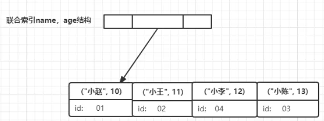

# 索引

## InnoDB 存储引擎索引概述

InnoDB 索引支持以下几种常见的索引：

- B+树索引
- 全文索引
- 哈希索引

InnoDB 存储引擎支持的哈希索引是自适应的，会根据表的使用情况自动为表生成哈希索引，不能认为干预是否在一张表中生成哈希索引。

B+树索引就是传统意义上的索引，这是目前关系型数据库系统中查找最为常用和最为有效的索引。

注意：B+树中的 B 不是代表二叉（binary），而是代表平衡（balance）。而且，B+树索引并不能找到一个给定键值的具体行，它找到的是数据行所在的页。数据库通过把页读入到内存，再在内存中进行查找，才能得到查找的数据。

:::tip 补充一点
页是 InnoDB 存储引擎管理数据库的最小磁盘单位，每页 Page Directory 中的槽是按照主键的顺序存放的。

数据库把页载入到内存，再通过 Page Directory（页目录） 进行二分查找。
:::

## B+树

B+树是为磁盘或其他之间存取辅助设备设计的一种平衡查找树，各叶子节点有指针相互连接。

> 插入和删除我略了

## B+树索引

B+树索引在数据库中有一个特点就是高扇出：在数据库中，它的高度一般都在 2~4 层，意味着查找某一键值的行记录最多只需要 2~4 IO。（一般机械硬盘每秒至少可以做 100 次 IO，2~4 次的 IO 查询时间只需 0.02~0.04 秒）

数据库中的B+树索引可以分为聚集索引（clustered index）和辅助索引（secondary index），但不管是聚集还是辅助索引，其内部都是B+树。聚集索引和辅助索引不同的是，叶子节点存放的是否是一整行的信息。

### 聚集索引

聚集索引是按照每张表的主键构造一棵B+树，叶子节点存放的是整张表的行记录数据。叶子节点也可称为数据页，这个特性决定了索引组织表中的数据也是索引的一部分。同B+树数据结构一样，每个数据页都通过一个双向链表来进行链接。

因为实际的数据页只能按照一颗B+树进行排序，因此每张表只能拥有一个聚集索引。多数情况下，查询优化器倾向于采用聚集索引，因为聚集索引能够在B+树索引的叶子节点上直接找到数据。

聚集索引的存储并不是物理上连续的，而是逻辑上连续的，因为：
- 页通过双向链表链接，页按照主键的顺序排序
- 页中的记录也是通过双向链表维护的

聚集索引的另一个好处是，它对于主键的排序查找和范围查找速度非常快。
- 主键的排序查找：叶子节点的数据就是用户所要查询的数据，比如用户要查询最后注册的 10 位用户，因为B+树索引是双向链表，找到最后一个数据页后，取出 10 条数据即可。
- 范围查询：如果要查找主键某一范围内的数据，通过叶子节点的上层节点就可得到页的范围，之后直接读取数据页即可。 

### 辅助索引

辅助索引，叶子节点不包含行记录的全部数据，除了包含键值以外，每个叶子节点中的索引行还包含了一个书签，用于告诉 InnoDB 存储引擎哪里可以找到与索引相对应的行数据。这个书签是相应行数据的聚集索引键。

辅助索引的存在不影响数据在聚集索引中的组织，因此每张表可以有多个辅助索引。通过辅助索引查找数据，InnoDB 存储引擎会遍历辅助索引并通过叶级别的指针获得指向主键索引的主键。再通过主键索引找到一个完整的行记录。

举例来说，如果在一颗高度为 3 的辅助索引树中查找数据，需要对这可辅助索引遍历 3 次找到指定主键。如果聚集索引的高度同样为 3，那么还需要对聚集索引树进行 3 次查找，才能得到完整行数据所在的页。因此一共需要 6 次逻辑 IO 访问以得到最终的一个数据页。

## Cardinality 值

什么时候添加B+树索引？一般的经验是，在访问表中很少一部分使用B+树索引才有意义，像性别字段、地区字段、类型字段，它们可取的值范围很小，称为低选择性。给它们添加B+树索引完全没有必要。相反，如果某个字段的取值范围很广，几乎没有重复，属于高选择性，给它们添加B+树索引非常适合（比如姓名字段）。

## B+树索引的使用

### 联合索引

联合索引指对表上的多个列进行索引，它的创建方法与单个索引创建的方法一样，不同之处在于有多个索引列。

```sql
CREATE INDEX t1_username_password ON t1(username,password)
```

如果查询 `SELECT * FROM table WHERE username=xxx AND password=xxx`，可以使用这个索引。但如果对 `password` 列的查询，`SELECT * FROM table WHERE password=xxx` 则不可以使用这颗B+树索引。

联合索引的第二个好处是对第二个键值进行了排序处理。

例如联合索引（a，b，c），下面语句可以直接使用联合索引得到结果

```sql
SELECT ... FROM t WHERE a=xxx AND b=yyy ORDER BY c;
```

但是下面的语句不行，因为索引（a，c）未排序：

```sql
SELECT ... FROM t WHERE a=xxx ORDER BY c;
```

### 覆盖索引

即从辅助索引中就可以得到查询的记录，不需要查询聚集索引中的记录。

使用它的一个好处是辅助索引不包含整行查询的记录，故其大小远小于聚集索引，可以减少大量的 IO 操作。

例如，已经建立了表 `student`，那么现在出现的业务需求中要求根据名称获取学生的年龄，并且该搜索场景非常频繁，那么先在我们删除掉之前以字段 `name` 建立的普通索引，以 `name` 和 `age` 两个字段建立联合索引，sql 命令与建立后的索引树结构如下。

```sql
ALTER TABLE student DROP INDEX I_name;
ALTER TABLE student ADD INDEX I_name_age(name, age);
```



流程为：

在 `name`，`age` 联合索引树上找到名称为小李的节点，此时节点索引里包含信息 `age` 直接返回 12。

### 优化器不使用索引的情况

范围查找、JOIN 链接等操作情况下，优化器可能不会选择索引去查找数据，而是选择聚集索引进行全表扫描得到数据。

例如现在表上有（`order_id`, `product_id`）联合主键，执行下列 sql：

```sql
SELECT * FROM xxx WHERE order_id > 10000 AND order_id < 102000;
```

不会按照 `order_id` 进行索引，原因在于用户选取的数据是整行信息，而 `order_id` 索引不能覆盖到我们要查询的信息。因此在对 `order_id` 索引查询数据后，还需要方法聚集索引获得整行的数据，将操作转变成了磁盘上的离散读操作。如果访问的数据量很小，优化器还是会选择辅助索引，但是当访问的数据占表中的很大一部分时（一般20%以上），优化器会选择聚集索引查找。因为顺序读远远快于离散读。

## InnoDB 存储引擎中的哈希索引

InnoDB 存储引擎使用哈希算法对字典进行查找，冲突机制采用链表法，哈希函数采用试除法散列方式。

自适应哈希索引仅是数据库自身创建并使用的，DBA 本身不能对其进行干预。自适应哈希索引经哈希函数映射到一个哈希表中，因此对于字段类型的查找非常快速。如：`SELECT * FROM t WHERE c='XXX';`。但是对于范围查找就无能为力了。

## 全文检索

全文检索是将储存在数据库中的整本书或整篇文章中的任意内容信息查找出来的技术。它可以根据需要获得全文中有关章、节、段、句、词等信息，也可以进行各种统计和分析。

从 InnoDB 1.2.X 版本开始，InnoDB 存储引擎开始支持全文检索。

### 倒排索引

全文检索通常使用倒排索引（inverted index）来实现。倒排索引也是一种索引结构。它在辅助表中储存了单词与单词自身在一个或多个文档中所在位置的映射。其拥有两种表现形式：
- inverted file index：[单词，单词所在的文档ID]
- full inverted index：[单词，(单词所在的文档ID，在具体文档中的位置)]

### InnoDB 全文检索

> 啊 睡了