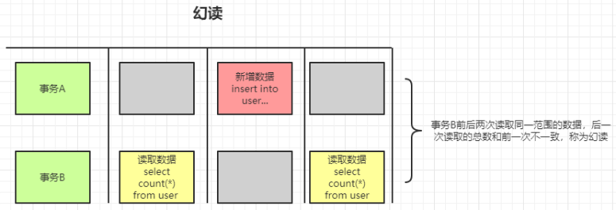

# 事务

数据库事务（transaction）是访问或操作各种数据项的一个数据库操作序列，这些操作要么全部执行，要不全部不执行。它是一个不可分割的工作单位。

## 事务的特性（ACID）

* 原子性（Atomicity）：事务作为一个整体被执行，包含在其中的、对数据库的操作要么全部执行，要么都不执行。
* 一致性（Consistency）：事务应确保数据库的状态从一个**一致性状态转变为另一个一致状态**。（一致状态的含义是数据库中的数据应满足完整性约束）
* 隔离性（Isolation）：多个事务并发执行时，一个事务的执行不影响其他事务的执行。
* 持久性（Durability）：已被提交的事务对数据库的修改应该永久保存在数据库中。

> 比如：假设用户A和用户B两者的钱加起来一共是20000。那么，不管A和B之间如何转账，事务结束之后两个用户的钱相加起来应该还是20000。
> 这就是事务的一致性。
  
## 事务可能出现的问题

### 脏读

1. 在事务A执行的过程中，事务A对数据资源进行了修改。事务B读取了事务A修改后的数据。
2. 因为某些原因，事务A并没有完成提交，发生了RollBack操作。则事务B读取的数据就是脏数据。

这种**读取到另一个事务未提交的数据**的现象，就是脏读。

### 不可重复读

事务B读取了两次数据资源。但是在这两次读取数据资源之间，事务A修改了数据。**导致事务B两次读取的数据不一致**。

在同一个事务中，前后**两次读取的数据不一致的现象**，就是不可重复读。

### 幻读

事务B**内**前后两次读取同一个范围的数据。在事务B两次读取的过程中，事务A新增了数据，**导致事务B后一次读取到前一次查询没有看到的行**。

幻读和不可重复读有些类似。但**幻读强调的是集合的增减**，而不是单条数据的更新。

### 第一类更新丢失

事务A和事务B都对数据进行更新。事务B先提交并更新了数据，但是事务A由于某种原因事务回滚，导致事务A回滚时把事务B更新的数据给覆盖了。

这种现象就是第一类更新丢失。

### 第二类更新丢失

事务A和事务B都对数据进行更新。事务B先更新了数据，但事务A后更新数据把事务B已提交的数据给覆盖了。

这种现象就是第二类更新丢失。

## 事务隔离级别、四层封锁协议

为了**解决以上问题**，主流数据库提供了四种事务隔离级别：读未提交、读已提交、可重复读、串行化。

事务隔离等价越高，越能保证数据的一致性和完整性，但是执行效率就更低。

MySQL**默认是可重复读**的级别。

### 读未提交

最低级别的隔离，所有的事务都可以读取其他未提交事务的执行结果。很少用于实际的项目。

### 读已提交

一个事务的更新结果只有再该事务提交之后才能读到。

### 可重复读

一个事务多次读同一个数据，在这个事务还没结束时，其他事务不能访问该数据（包括读写），这样就可以在同一个事务内两次读到的数据是一样的了。**但是仍然会出现幻读**。

在可重复读中，该sql第一次读取到数据后，就将这些数据加锁（悲观锁），其它事务无法修改这些数据，就可以实现可重复读了。**但这种方法却无法锁住insert的数据**，所以当事务A先前读取了数据，或者修改了全部数据，事务B还是可以insert数据提交，这时事务A就会发现莫名其妙多了一条之前没有的数据，这就是幻读，不能通过行锁来避免。

### 串行化
最高级别的隔离，它要求事务序列化执行，事务只能一个接一个地执行，不能并发的执行。
在这个级别，可以解决上面提到的所有问题，但可能会导致大量的超时和锁竞争，通常不会使用这个级别。