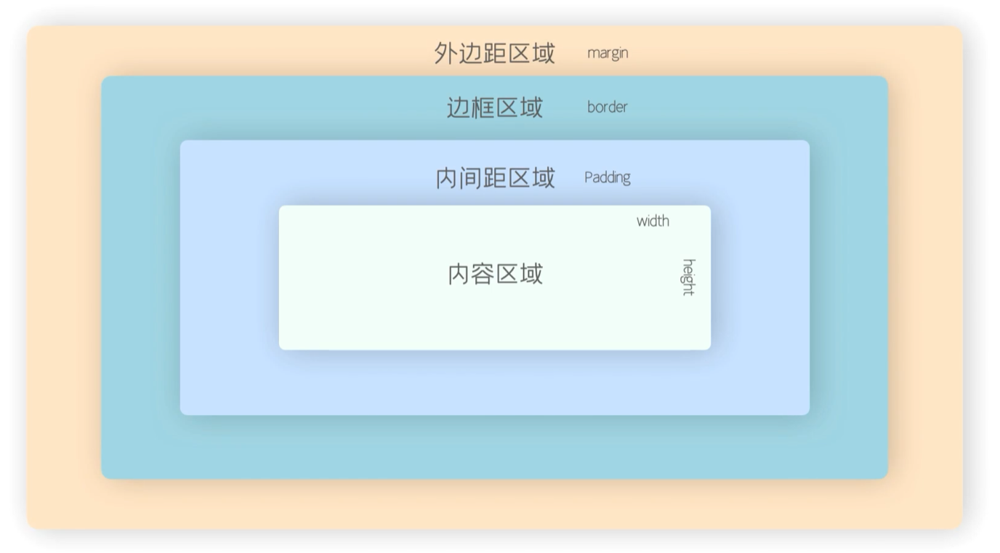
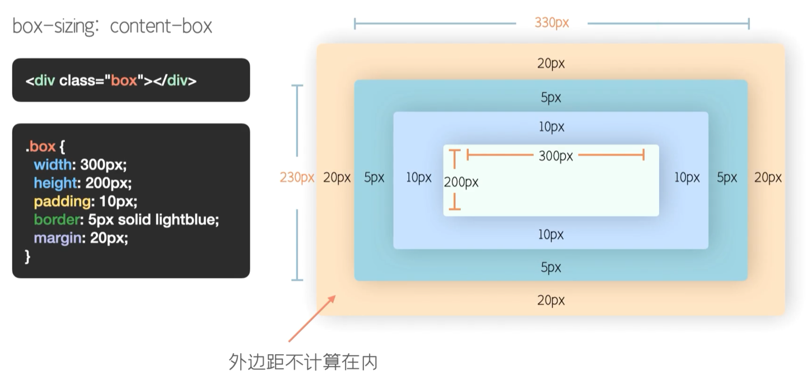
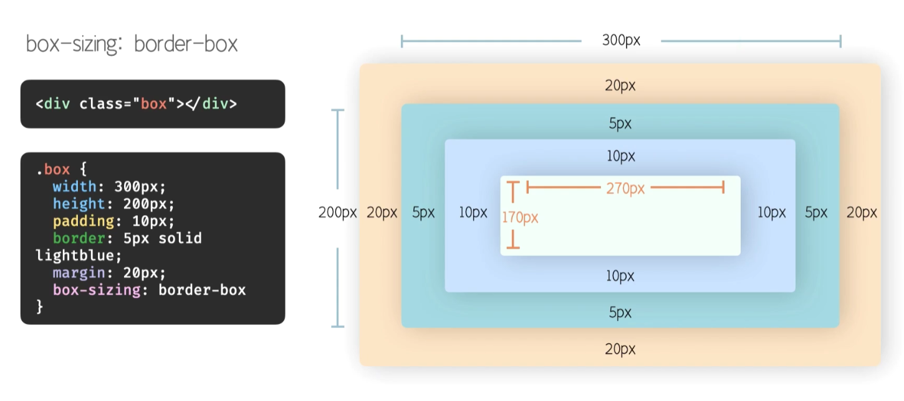
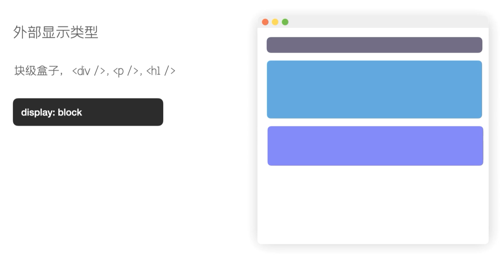
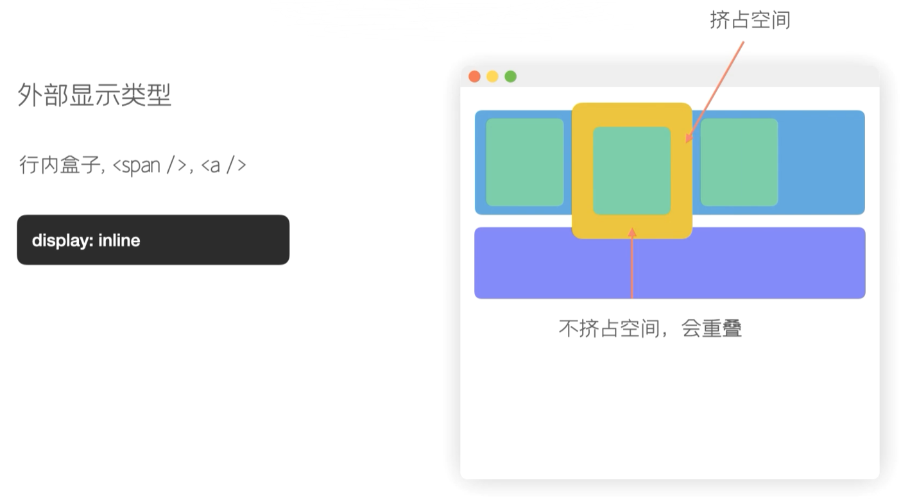
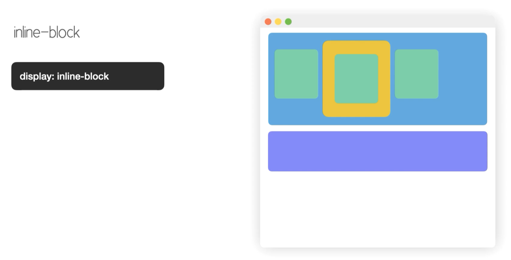

# 盒子模型

[图源](https://www.bilibili.com/video/BV13V411z7do)

## 组成部分

从内到外分别是：`content`、`padding`、`border`、`margin`

## 标准盒模型 content-box

当已经设定了 `width` 和 `height` 值的时候，`padding` 和 `border` 不被包含在你定义的 `width` `和height` 之内。

你定义的 `width` 只负责 `content` 区域的宽度，如果想得到整个盒子宽度，需要再加上`padding` 和 `border` 的厚度。

## IE盒模型

不管你如何设置 `padding` 和 `border`，它只在盒子里面伸缩，不影响整体的宽高。但如果 `padding` `和border` 太大，会把内容挤掉的。

## block

块状元素可以正确解释盒模型的属性 `width`、`height`、`padding`、`margin` 和 `border`。

块状元素前后带有换行符，所以自占一行，在垂直方向一个接一个的放置。

块状元素一般作为容器、盒子使用。

块状元素默认情况下，**宽度与父元素同宽**，高度根据内容而定，没有内容，高度为0。

## inline

行内元素不能正确解释盒模型的属性，`width`、`height` 执行无效，`padding`、`border`、`margin` 解释时，左右解释没有问题，上下解释不正确。

行内元素在一行内从左往右依次排列。

行内元素默认情况下，宽度和高度都根据内容而定。

垂直方向上的 `margin` 和 `padding` 虽然能设置生效，但是不会挤占其它行内盒子的空间。

## inline-block

可以设置宽高，同时上下内外边距也能设置生效的模型。

