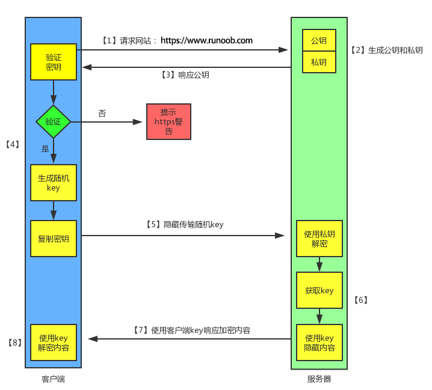

# About-HTTP

## HTTP 与 HTTPS

HTTP（HyperText Transfer Protocol：超文本传输协议）

以**明文方式**发送内容，不提供任何方式的数据加密，如果攻击者截取了Web浏览器和网站服务器之间的传输报文，就可以直接读懂其中的信息，因此，HTTP协议不适合传输一些敏感信息，比如：信用卡号、密码等支付信息。

HTTPS（Hypertext Transfer Protocol Secure：超文本传输安全协议）

HTTPS 经由 HTTP 进行通信，但利用 SSL/TLS 来加密数据包。HTTPS 开发的主要目的，是提供对网站服务器的身份认证，保护交换数据的隐私与完整性。它默认工作在 TCP 协议 443 端口，工作流程一般如以下方式：

1. TCP 三次握手同步
2. 客户端验证服务器数字证书
3. DH 算法协商对称加密算法的密钥，hash 算法的密钥
4. SSL 安全加密隧道协商完成
5. 网页以加密的方式传输，用协商的对称加密算法和密钥算法祭加密，**保证数据机密性**；用协商的 hash 算法进行数据完整性保护，**保证数据不被篡改**。

使用 HTTPS 协议需要到 CA（Certificate Authority，数字证书认证机构） 申请证书，一般免费证书较少，因而需要一定费用。

而且 HTTP 和 HTTPS 使用的是完全不同的连接方式，用的端口也不一样，前者是 80，后者是 443。

### HTTPS 工作原理

1. 客户端发起 HTTPS 请求

用户在浏览器输入一个 HTTPS 网站，然后连接到服务器的 443 端口。

2. 服务端的配置

采用 HTTPS 协议的服务器必须要有一套数字证书。自己制作的证书需要客户端验证通过后才可以继续访问。而受信任的公司申请的证书则不会弹出提示页面。

这套证书其实就是一对公钥和私钥。公钥用于加密，私钥用于解密。可以将它们想象成一个锁头和一个钥匙，全世界只有一个人拥有这把钥匙，而可以把锁头给别人，别人把重要的东西锁起来，再发给你。只有你一个人拥有这把钥匙，所以只有你能看见被这把锁锁起来的东西。

3. 传送证书

这个证书其实就是公钥，包含了许多信息，比如证书的颁发机构、过期时间等等。

4. 客户端解析证书

这部分工作是由客户端的 TLS 来完成的。首先验证公钥是否有效，比如颁发机构、过期时间等等。如果发现异常，则会弹出一个警告框，提示证书存在问题。

如果证书没有问题，那么就生成一个随机值，然后用证书对该随机值进行加密。（把随机值用锁头锁起来）（这个随机值是对称加密的私钥，可以用来加密和解密）

5. 传送加密信息

传送用证书加密后的随机值，目的是让服务器得到这个随机值。之后的客户端和服务器就可以通过这个随机值来进行加密解密。

6. 服务端解密信息

服务端用证书的私钥解密后，得到了客户端传来的随机值。然后把内容通过该随机值进行对称加密。正好客户端和服务器都知道这个随机值（私钥），所以只要私钥越复杂，数据就越安全。

7. 传输加密后的信息

这部门信息是服务器用随机值加密后的信息，可以在客户端被还原。

8. 客户端解密信息

客户端用之间生成的私钥解密服务器传过来的信息，获取了解密后的内容。

整个过程第三方即使监听到了数据，也束手无策。

## 对称加密和非对称加密

在对称加密算法中，加密使用的密钥和解密使用的密钥是相同的。

非对称加密是相对于对称加密而言的，是指加密和解密使用不同密钥的加密算法。公钥和私钥是成对出现的，如果用公钥对数据进行加密，只有用对应的私钥才能解密；如果用私钥对数据进行加密，那么也只有用对应的公钥才能解密。公钥是密钥对外公开的部分，私钥则是非公开的部分，由使用者自行保管，这也就大大降低了身份被冒充的风险。

## 每次进行HTTPS请求时都必须在SSL/TLS层进行握手传输密钥吗？

服务器会为每个浏览器（或客户端软件）维护一个 session ID，在 TLS 握手阶段传给浏览器，浏览器生成好密钥传给服务器后，服务器会把该密钥存到相应的 session ID 下，之后浏览器每次请求都会携带 session ID，服务器会根据 session ID 找到相应的密钥并进行解密加密操作，这样就不必要每次重新制作、传输密钥了！

## 为什么数据传输是用对称加密？

非对称加密的加解密效率是非常低的，而 HTTP 的应用场景中通常端与端之间存在大量的交互，非对称加密的效率是无法接受的。

在 HTTPS 的场景中只有服务端保存了私钥，一对公私钥只能实现单向的加解密，所以 HTTPS 中内容传输加密采取的是对称加密，而不是非对称加密。

## HTTP 各版本的区别

[HTTP 各版本的区别——CSDN](https://blog.csdn.net/qq_40860852/article/details/93632106)