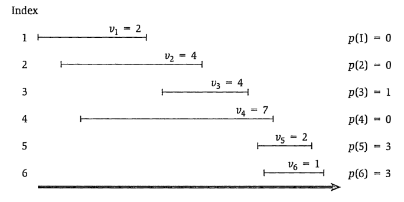

# 先导

## [归并排序](https://www.acwing.com/problem/content/789/)

::: tip 思路
递归去分，接着得到两个有序的子序列，最终合并
:::

```cpp
void merge_sort(int *a, int l, int r) {
    if (l >= r) return;
    int mid = (l + r) / 2;
    merge_sort(a, l, mid), merge_sort(a, mid + 1, r);
    // 此时 l ~ mid，mid + 1 ~ r 已经是两个有序的子序列
    // 开始归并 temp 是临时数组
    int i = l, j = mid + 1, k = 0;
    while (i <= mid && j <= r) {
        if (a[i] < a[j]) temp[k++] = a[i++];
        else temp[k++] = a[j++];
    }
    while (i <= mid) temp[k++] = a[i++];
    while (j <= r) temp[k++] = a[j++];

    for (int i = l, j = 0; j < k; ++ i, ++ j) a[i] = temp[j];
}
```

## [快速排序](https://www.acwing.com/problem/content/787/)

::: tip 思路
进入函数寻找烧饼，不断交换，直到两指针相交结束。接着以两指针为界，继续递归。
:::

```cpp
void quick_sort(int *a, int l, int r) {
    if (l >= r) return;
    int x = a[(l + r) / 2], i = l - 1, j = r + 1;
    // 开始进行交换
    while (i < j) {
        do ++ i; while (a[i] < x);
        do -- j; while (a[j] > x);
        if (i < j) swap(a[i], a[j]);
    }
    // 继续递归
    quick_sort(a, l, j);
    quick_sort(a, j + 1, r);
}
```

## 分治求最大最小值

::: tip 思路
将数组分成两个区间，分别得到这两个区间的最大最小值，接着归并
:::

不确定能不能运行，反正思路是对的......（数组长度为偶数的时候能用，奇数会无限递归下去）

```ts
function findMaxMin(a: number[], l: number, r: number): [max: number, min: number] {
    if (r - l === 1) {
        if (a[l] > a[r]) return [a[l], a[r]];
        else return [a[r], a[l]];
    } else {
        const mid: number = l + r >> 1;
        const [x1, y1] = findMaxMin(a, l, mid);
        const [x2, y2] = findMaxMin(a, mid + 1, r);
        const max = Math.max(x1, x2);
        const min = Math.min(y1, y2);
        return [max, min];
    }
}
```

## 分治求第二大的元素（擂台法）

::: tip 思路
将 $k$ 个元素两两分组，进行比较

较小的那个数存放在较大那个数所指向的链表中

如果 $k$ 是奇数，那么 $k$ 赋值为 $(l + r) / 2 + 1$

如果 $k$ 是偶数，那么 $k$ 赋值为 $(l + r) / 2$

没有选出冠军继续进行上面步骤。第二大的数就是冠军所指向链表中，最大的数
:::

## 带权区间的调度

有 $n$ 项活动申请使用同一个礼堂，且任何两个活动不
能同时举行

* 每项活动有一个开始时间和一个截止时间，
* 安排每个活动都有一个收益值;

问:如何选择这些活动,使得被安排的活动收益值达到最大?

::: tip 思路
按照截至时间将这些活动从小到大排序。

预处理一个 $P(a) = b$ 数组，能找到当前下标活动 $a$ 能与其相容活动的最大小标 $b$，如图。



最终按顺序从小到大遍历，像最长公共子序列一样去更新它们
:::

求最优解的值的伪代码。

```ts
class Activity {
    start: number
    end: number
    weight: number
}

function Solve(As: Activity[]): number {
    // 目标任务数
    const n = As.length;
    // 升序排序
    const OAs = As.sort((a, b) => a.end - b.end);
    // 获取P数组
    const p: number[] = getP(OAs);
    // 动规数组初始化为0
    const dp: number[] = new Array(n + 1).fill(0);

    for (let i = 1; i <= n; ++i) {
        dp[i] = Math.max(dp[i - 1], dp[p[i]] + OAs[i].weight);
    }

    return dp[n];
}
```

求最优解

```ts
function getSolution(res: number): number[] {
    if (res === 0) output nothing;
    else {
        if w[res] + dp[p[res]] > dp[res - 1] {
            output res;
            getSolution(p[res]);
        } else {
            getSolution(res - 1);
        }
    }
}
```

## 矩阵乘法

::: tip 提示
线性代数课本上有
:::

```ts
function Solve(A: number[][], B: number[][]): number[][] {
    const l = A的行;
    const r = B的列;
    const e = A的列或B的行
    const C: number[][] = new Array[][]; // 反正不能这么写
    for (let i = 1; i <= l; ++ i) {
        for (let j = 1; j <= r; ++ j) {
            C[i][j] = 0;
            for (let k = 1; k <= e; ++ k) {
                C[i][j] += A[i][e] * B[e][j];
            }
        }
    }
    return C
}
```

## 矩阵链乘法

对于许多个矩阵连乘，求出一种运算顺序使运算次数最少

::: tip 提示
这是区间DP问题

先枚举区间长度，一般从 $2$ 开始

再枚举区间左端点，同时通过区间长度算出区间右端点

枚举切割点，找到该区间的最佳切割点
:::

实在是找不到有矩阵链乘法OJ，这个是求最优解值的伪代码

```ts
function Solve() {
    // dp[][]数组全是0, s[l][r]是储存最佳切割点的
    for (let len = 2; len < n; ++ len) {
        for (let l = 1; l < n - len + 1; ++ l) {
            let r : number = l + len - 1;
            dp[l][r] = 0x3f3f3f3f, s[l][r] = l;
            for (let k = l; k < r - 1; ++ k) {
                // 这步是算这个切割点的权值
                const t = dp[l][k] + dp[k+1][r] + p[l-1]*p[k]*p[r]
                // 找到一个更优的更新它
                if (t < dp[l][r]) {
                    dp[l][r] = t;
                    s[l][r] = k;
                }
            }
        }
    }
    return [dp, s];
}
```

## [01背包问题和完全背包问题](/algorithm/6.动态规划.html#背包问题)

写过了......略

## [最长公共子序列](https://www.acwing.com/problem/content/899/)

给定两个长度分别为 $N$ 和 $M$ 的字符串 $A$ 和 $B$，求既是 $A$ 的子序列又是 $B$ 的子序列的字符串长度最长是多少。

::: tip 提示
先规定：`dp[i][j] = m` 为字符串 `A[1..i]` 与 字符串 `B[1..j]` 的最长公共子序列长度 `m`

进入动规后是比对 `i` 和 `j`

假如此时 `A[i] != B[j]`，不能增加最长公共子序列的长度，`dp[i][j] = max(dp[i-1][j], dp[i][j-1])`

假如此时 `A[i] == B[j]`，皆大欢喜，长度 + 1 `dp[i][j] = dp[i-1][j-1] + 1`

最后答案是是 `dp[N][M]`
:::

```cpp
#include <bits/stdc++.h>

using namespace std;

const int N = 1010;

char a[N], b[N];
int dp[N][N];
int n, m;

int main(){
    cin >> n >> m;
    cin >> a + 1 >> b + 1;
    for (int i = 1; i <= n; ++ i) {
        for (int j = 1; j <= m; ++ j) {
            if (a[i] == b[j]) dp[i][j] = dp[i-1][j-1] + 1;
            else dp[i][j] = max(dp[i-1][j], dp[i][j-1]);
        }
    }
    cout << dp[n][m];
    
    return 0;
}
```

## [最长上升子序列](https://www.acwing.com/problem/content/897/)

给定一个长度为 $N$ 的数列，求数值严格单调递增的子序列的长度最长是多少。

::: tip 提示
设 `i` 与 `j`。`i` 是遍历的数，`j` 是之前的数

如果对应下标的数 `a[j] < a[i]` ，那么 `dp[i] = max(dp[i], dp[j] + 1)`
:::

```cpp
#include <bits/stdc++.h>

using namespace std;

const int N = 1010;

int a[N], dp[N];

int main(){
    int n;
    cin >> n;
    for (int i = 1; i <= n; ++ i) cin >> a[i];
    
    for (int i = 1; i <= n; ++ i) {
        dp[i] = 1;
        for (int j = 1; j < i; ++ j) {
            if (a[i] > a[j]) dp[i] = max(dp[i], dp[j] + 1);
        }
    }
    
    int res = 0;
    for (int i = 1; i <= n; ++ i) {
        res = max(res, dp[i]);
    }
    cout << res << endl;
    
    return 0;
}
```

## [最短编辑距离](https://www.acwing.com/problem/content/904/)

给定两个字符串 $A$ 和 $B$，现在要将 $A$ 经过若干操作变为 $B$，可进行的操作有：

1. 删除–将字符串 $A$ 中的某个字符删除。
2. 插入–在字符串 $A$ 的某个位置插入某个字符。
3. 替换–将字符串 $A$ 中的某个字符替换为另一个字符。

现在请你求出，将 $A$ 变为 $B$ 至少需要进行多少次操作。

::: tip 提示
规定 `dp[i][j] = m` 为字符串 `A[1..i]` 到 `B[1..j]` 最少需要操作的次数 `m`

转移状态有四种方式

* 插入

添加一个字母之后变得相同，说明没有添加前，a的前i个已经和b的前j-1个已经相同

`dp[i][j] = dp[i][j-1] + 1`

* 删除

删除该字母之后变得相同，说明没有删除前，a中前i-1已经和b的前j个已经相同

`dp[i][j] = dp[i-1][j] + 1`

* 替换
  
替换说明对应结尾字母不同

`dp[i][j] = dp[i-1][j-1] + 1`

* 啥也不做
  
对应结尾字母相同

`dp[i][j] = dp[i-1][j-1]`
:::

```cpp
#include <bits/stdc++.h>

using namespace std;

const int N = 1010;

int n, m;
char a[N], b[N];
int dp[N][N];

int main(){
    scanf("%d%s", &n, a + 1);
    scanf("%d%s", &m, b + 1);
    
    for (int i = 0; i <= n; ++ i) dp[i][0] = i;
    for (int i = 0; i <= m; ++ i) dp[0][i] = i;
    
    for (int i = 1; i <= n; ++ i) {
        for (int j = 1; j <= m; ++ j) {
            dp[i][j] = min(dp[i][j-1], dp[i-1][j]) + 1;
            dp[i][j] = min(dp[i][j], dp[i-1][j-1] + (a[i] != b[j]));
        }
    }
    
    cout << dp[n][m];
    
    return 0;
}
```

## [零钱兑换](https://leetcode-cn.com/problems/coin-change/)

给定不同面额的硬币 `coins` 和一个总金额 `amount`。编写一个函数来计算可以凑成总金额所需的最少的硬币个数。如果没有任何一种硬币组合能组成总金额，返回 `-1`。

你可以认为每种硬币的数量是无限的。

-----

我直接请评论区的神

```cpp
class Solution {
public:
    int coinChange(vector<int>& coins, int amount) {
        if (amount == 0) return 0;
        int n = coins.size();
        vector<int> dp(amount + 1); // dp[i]为总金额为i要的最少个数
        dp[0] = 0; // 初始化
        for (int i = 1; i < amount + 1; ++ i){ // i表示金额
            dp[i] = 1e8;
            for (int j = 0;j < n; ++ j){ //遍历硬币面额
                if (i == coins[j]) { //总金额=面额 只需要一个硬币
                    dp[i] = 1;
                }else if (i > coins[j]){ // 总金额>面额 个数=min【dp（总金额-面额）+1,dp[总金额]】 
                    dp[i] = min(dp[i], dp[i - coins[j]] + 1);
                }
            }  
        }
        return dp[amount] == 1d8 ? -1 : dp[amount];
    }
};
```