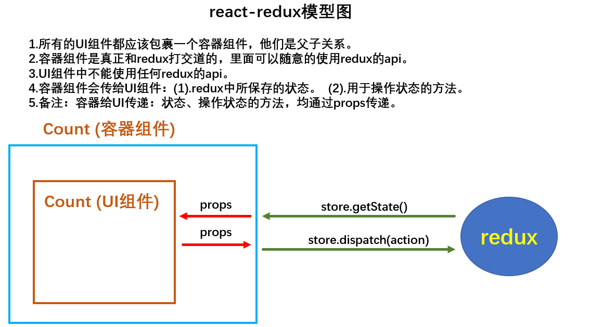

# react-redux

::: tip 注意
用上了react-redux就不用再写`store.substribe(()=>{});`去监听状态改变了。
:::



## 创建react-redux容器组件

这里有两个比较重要的方法

* `mapStateToProps`：用于传递状态
* `mapDispatchToProps`：用于传递操作状态的方法

```jsx
import CountUI from './Count';
import {connect} from 'react-redux';

// 该函数返回一个对象的key用作UI组件props的key
// 对象的value用作UI组件props的value
function mapStateToProps(state){
    return {count: state};
}

// 该函数返回的对象同上，只不过是操作state的方法
function mapDispatchToProps(dispatch){
    return {
        increment: () => {
            dispatch(createIncrementAction(1));
        },
        decrement: () => {
            dispatch(createDecrementAction(1));
        }
    }
}

export default connect(mapStateToProps, mapDispatchToProps)(CountUI);
```

## 向react-redux容器组件传入store

```jsx
import Count from './containers/Count'; // 容器组件
import store from './store'； // store

class App extends Component {
    render(){
        return <Count store={store}/>
    }
}
```

## react-redux对应UI组件的使用方法

这样的话，在UI组件中就看不到redux的痕迹了，需要的状态和方法已经通过`props`传了进来。

```jsx
class Count extends Component {
    // 加法
    increment = () => {
        this.props.increment();
    }
    // 减法
    decrement = () => {
        this.props.decrement();
    }
    render() {
        ......
        {this.props.count}
        ......
    }
}
```

## 简写mapStateToProps与mapDispatchToProps

```jsx
export default connect(
    state => ({count: state}),
    {
        increment: createIncrementAction, // 给action，react-redux它会自动分发（dispatch）
        decrement: createDecrementAction  // 给action，react-redux它会自动分发（dispatch）
    }
)(CountUI);
```

## 使用Provider传递store

这个`Provider`是 react-redux 里的。它会自动分析整个与应用里的容器组件，把`store`精准的传递给每个容器组件

```jsx
import store from './store';
import {Provider} from 'react-redux';

ReactDOM.render(
    <Provider store={store}>
        <App/>
    </Provider>
    document.getElementById('root');
);
```