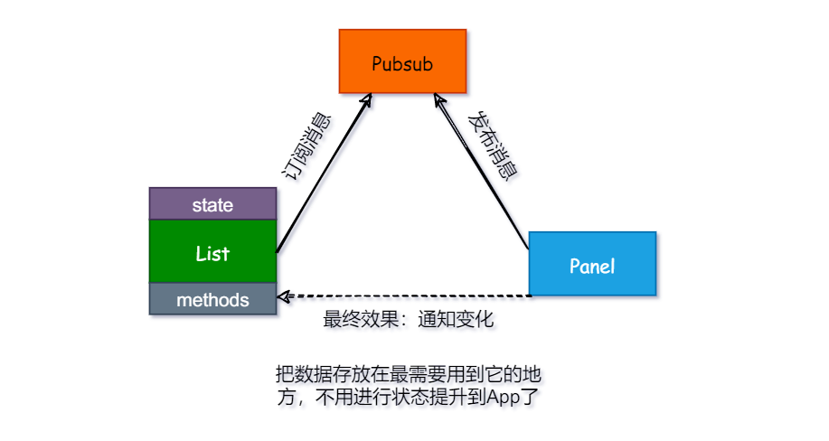

# 消息订阅（pubsubjs）

具体的使用方式详见其[Github](https://github.com/mroderick/PubSubJS)，下面的只是举例如何应用在React中实现父子组件间的相互通信。

## 设计



## 进行消息订阅

```jsx{3-5}
class List extends Component {
    componentDidMount(){
        Pubsub.subscribe('update', (msg, data) => {
            console.log(data);
        });
    }
}
```

## 进行消息发布

```jsx{3}
class Panel extends Component {
    search = () => {
        Pubsub.publish('update', [{id: 1}, {id: 2}]);
    }
}
```

## 取消消息订阅

```jsx{3-5,9}
class List extends Component {
    componentDidMount(){
        this.subscriber = Pubsub.subscribe('update', (msg, data) => {
            console.log(data);
        });
    }

    componentWillUnmount(){
        PubSub.unsubscribe(this.subscriber);
    }
}
```