# 1 概述

## 1.1 三种交换方式的对比

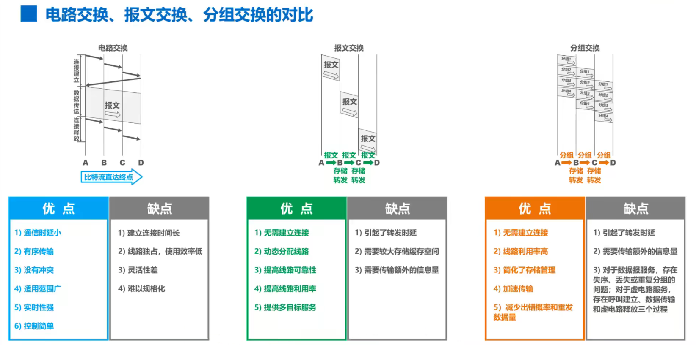

## 1.2 网络分类

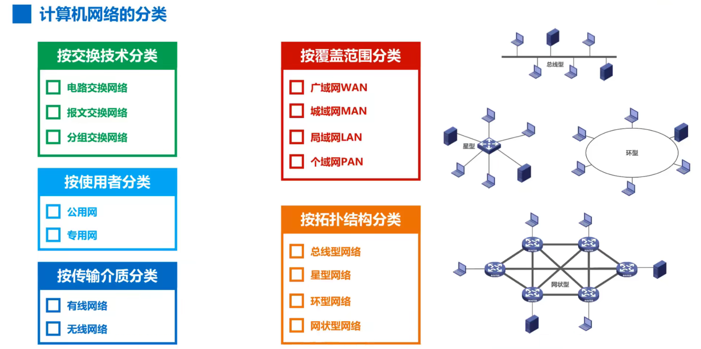

## 1.3 性能指标

### 1.3.1 比特、速率

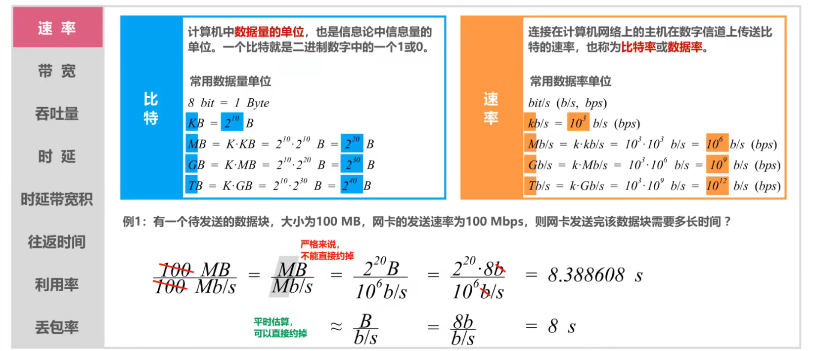

### 1.3.2 带宽

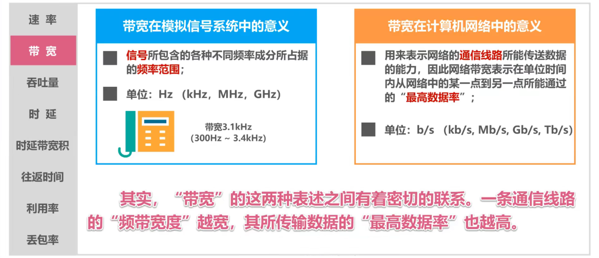

### 1.3.3 吞吐量

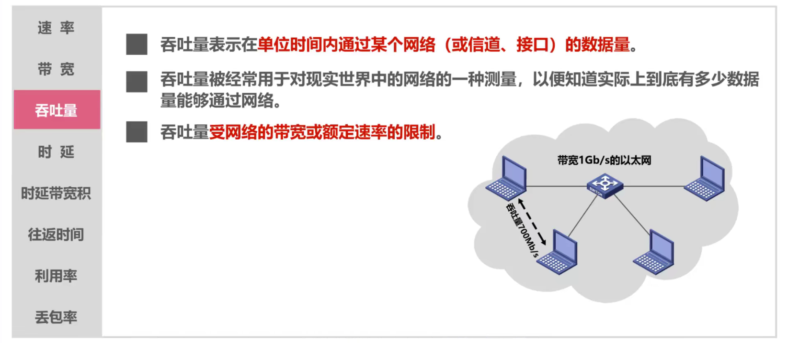

### 1.3.4 时延

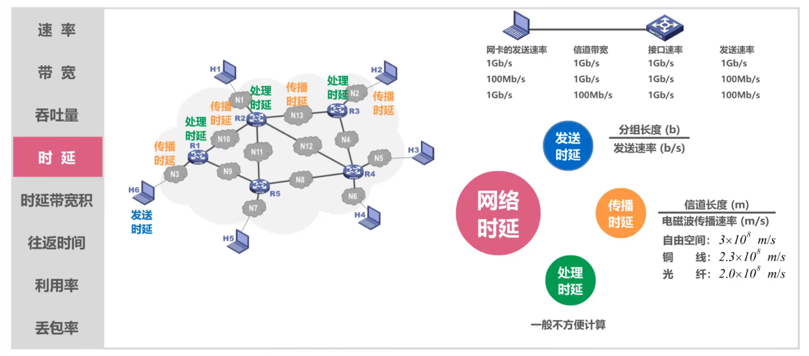

### 1.3.5 时延带宽积

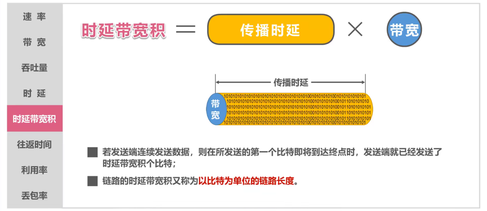

### 1.3.6 往返时间 RTT

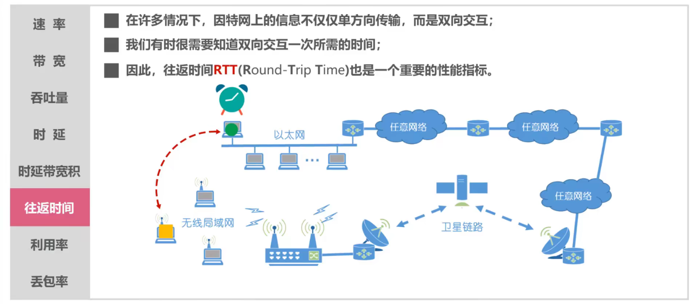

### 1.3.7 利用率

### 1.3.8 丢包率

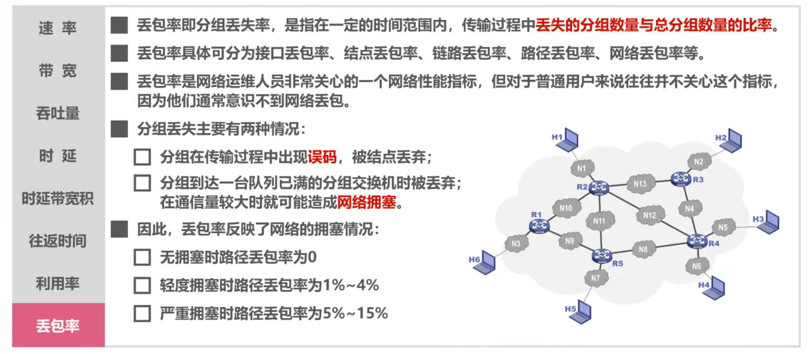

## 1.4 计算机网络体系结构

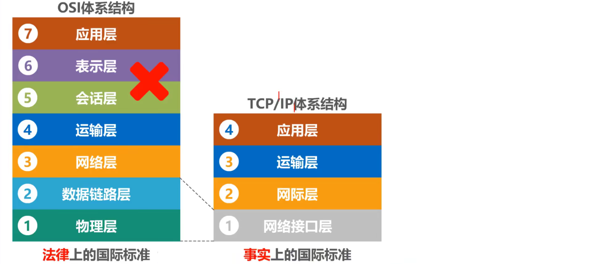

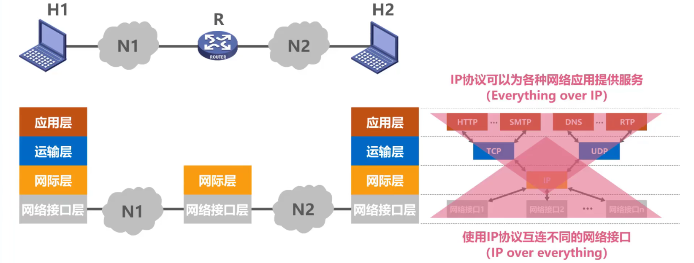

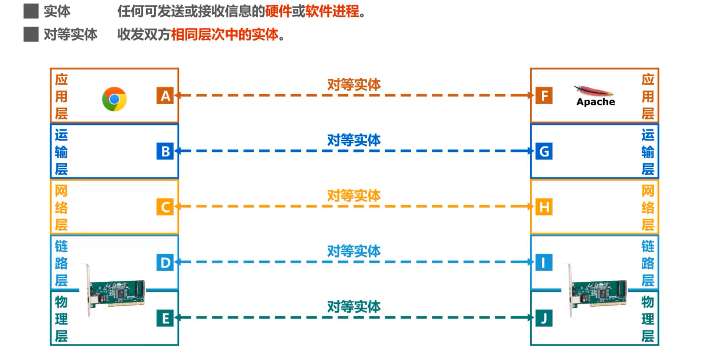

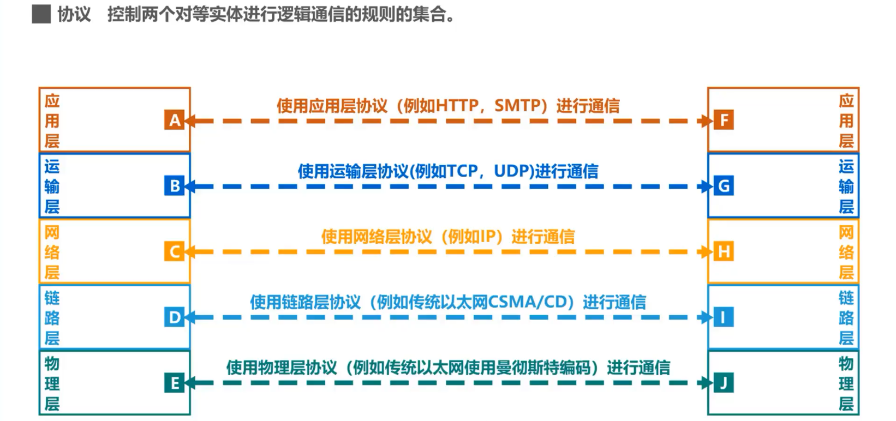

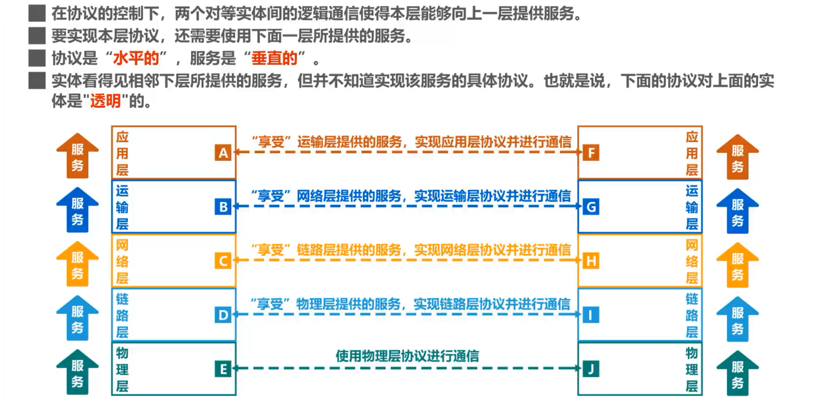

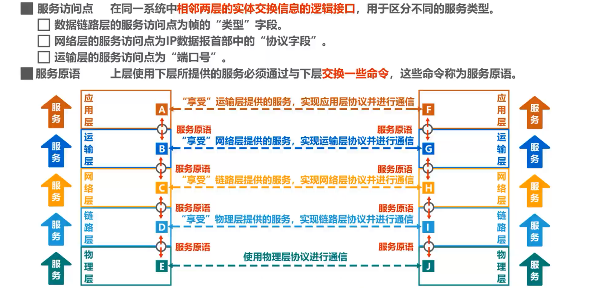

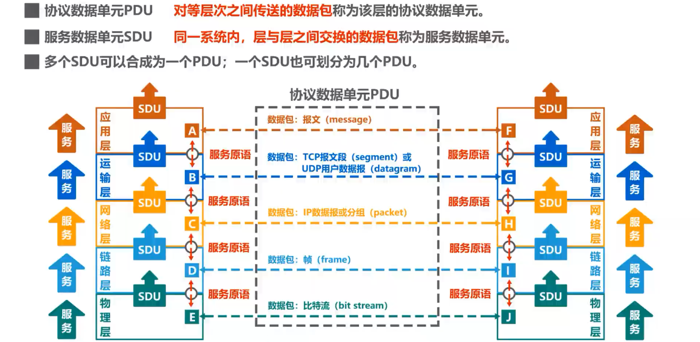

## 1.5 习题

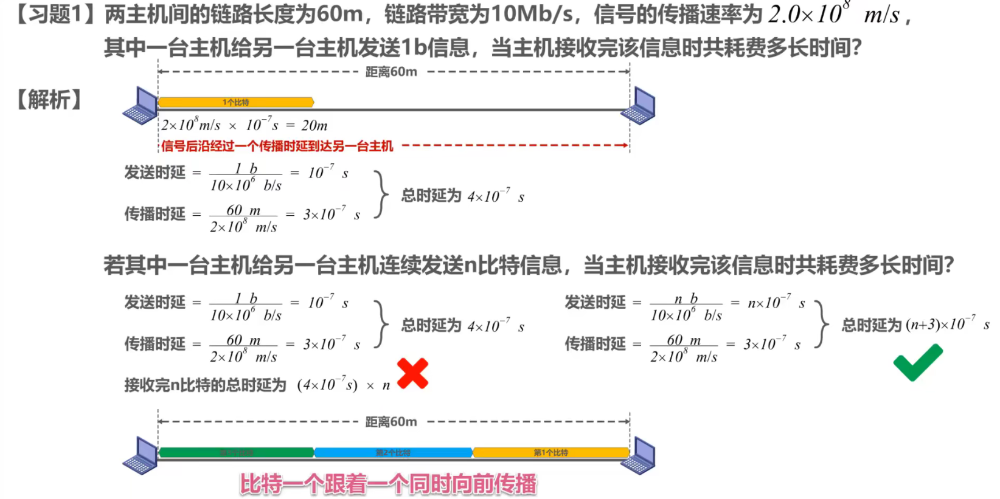

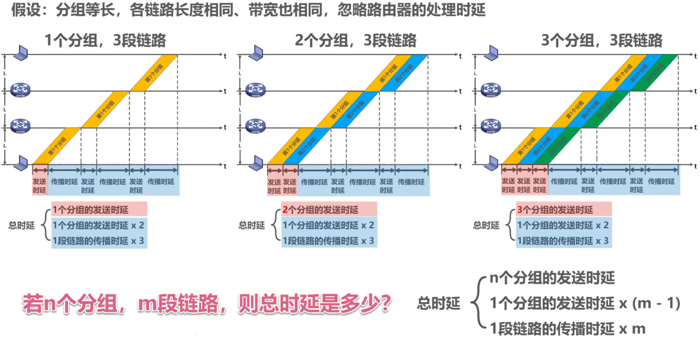

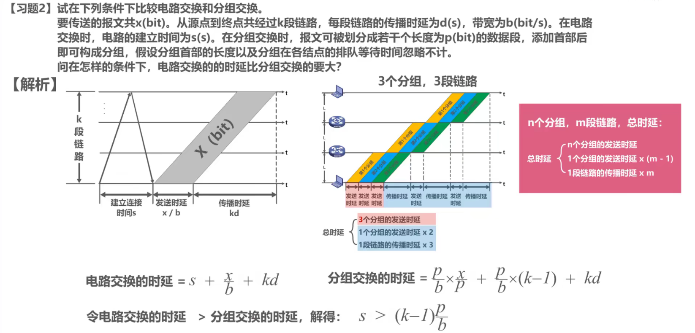 

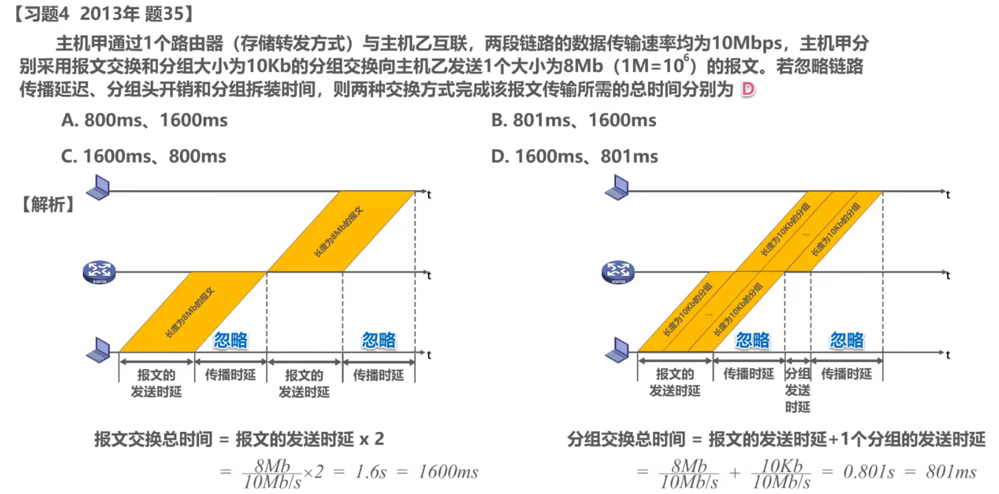